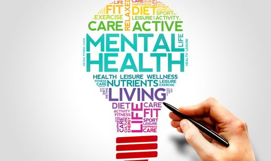
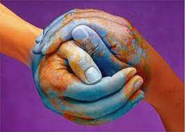

## Table of contents
* [Introduction](#intro)
* [The Problem: Background and Motivation](#backgrnd)
* [EmoteMap Will Solve the Problem by...](#solve)
* [Industry Review: What Differentiates EmoteMap](#differentiate)
* [References](#references)

# Introduction

### Abstract
TO FINISH DO ABSTRACT....

### Objectives
 - Create a writing tool that allows self-reflection in a similar way to blogging and journaling.  
 - Create a peer-led support network where users can interact with each other as a community.      
 - Create a tool that raises awareness and information through a visual heat-map based on an accumulation of users' mental health in different geolocations.

### Trailer
To get an overview of the Ethos of EmoteMap please view our [trailer](https://www.youtube.com/watch?v=SMLlnLANZNY).

## Who is our Target Market & Stakeholders?
The end user our team seeks to attain to is any male or female on the planet who has access to the Internet over the age of 13.  Please see Sarah's fictional user story in our [UX section](uxDesign.md) where we talk about our end users in more detail, including Sarah's fictional user story which serves as an example of a way in which we aim for users to interact with EmoteMap. There are *X* number of people in our target population. When it came to evaluating exactly how users interpreted our designs throughout the development process we found, through [Smart Survey's sample size calculator](https://www.smartsurvey.co.uk/sample-size-calculator), our required sample size  for a target population of this size was *X*. Please see our Limitations heading of the [Evaluation section](evalSect.md) for a more in depth discussion about the sample size of our market.    

Our team aimed to address two key stakeholders:    
Our first was the type of end user that made up our target market, as explained above. Second would be any analyst or organisation who would benefit from the data provided by EmoteMap about the different emotions and experiences felt globally. This could be in the form of visual data provided by our heat map, data extracted from the experiences and emotions logged by users; either as part of their blog post, the keyword emotion that they chose to log (e.g - "anxious"), user geolocation, or the 1-3 scale of emotion logged by the user. We envisage this kind of stakeholder to be a data analyst or a mental health organisation for example. For a more detailed investigation into this type of stakeholder, please see Christina's fictional story in our [UX section](uxDesign.md) which can help you visualise exactly how this kind of stakeholder would benefit from using EmoteMap.

</p

# The Problem: Background and Motivation
### The Problem
Our team addresses both the problem of poor  mental health globally and the inadequacy of today's mainstream social media in addressing it. To make the problem more digestible we decided to define it in two parts. In the first, we explain the issue of poor mental health which has become significantly worse as a result of the global lockdown. In the second we address the related issue of online culture's inadequacy to acknowledge the first problem. Current mainstream social platforms found online can be ,in fact, detrimental to it.

### The First Part of the Problem: Mental illness globally
Our team seeks to address the problem of mental illness globally. We do not believe that you can define mental illness simply as sadness or insanity. It is not a binary or exclusive concept in this way. Rather, we see it as a complex and universal problem. A time series curated by the Institute for Health Metrics Evaluation demonstrates that in a recent year about 13% of the global population suffered from some kind of mental disorder (Guardian, 2011). The British charity, Mind, refers to a statistic that one in four people will experience some form of mental illness in a given year  (Mind, 2020). Over in America it has been noted by the Anxiety and Depression Association of America that anxiety disorders are the most common mental illness in the US, effecting 40 million adults aged 18 and older (ADAA, 2021). Ironically, although anxiety is highly treatable only 36.9% of those suffering receive treatment (ADAA, 2021).  

We view mental illness as a global phenomenon, experienced in different ways around the world. For example, the incidence of catastrophic healthcare expenditure in Mexican households caring for a person with a mental disorder (Castro et. al, 2020) is not a naturally relatable topic for someone experiencing depression in the UK. At the same time, those Mexicans suffering from catastrophic healthcare expenditure will find it hard share similar coping mechanisms with Syrians dealing with mental distress in ongoing conflict and non-conflict settings during COVID-19. Emotemap seeks to unite people experiencing this universal and complex phenomenon at a local level, whereby users can find people going through similar experiences and emotions by searching for a keyword or looking in a certain location.

This part of the problem is particularly prominent today as a result of lockdown and social distancing measures. 60% of adults and 68% of young people have said their mental health has worsened during lockdown (Mind, 2020). In addition to this many who have never previously experienced mental health problems have seen their mental health and wellbeing decline during lockdown (Mind, 2020).

### The Second Part of the Problem: Current online societies are detrimental to mental health
The compulsive use of social media amongst our population is increasing. By 2022 it is forecast that there will be 3 billion active monthly users of social media and therefore has become an integral part of society. As our lives become more heavily dependant on online culture, the impact that it has on our mental health is exacerbated.  

Mainstream social platforms are detrimental to humans' mental health. Harris and Pettman believe that algorithms in mainstream social media platforms hijack our psychological vulnerabilities and exploit our minds' weaknesses by playing to our emotional disposition of seeking social reassurance (Harris, 2016). On the surface, social media appears to be ultra-social and therefore we use it in the hope that it will make us feel less alone. However, after continued use it becomes evident that each user has their own inner life, which we are not part of. Through noticing this users receive a strong 'rebound loneliness' (Pettman, 2016:20). In agreement with this, according to a new Cigna study, 7 out of 10 heavy social media users reported feelings of loneliness (Cigna, 2008).  

Harris agrees with this, arguing that our social approval is in the hands of tech companies (Harris, 2016) due to their emotionally addictive nature. In this way, social media can be likened to gambling due to the issue of instant gratification (Song et. al, 2004). Dopamine, which increases the general of goal-directed behaviour, is released when checking social media. Therefore, the use of manipulative algorithms in mainstream social media platforms account for the powerful emotional attachment of many users. This kind of emotional addiction leads to detrimental impacts on humans such as low self-esteem. The Royal Society of Public Health recently found that 9 in 10 females say that they are unhappy with the way they look (Edmonds, 2008).

As a result of this developing dependency on social media we believe that it is our duty to learn to find new and more positive ways of interacting with each other in order to attain to our mental health. Barak and Grohol bring to light that two thirds of all people with diagnosable mental disorders do not seek treatment and therefore internet-based interventions provide the outreach dimension that mental health services have always sought (Barak & Grohol, 2011). We believe that by encouraging a culture of sharing experiences and emotions, and therefore the way in which we use online platforms as a communications modality, people can feel less inhibited which may encourage self-reflection and healing.  

See the next section where we discover how blogging and online peer-led support groups can help solve this problem. 

### A third issue worth mentioning: Mental Illness Stigma and lack of care

[Clare Henderson](https://www.ncbi.nlm.nih.gov/pmc/articles/PMC3698814/), published an important paper. She discovered that globally, more the 70% of people do not seek treatment when they have a mental health issue. This is a massive number. This is due to the prejudice against people who are suffering from mental illness, and the fear of discrimination against people with a mental illness. She suggested that large-scale anti-stigma campaigns could increase the number of people willing to receive help. She mentions that people with serious problems like psychosis are more likely to be perceived as violent. 

From this [BBC News](https://www.bbc.co.uk/news/newsbeat-54529217) article it seems young people within the UK have been struggling to get support during the lockdown. They have been feeling like they "didn't really matter" in society. This is a major issue. How can we allow these people to think they have no place. They have been struggling to get referrals within the NHS and the number of referrals has dropped within the last year. Lucy felt that "it has been really difficult to talk about mental health online". This suggests that the NHS has put mental health on the back seat, not seeing it as a more serious issue.

### How can blogging for self-reflection and online peer-led support groups solve the first two problems mentioned?
Scheff is a sociologist who has emphasised that unresolved emotional distress gives rise to neurotic patterns of behaviour that can be dissipated by catharsis in the form of writing or blogging (Scheff, 1979). This brings to light that the re-experiencing of distressful emotions through writing can uncover the unconscious source of emotional distress and lead to an improvement in attitude and behaviour. In agreement with this, Ulrich and Lutgendorf argue that writing about trauma with focus on cognition and emotions associated with that trauma allows people to develop greater awareness of the positive benefits that have come from that situation (Ulrich & Lutgendorf, 2002).  

Barak and Grohol have brought to light that online peer-led support groups have existed since the 1980s (Barak & Grohol, 2011). They believe that not all mental health interventions need explicitly professional or psychotherapeutic techniques. In a similar way to EmoteMap, mutual self-help support groups rely on individuals to provide asynchronous general emotional support and information to one another, generally without a professional’s intervention or guidance (Barak & Grohol, 2011). Online peer-led groups appear to be equally effective as information providing websites. This is exemplified by Freemen, whose 2009 study involved the analysis of 238 college students's interactions with online websites and mutual support groups. One of the two groups only viewed websites with information about student problems whilst the other had additional access to an online mutual support group. The latter group improved both in terms of well-being and satisfaction with life (Barak & Grohol, 2011).   

In agreement with this, Bakar and Moore did a study on MySpace and discovered that those users who blogged frequently increased their social integration and friendship satisfaction scores compared to those who did not (Bakar & Moore, 2008).  

[Holding Emotions in:](https://www.betterhealth.vic.gov.au/health/HealthyLiving/negative-emotions#:~:text=Holding%20onto%20negative%20emotions%20causes%20a%20downward%20spiral,-Negative%20emotions%20stop&text=This%20only%20prolongs%20the%20anger,example%2C%20expressing%20anger%20with%20violence.Journaling) Journaling is an exercise to process the thoughts, hardships and emotions. If people experience high and negative emissions, they tend to choose not to act in a safe way and process their emotion. He haven't been taught how to do this in school. This can be damaging to your psyche. This just lengthens sorrow and creates a foggy smokescreen through which one see life. In general, it was taught people how to cope with negative emissions. Journaling is a way to distinguish you from your thinking and your feelings. You get it out on paper instead of keeping the ideas in your mind. Giving you a new perspective into the roots of your issues. [It induces a dissociative feeling with your psyche, and halts the negative thought loops](https://owlsandindigo.com/how-to-stop-negative-thinking-with-this-one-journaling-exercise-from-someone-with-anxiety/)

# Ways in which EmoteMap will solve the issues mentioned above...
### 1) Introducing a more positive way for users to interact online
We are not trying to reduce the interaction that humans have with online social platforms, it is clear that this will inevitably increase in forthcoming years. Instead, we want to create an aspect to online sociality that is similar in interactivity to current mainstream social media platforms but addresses mental healßth explicitly.

### 2) Creating an environment whereby users can be both self-reflective and feel supported by a community of users
Blogs offer mental health intervention in a similar way to journaling. Although journaling has traditional been done in private to complement psychology, blogging has taken many would-be private journals and turned them public (Bakar & Moore, 2008). We want to build an application where users can view emotional posts across time and locations across the globe. EmoteMap combines blogging and journaling. Users will have the option to remain anomalous while journaling, but they can view other users' journals, making it similar to blogging. This a sense of playfulness and fun in comparison to normal journals. Feedback from others can help an individual learn to view feelings and thoughts in ways different from how they would if they were left to their own devices. We understand there are trolls on the internet. So we are aiming to build EmoteMap in a way that stops trolls from bringing people down. We want the site to be a place of solace, sharing, and caring. We aim to do this by implementing the capability of allowing users to leave positive emoji's/postive comments ONLY on other user's posts. It can people a place where users can receive help in the real world too. For example, we can have volunteers/moderators on the website speak to users going through distress.

### 3) Solving a global problem locally
The complexity of the issue of global mental illness means that there is no universal solution. We also acknowledge that those suffering mentally may be doing so due to culturally dependant reasons. Therefore, a teacher facing stress, anxiety and depressing at the beginning of the academic year during the COVID-19 pandemic (Santamaría & Mondragon, 2021) may search keywords such as 'stress, anxiety, teachers, COVID'. The posts they read will most likely be completely different to those of someone experiencing intimate partner violence and unhealthy alcohol use in the Zambia (Kane et. al, 2021). This intends to develop a sense of togetherness. As people can now see how other users are going through the same issue, in regions close to where the user is. The user will get an experience of how people in their area a feeling and take action. We plan to allow users going through similar issues to build local support groups where they can work through their issues.

### 4) Empowering non-users with relevant data and reducing the stigma of mental health.
We seek to empower analysts and organisations with data that will aid them in their efforts to combat the issue of mental illness globally. This will be an indirect contribution to solving the problem. For example, a charity could raise awareness for mental illness by showcasing visual data taken from EmoteMap's heat map interface which would allow for a comprehensive explanation of how many people feel depressed in certain areas. Or a private organization can focus its efforts to combat mental health in a specific area. It can be a place for anyone to visit and see how the world's feeling, see how people feeling. Maybe people will open their hearts, and get inspired about the field, reducing the prejudice and make mental health problems more mainstream. EmoteMap will show the world that mental health is an issue that should be taken seriously. Maybe we can read the posts of people with psychosis and see how actually think/feel and offer compassion to them. Maybe the NHS will see the posts of people like Lucy, and pay more attention to her needs.

# Industry Review: What Differentiates EmoteMap?

#### Website 1 - The Mental Elf (https://www.nationalelfservice.net/mental-health/)
##### Summary:
The Mental Elf is a 'no misinformation' mental health blogging website started by information scientist, Andre Tomlin. The blog is now a team of contributors aiming to bring fresh perspectives, considerable knowledge, and clinical experience when talking about mental health.  

##### How EmoteMap solves the problem differently:
Although The Mental Elf's enlightening information can provide those trying to understand their mental health better the relevant knowledge, Emote Map aims to build more of a positive way for users to interact online. We aim to create a communal feel, whereby users can both be self-reflective as well as feel supported by other users who have had similar experiences and emotions.

#### Website 2 - Young Minds (https://youngminds.org.uk/)
##### Summary:
YoungMinds has partnered with 02 to gather tips and advise on how to enjoy a more positive time online. They work to tackle issues such as 'What kind of social media feed do I have?', 'How can I deal with online bullying?', or 'How can I block, mute, or report other accounts?'. This is a great website for people who are going through online hate and abuse to seek help, there is not much to fault on it, however this does bode a question? How do can we stop online bullying and hate? How can we stop this on social media?.

##### How EmoteMap solves the problem differently:  
Although YoungMinds is explicitly addressing the negative impact that social media can have on the mental health of users, EmoteMap guides users on a variety of issues. We understand that a major contributing factor to poor mental health is the use of social media, however, we account for more factors than just this. We understand that global mental illness does not have a quick fix. It is a complex and universal problem, which is why we encourage groups of users to unite over shared cultural and topical issues. Also, people are going to use social media in one form or another. It has become part of our way to seek connection. Most platforms today provide a place for online abuse to take place, there is no moderation. EmoteMap can still be a social media platform but it will be a platform for good. Where people can escape from the darker places of the internet, and support one another. While still being a part of a social media platform.

#### Website 3 - The Mighty (https://themighty.com/)
##### Summary:
YoungMinds has partnered with 02 to gather tips and advice on how to enjoy a more positive time online. They work to tackle issues such as 'What kind of social media feed do I have?', 'How can I deal with online bullying?', or 'How can I block, mute, or report other accounts?'. This is a great website for people who are going through online hate and abuse to seek help, there is not much to fault on. However, this does bode a question? How do can we stop online bullying and hate? How can we stop this on social media?

##### How EmoteMap solves the problem differently:
The Mighty are building a positive online community in the same way that we seek to. We see light in this, as EmoteMap makes the user the heart of the website too. They are a great starting point when it comes to solving the problem of global health mentally. However, Emote Map's encapsulating map interface enables the visitors to gain a localized understanding of a very much global problem in a way that The Mighty does not. In Mighty non-users cannot see what these communities are up to, which can turn away people who are not looking to join a community. EmoteMap, allows non-users to still read and gain an understanding of what people are going through in certain areas. This might spark an interest in someone to provide help. EmoteMap will be a place for these people to direct supports its users.

#### Website 4 - Our World In Data (https://ourworldindata.org/mental-health)
##### Summary:
This is a website that displays mental health disorders, across the globe with varying categories. You can search a country's rate of depression, anxiety, and other mental health issues. It is displays accurate data from the past 30 years. However, the interactivity is boring, and wouldn't want to remain on the site.

##### How EmoteMap solves the problem differently:
Although this application displays mental health issues around the globe, it doesn't bring about change. EmoteMap will be different as it shows real emotions/thoughts of people across regions of the globe while allowing users to interact with others developing connections to these regions and increasing a sense of community. In essence, it combines this website, with the attributes of the websites above. Making it a unique product. It can be a platform where people can offer direct support and bring about change. EmoteMap will have beautiful UX keeping people interested in seeing what others are feeling.

From this research, we believe that there is a gap within the market place to build EmoteMap. EmoteMap is set out to solve the issues described above, and do what no other application is doing at the moment.

### Overview of the problem

1. There has been an increase in mental health issues across the globe.
2. Online communities have become a place contributing to mental health issues.
3. There is a big stigma of mental health, making people unwilling to seek help.
4. People don't take mental health as a serious issue.

### What we wish for in society

Our team wishes to live in a society where people care about mental health. Where they see mental health as a serious issue and support them as much as they would someone with a physical disability. If people start to care about this issue, then the stigma dies. Meaning people with mental health problems will actively seek help. We also want to create an attractive online community that can replace other social media platforms, be a place of solace, and in turn decreases mental health problems. 

Next section: [UX Design](uxDesign.md)

## References
1. ADAA (2021) 'Understand Anxiety and Depression' *ADAA* Available at: https://adaa.org/understanding-anxiety/depression
2. Backar, J, Moore, S, M (2012) 'Blogging as a social tool: A psychosocial examination of the effects of blogging' *CyberPsychology & Behaviour* 747-749  
3. Cigna (2018) 'New Cigna Study Reveals Loneliness at Epidemic Levels in America' *Cigna* Available at: https://www.cigna.com/about-us/newsroom/news-and-views/press-releases/2018/new-cigna-study-reveals-loneliness-at-epidemic-levels-in-america
4. Diaz-Castro, L, Cabello-Rangel, H, Pineda-Antúnez, C, & Pérez de León, A, (2021) 'Incidence of catastrophic healthcare expenditure and its main determinants in Mexican households caring for a person with a mental disorder' *Global Mental Health*  
5. Dosil Santamaría, M, Idoiaga Mondragon, N, Berasategi Santxo, N, & Ozamiz-Etxebarria, N, (2021) 'Teacher Stress, Anxiety and Depression at the beginning of the academic year during the COVID-19 pandemic' *Global Mental Health* 1-24  
6. Edmonds, R, (2019) ‘Anxiety, loneliness and Fear of Missing Out: The impact of social media on young people’s mental health’ Available at: https://www.centreformentalhealth.org.uk/blogs/anxiety-loneliness-and-fear-missing-out-impact-social-media-young-peoples-mental-health  
7. Guardian (2019) 'Mental illness: is there really a global epidemic?' *Guardian Media Group* Available at: https://www.theguardian.com/society/2019/jun/03/mental-illness-is-there-really-a-global-epidemic#:~:text=According%20to%20data%20from%20the,some%20kind%20of%20mental%20disorde
8. Harris, T, (2016) ‘How Technlogy Hijacks People’s Minds – from a Magician and google’s Design Ethicist’ –  http://www.tristanharris.com/2016/05/how-technology-hijacks-peoples-minds%e2%80%8a-%e2%80%8afrom-a-magician-and-googles-design-ethicist/  
9. Kane, J, Glass, N, Bolton, P, Mayeya, J, Paul, R, Mwenge, M, & Murray, L, (2021) 'Two-year treatment effects of the common elements treatment approach (CETA) for reducing intimate partner violence and unhealthy alcohol use in Zambia' *Global Mental Health*  
10. Kakaje, A, Fadel, A, Ghareeb, A, Al Zohbi, R, (2021) 'Mental distress in ongoing conflict and non-conflict settings during COVID-19: A study on Syrians in different countries' *Global Mental Health* 1-8  
11. Mind (2020) 'The Mental Health Emergancy: how has the coronavirus pandemic impacted our mental health?' *London: Mind* Available at: mind.org.uk  
12. Pettman, D, (2015) ‘Infinite Distraction: paying attention to social media’ *Polity* 31-48, 79-97  
13. Scheff, T, J, (1979) 'Catharsis in Healing, Ritual, and Drama' *Berkeley: University of California Press*  
14. Ulrich, P, Lutgendorf, S, (2002) 'Journaling about stressful events: Effects of cognitive processing and emotional expression' *Springer Link* 244-250  

