

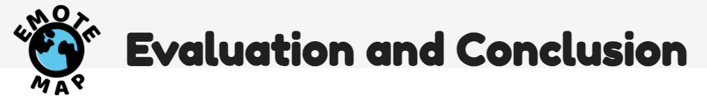

## Table of contents
1. [Evaluation](#eval)
* [a) Methodology](#method)
* [b) Timeline of Evaluation Methods](#timeline)
* [c) More Limitations: Sample Size](#success)

2. [Conclusion](#conc)
* [a) Reflection on Working Practices](#working)
* [b) How Successful was our Project?](#success)
* [c) How did COVID effect our Work?](#covid)
* [d) Discussion of Social and Ethical Implications](#ethical)
* [e) Discussion of Future Work](#future)

# EVALUATION

# a) Methodology

In our evaluation we discuss our methods of gathering feedback data from users throughout the development process. In order to evaluate how our product would be received by users we used five techniques throughout the process; paper prototyping, wireframing, an idea matrix, questionnaires, and semi-structured interviews. Firstly, In our methodology, we expand on the five techniques used, explaining how we carried them out and interpreted them as a group. Secondly, we put together a Timeline of Evaluation Methods where we walk through the decision making process for our unique design model, from Early Ideation and Paper Prototyping on 21/2/21 to Presenting our Webpage to users on a local host on 5/4/21. We also touch on the interdependence of the evaluation techniques in this section. We mention various limitations that arose with certain evaluation techniques throughout the first two sections of the Evaluation. However, there is a third and final section to the Evaluation that discusses the potential argument that our sample size when conducting user feedback was a limitation.

### Evaluation Technique 1: Paper prototyping

This process involved drawing our first interpretations of what we envisaged our website to look like on paper and then showing and observing potential users' interaction with it. The process of paper prototyping involved three roles..

**1. User:**
*The user was the person that would be trying the system and saying out loud what they were thinking as they tried to navigate the paper prototype*

**2. Observer:**
*This person watched from a distance and did not interact or say anything to other people taking part in the process. However, they maintained an important role in taking notes on any critical incidents during the paper prototyping process. Thanks to the observer, we could make decisions with regards to  parts of our early designs that strongly effected the usability of our design.*

**3. Facilitator:**
*This person acted as the leader of the process, guiding the user through the prototype and asking key questions along the way. It was their job to encourage the user to think aloud by asking questions about their thought pattern, such as "Do you know what is going on at this point?" or "What would you do next now that you are on the Sign Up page?". Perhaps if the user was stuck (which happened a lot at the stage of paper prototyping, as the hand drawn interface was not the clearest!), "Do you find anything here useful, in terms of figuring out what you would like to do next?"*

A limitation here was the impact of social distancing. Members of our team were only able to work with two family members or housemates. Despite emphasising to any one participating to act as neutrally as possible, it  can be argued that the people who lived with us would naturally be impartial. Because we needed the user to be as truthful as possible when providing us feedback to do with our design, this could therefore be seen as a limiting factor.

To learn more about how our paper prototyping allowed us to, at a very early stage, obtain our first UX feedback and its essential role in our early ideation see the [UX section](uxDesign.md) , where we give specific examples of user preferences after seeing our paper prototype which then went on to influence our design process.

### Evaluation Technique 2: Wireframing

Wireframing enabled us to create an interactive version of our undeveloped website that users could access on a desktop easily through a link [like this one](https://zaki744910.invisionapp.com/console/share/4Y2FIC1NV7/584973219). For example, we could draw parts of the website that we had not yet built on screenshots of the website as it looked at the time.

Please see our [UX section](uxDesign.md) where we discuss how users were able to engage with our wireframe, and could even leave comments as feedback.    

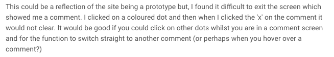

As demonstrated by the screenshot of some feedback a user left, a limitation that we experienced when sending out the link to users can be seen. In this case, the 'x' on the comment that they are referring to was part of the screenshot of the webpage that we had uploaded as part of wireframe. Thus, this user did not understand the concept of a wireframe and thought that it was more interactive and accurate than it was. Due to the fact that some users thought  the wireframe should work in the same way as the website would, we recognise that perhaps we should have either been clearer when sending out the message with the link in or carried out more guided walkthroughs of the wireframe in order to avoid this issue.    

Below is a screenshot of a text we sent to people who agreed to look at our wireframe and then fill out a questionnaire.

### Evaluation Technique 3: Idea Matrix

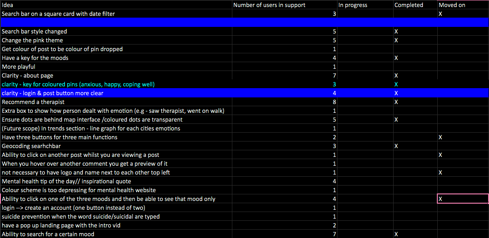

Another method we used in evaluating our designs was an idea matrix. This was an excel spreadsheet that came to be extremely useful in prioritising user suggestions and thus which changes we were going to make to the website throughout the development process.

### Evaluation Technique 4: Questionnaires

Our group used questionnaires as the main form of quantitative feedback as we were able to send a link such as [this one](https://www.smartsurvey.co.uk/s/S58J8X/), to users who had recently used our wireframe or been shown our most up to date website on a local host. This way, we could gain insights at scale into how users interpreted our website. Users answered questions such as "Would you recommend this product to a friend?", "Do you think this website is solving a serious problem?" or "How would you improve this website?".

In total we produced three questionnaires. The first two were sent to users alongside the wireframes and the last one was filled out by users after they had used the website on a local host. The last two questionnaires asked the same questions as the first, but we improved it slightly. For example, we added a 'if not, why not' option to answers that currently only included 'yes' and 'no'. This way we were not forcing the user to spend a large amount of their time on it but still gave them the option to leave more detailed feedback if they wished.

*Here are links to all three of our questionnaires if you are interested:  
note: the 2nd and 3rd show the mentioned improvement in questions*  
 [1st questionnaire (1st wireframe)](https://www.smartsurvey.co.uk/s/S58J8X/)  
 [2nd questionnaire (2nd wireframe)](https://www.smartsurvey.co.uk/s/S58J8X/)  
 [3rd questionnaire (Our most up to date website shown on a local host)](https://www.smartsurvey.co.uk/s/S58J8X/)

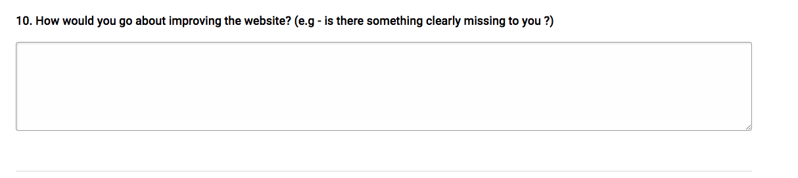

The questionnaires themselves did in fact hold a qualitative functionality to them. This was mainly in two of the questions, seen above, where we prompted the user for a response.

### Evaluation Technique 5: Semi-structured interviews

We carried out semi-structured interviews as a method of gathering qualitative feedback data. Our interviews were on average 10 minutes long and were conducted after someone had interacted with our paper prototype, a wireframe, or the most up to date version on a local host. The questions we asked in each interview varied depending on the stage of the development process that we found ourselves at. We were able to ask very specific questions about our UX this way. For example, at a relatively early stage of the development process we were trying to decide whether to have the post landing page appear from the left hand side. As seen by the images to the right , we were able to show the user two potential layouts that we sketched on the website [Invision](https://www.invisionapp.com). Being able hear their reasons behind their decisions about our user interface was extremely useful.

On top of this, we would always ensure that we asked a general and open ended question at the end of the interview about how the user thought we could improve the user experience as it was, or if they had any ideas. That being said, something extremely insightful that we noticed when conducting interviews was that the user would constantly be making comments about how they would want the website to be improved as they were interacting with the wireframe or prototype. Due to the fact
that we recorded the audio to our interviews, we were able to make use out of any suggestions.

# b) Timeline of Evaluation Methods
Below is a timeline of our user testing techniques. The read lines show the interdependence of techniques on one another.

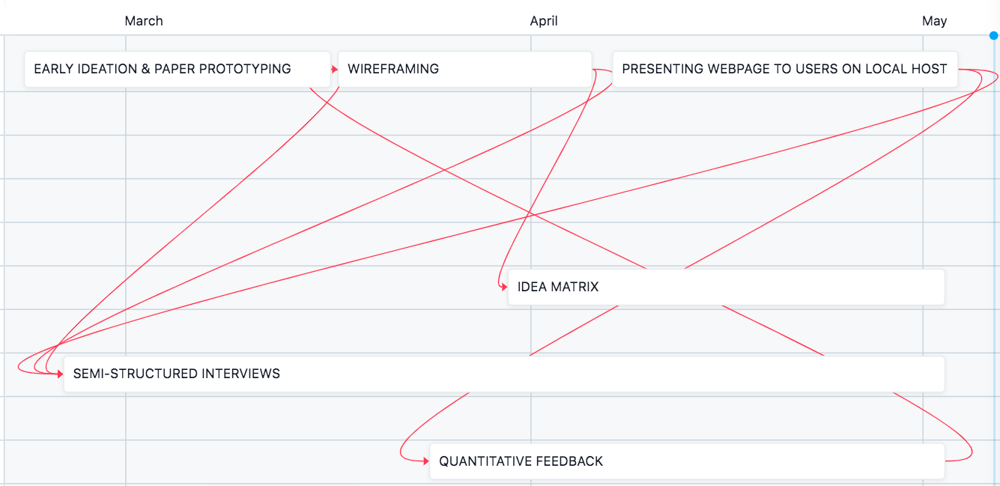

### Stage 1: Early Ideation & Paper Prototyping 21/2/21
21/2/21: Paper prototyping was a key part of getting our idea off the ground and taking an abstract concept in our heads to a more consolidated one. Although our idea of how the website would look was completely premature, this was our first attempt at getting a feel for how users would interact with the website. Users were able to give us a sense of direction in this way before we started coding anything

24/2/21: Paper prototyping naturally led us to start conducting semi-structured interviews. The process of paper prototyping, as explained above, somewhat resembled the process of an interview. As a group, we ensured that we conducted such interviews with people after they had undergone the paper prototyping from this date onwards. This method of qualitative evaluation continued throughout the rest of our development process, being conducted with users after they had seen the wireframe or been shown the most up to date version of the website on a local host.

### Stage 2: Move to Wireframing 17/3/21

17/3/21: So far, our evaluation was based on feedback from users who had only seen our ideas written on paper. At the point that we had built the first map interface (see sprint 3 in the [Project Management and Development section](sprints.md) part we were able to take our prototyping one step further by showing them a wireframe where we were able to make the undeveloped website look as it would do in the future. We decided to use a wireframe because it allowed us to evaluate how users thought of our design before it was actually coded.

5/4/21: There reached a point where our first wireframe became out of date in relation to the level of development of the website. At the same time, we felt that the website was too undeveloped to be used by users. Therefore, we built a second wireframe so we could continue to evaluate our website against user preferences which enabled us to gain feedback from users at different stages during the development process as we built our website ahead of time.

### Stage 3: Quantitative Feedback Involvement 24/3/21
24/3/21: Although we felt that interviews were a good source of creating qualitative feedback, we made a decision to try and increase our sample size when it came to evaluating our product and attempt to create some quantitative feedback. In order to achieve a quantitative metric for how a user would feel about our product, we decided it was necessary to ask some 'how much' and 'how many' questions at scale to our users. Very shortly after we started showing our first wireframe to users, we created a questionnaire that we could send alongside the link to the wireframe. We tried to push the quantitative aspect of the questionnaires by using 5 point likert scale, as seen in the above figure. For example, in improving our first questionnaire to our second one,  ensured that we reflected the different points on the scale itself, instead of having just numbers. For example as possible choices to the question 'How playful did you find this website?', instead of just having options 1-5, we would have:        
1 - not playful at all  
2 - not very playful  
3 - somewhat playful  
4 - very playful  
5 - extremely playful  

### Stage 4: Idea Matrix  30/3/21
30/3/21: Shortly after we started collecting quantitative data, we decided that it would be effective to create a method by which we could better draw insights from it. We made this decision because at this point we had received many suggestions from users in terms of how we could improve the user interface of our design. In this way we were able to populate the idea matrix with the recorded feedback data from both the questionnaires and semi-structured interviews.

Although the idea matrix complemented both the semi-structured interview feedback and the questionnaire data, we found that it was particularly useful for the last question on the questionnaire: "How would you go about improving the website?(e.g - is there something missing to you?)"

### Stage 5: Presenting Webpage to Users on Local Host 5/4/21

We continued using wireframes as a method of evaluation for our designs until our website was functional enough to show users via a local host. We felt that our website was developed enough by 27/3/21 (see sprint 3 in the sprints section for more information on exactly how developed the website was at this point). However there was a period where all team members were busy which meant that we conducted interviews and collected questionnaire responses for the users that were shown the webpage on the local host slightly later than expected.    

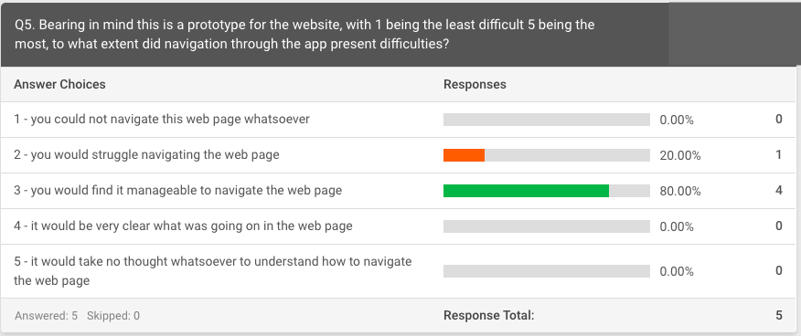

For our group, we found this stage particularly significant as our design involved the navigation of a map, and the creation of a post which contained a personal message. Due to this nature of our design, there is quite a personalised element to how a user interacts with it. Thus, for our user feedback to be more accurate and meaningful, having users experience the actual website was significant to evaluating and improving our designs in the development process. In agreement with this, we found that users found it much easier to navigate the website in this way, as opposed to using the wireframe. See the screenshot above which shows the feedback from the last two questionnaires which proves this.

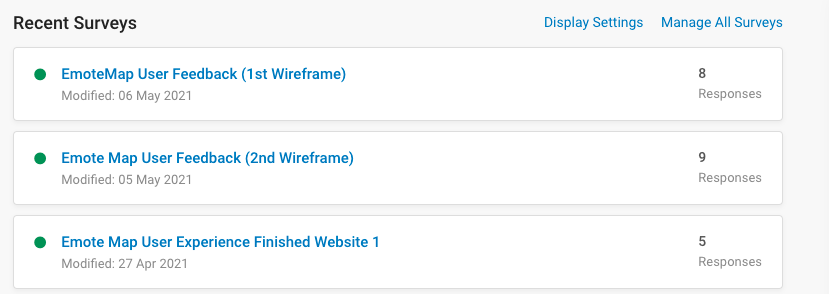

Another possible limitation to our evaluation was our inability to show enough users our most up to date version of the product when we moved to doing so on a local host as opposed to a wireframe. In order to do this, we would need to either show someone in person or organise a Microsoft Teams or Zoom meeting which proved time consuming and less successful when it came to quantitative data collection. It was much easier for a user to use the link to a wireframe and then fill out the questionnaire. As seen in the image to the left, this is demonstrated by the fact that we had an average of 8.5 responses for the first two wireframes, as opposed to 5 for the final one. This being said, all the users who carried out a questionnaire had been shown the website personally, and also been interviewed. As a result, this user feedback was of greater richness and therefore the qualitative element of it was more valuable.

# c) More Limitations: Sample Size

### How we calculated our target sample size

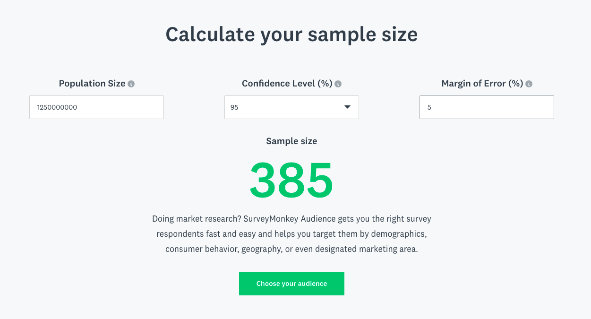

Our target market was any person, male or female, who had access to both a computer and the Internet. After trying to find a statistic online we realised that the number of this population could only be approximated, and also depends on what is defined as a computer. The website InternetWorldStats.com estimates that 2.5 billion people are Internet users and thus have access to it via a mobile device or a computer. We guessed that of those 2.5 billion people, half were accessing via a computer. It can be argued that this guess in itself is a limitation

### How we calculated our sample size
Questionnaires completed: 22    
Semi-structured interviews conducted: 9    
Totals sample size: 31

### Sample size limitation
We used Survey Monkey's sample size calculator to estimate our sample size. This forced us to think about the population that may be using our product and therefore question how big our market was. Considering our end users in this way made us contemplate how much feedback data was 'enough'.  As calculated in the sections above, our sample size was 31 whilst our target sample size was 385. Although we did not reach the ideal sample size, we realised that, ultimately, we could only analyse the data that we could gather. This shortfall of responders therefore makes it difficult to be certain of our analysis at this point. Although our sample size could have been higher, we followed the notion that when carrying out our evaluation we would balance richness with practicality. When gathering our feedback data we constantly considered how we would go on to analyse that data for two main purposes; firstly, figuring out what users wanted so we could reflect this in our development process and secondly, how we could analyse that data at the end of our project in order to conclude how successful we were in terms of achieving the original goals that we set out to achieve (see these in our [Introduction](introSect.md)). In order to thoroughly and accurately analyse our data in a just way, we dedicated time. As a result of this, we at some points opted to collect a smaller amount of qualitative data which we could analyse robustly. For example, although carrying out qualitative user feedback such as semi-structured interviews was time-consuming as we needed to spend time re-listening to the audio and extracting the relevant responses to questions before entering this feedback data into the idea matrix. We still decided to do this as we would understand on a more detailed level what users preferred when experiencing our product. Ultimately, although our feedback data lacked in terms of sample size because of this, we were able to make the analysis of the data much richer.    

# CONCLUSION

# a)Reflection on Working Practices

Taken as a whole, we worked quite effectively as team, with the clear team roles and constant communication over discord helping greatly in facilitating collaboration and continuous integration, as we were very quickly able to discuss issues and solutions, and delegate who should should be tasked with implementing those solutions.

As discussed in our [Project Management & development process](sprints.md) document, the use of discord channels greatly aided discussion as we were able to keep focused the discussion on disperate elements of the project, instead of having one chat where everything was lumped into one place, meaning that we were able to keep track of and refer to implementation issues in specific areas.

The agile design process was especially useful in making sure that our project remained focused and kept to the brief; for example as discussed in our [UX Design](uxDesign.md) document, the feedback from our constant user testing resulted in us adding valuable features like the about page and the welcome pop up for new users. On reflection however we realised that we did not stick as rigidly to this design methodology as we had initially set out to; part of this was due to the impact of covid-19, which we discuss below, but also partly due to a lack of discipline; instead of regular calls/meetings, we instead focused more on chat messages. Although we were discussing and collaborating constantly in this way, the nature of text messages resulted in unnecessary miscommunication - for example during the project write up on multiple occasions we overlapped on which areas a specific person was focusing on writing, leading to a duplication of work in some instances. In future work, we agreed that we would timetable more regular and structured meetings to alleviate these issues. Again see our [Project Management](sprints.md) document for some further problems we encountered with the agile development process.

We did have issues in the first couple of sprints around effectively using github and angular, as most of the team were still getting to grips with both technologies; on multiple occasions we lost progress due to people forgetting to fetch before they pulled, meaning when they pushed, old versions of files overwrote some changes! Once we implemented a rigid process of fetching and pulling from our repository before and after every local change, these issues subsided, although because of the aforementioned issues with relying on text chat over videos calls, it took longer than strictly necessary to communicate this process effectively to the whole team.

# b)How Successful was our Project?

### Did we meet the brief?
Broadly, we would argue that our project has been a success, both in meeting the brief although more so in some areas than others. The project brief was to develop a web app around the concept of 'serious play'; in our case we took that to mean bringing attention to a real world problem in a new and engaging way, along with the perhaps enabling ways to address the problem.

### Did our product address 'serious play'?

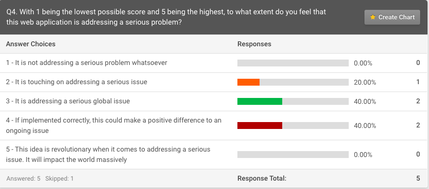
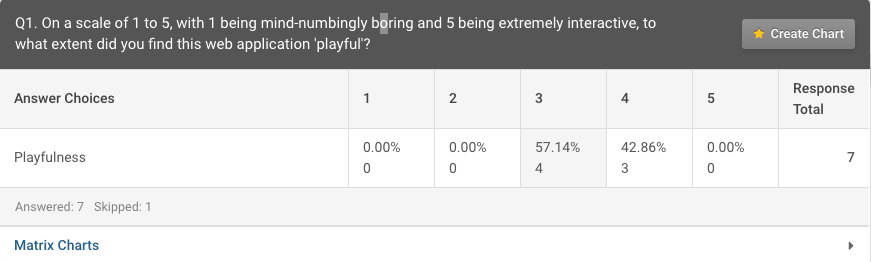

As a team, we view the display of emotion via a map a novel and interactive way to learn about mental health issues, and think that the application in its current state, once it has more users, has great potential to facilitate the sharing of emotions on a larger scale.    

Feedback we collected broadly agreed with us, with 100% of responses to our minimal viable product (MVP) website rating our website 3/5 or higher on a scale with 1 representing "mind-numbingly boring" and 5 being "extremely interactive", when asked how playful our website is. Similarly, when asked if our website was addressing a serious problem on a scale of 5, 100% ranked the website 3/5 or higher.

### Did we meet our own objectives?

#### Objective 1: 'Create a writing tool that allows self-reflection in a similar way to blogging'

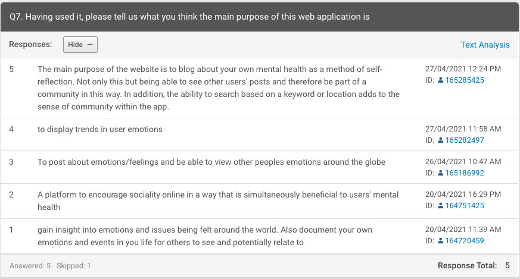
We would argue that our project was very successful in meeting this goal; even disregarding the map element of our website, the app allows users a clear way to make a 'blog post', and has a dated timeline/history of all previous posts, essentially providing the function of a virtual diary. User feedback exemplifies this, in the image to the right we see that when asked what they thought the main purpose of the website was, 60% of users mentioned something about documenting, posting, or blogging about their mental health. One user stated explicitly that they thought using this writing tool was for the purpose of self-reflection.  The mapping and mood elements actually provide additional functionality, with users able to see their emotion and location for each 'blog' post they have made - we argue that this could make our website better than a traditional diary/blogging service for facilitating self-reflection. However, our user feedback suggests that most people would not user our website in this way; only 20% of people were most likely to use the website for blogging purposes, although this does not mean that users wouldn't use it for this purpose, just that they found the other features more engaging.

#### Objective 2: 'Create a peer-led support network where users can interact with each other as a community'

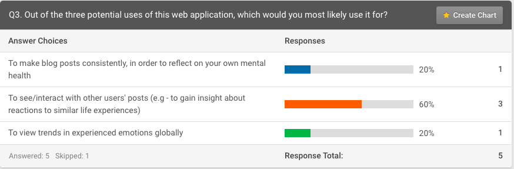
For this objective we did achieve some level of success, with some caveats. Our most recent feedback data, for our most developed version of our MVP suggested that this objective was achieved to some extent; 60% of users said they were most likely to use the website "To see/interact with other users' posts (e.g - to gain insight about reactions to similar life experiences)". Users therefore express that they can see themselves using the product in a social way which also further supports us achieving success in creating a playful application; users wanted to use the website to engage with with peoples emotions and experiences!    

However we would argue that beyond the camaraderie provided by seeing other users experiencing similar emotions, in its current state our website does not provide much, if any, interaction between users beyond this. In the future work section below we discuss some ideas for features that would help us better achieve this objective.

#### Objective 3: 'Create a tool that raises awareness and information through a visual heat-map'
There are clearly improvements to be made in achieving this objective. Though the current map display makes it clear where people are feeling 'happy' or 'sad', it is less successful at presenting the reason FOR these broader trends. Though users can hover over posts to see the reason for a particular rating, our website does not currently coalesce these reasons. Adding this broader trend element would make our website more playful, and greatly improve the extent to which we met our 3rd objective -  "creating a tool that raises awareness and information through a visual heat-map based on an accumulation of users' mental health in different geolocations" - however we would still argue that our user feedback suggests we did achieve some success in meeting this goal. We also were clearly successful in this goal in terms of technical achievement; our website does have a visual heat-map effect displaying trends in user emotions.

# c)How did COVID-19 effect our Work?

The COVID-19 pandemic has had a massive impact on the world. The associated deaths, impact on the economy and the isolation caused by national lock downs have shook the planet. Unsurprisingly our project, team and its members have also been impacted by it's effects. Aside from the negative mental effects caused by the general panic and devistation happening around the world 2 main factors have impacted our group and it's dynamics:

**Absence of face to face interaction:** Throughout the entirety of this project the UK has been in some degree of national lock down. Due to this, it has not been possible for the team to meet up in person, therefore all interaction within the team has taken place online. In fact throughout the project not one member had met another in person. This has presented challenges. The absence of face to face interaction has made it more difficult to form personal bonds which can help drive team morale and motivation. On top of this being limited to online interaction has meant tasks can tend to take longer as it is slower to bounce ideas off each other. To counteract this, we decided early on how we would collaborate and set up the infrastructure we would would require to do so. We each agreed to remain as active as possible on the Discord server to compensate for being unable to meet in person. We also regularly held video calls where all members having their webcam on. We decided as a group that it was essential for team members to use their webcam both to reduce feelings of isolation and to attempt to emulate something closer to human interaction.  

**Isolation:** The national lock downs mentioned previously have left everyone feeling isolated, our team members included. Throughout our course we have had no face to face lectures. This has both affected the quality of teaching and our ability to make friends. With many group members moving into a new city knowing no one and national lock downs making it not possible to meet in person, most group member's lives throughout the project have been limited to being sat at home in front of a computer screen. This isolation has unsurprisingly had a negative effect on our mental health making it more difficult to stay enthusiastic and motivated throughout the project. In an effort to combat this, along with regular contact through discord, we have used our team as a sort of support group. Each member has been supportive of other members offering to discuss any mental health issues other members might be facing.

Obviously COVID-19 has presented many challenges for our team and its members, however we feel we have overcame them as best we could. There is no real way to fully replicate face to face communication, however by keeping all group members in constant contact over Discord, through instant messaging and video chats, we were able to keep everyone involved and engaged. COVID-19 has been difficult for all group members but by using our team as a mental support group we have avoided feelings of complete isolation as all group members were able to talk openly about their feelings without judgment. This non-judgmental discussion really helped all members through this tough time.

# d)Social and Ethical implications

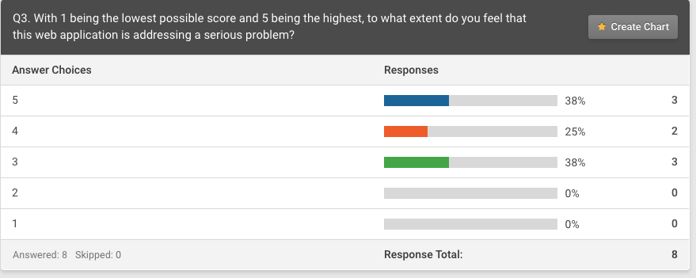
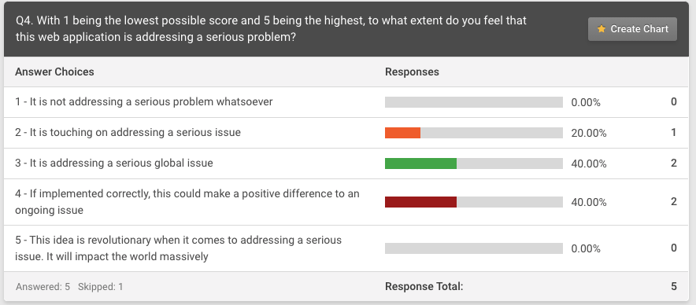

Throughout our development process, we coded the product in a user-centric way. We kept the user at the centre of the project by basing our development decisions on user data. Being data driven in this sense empowered users. (See our [Evaluation](evalSect.md) for more information on the techniques used to do this).  This can be exemplified by some feedback from our three questionnaires throughout the development process. This is demonstrated by the pictures above which show the responses to the question ‘To what extent do you feel that this web application is addressing a serious problem?’ in the questionnaires for the first wireframe and the finished product. Considering that one of our main goals for this project was to solve a serious problem, we aimed was to do this in a user-approved way.    

On top of this, being data driven allowed us to avoid biases to creep in to our development process. Keeping design process user-centric allowed us to prevent any incumbent form taking control and shaping it to their own ends. We seek to maintain this attitude during any further work.

### How will we continue to consider these implications?

We have already started thinking about how we can design our product ethically at scale. Although our sample of users was 31, we believe it is important to consider the ethical implications for our users when there are many more. As EmoteMap’s purpose is to create a community of relatable posts, we want to combat any potential issues that can arise as a result of this. For example suicide communities which can arise in order to encourage methods of taking ones own life are not uncommon on other blogs and online social communities. We would need to put in the necessary regulations as a response to this kind of activity. We are currently thinking about adding a feature in order to flag a post which suggests a suicidal activity and therefore want to have the ability to respond to them. Perhaps this could be done by partnering with suicide prevention organisations to support anyone who may be struggling with suicidal thoughts, as well as resources for concerned friends to respond to and report a post that worries them. If our product was to potentially reach popularity in countries outside the UK, we would need to consider partnering with suicide prevention organisations in the relevant city or country.    

In addition to this, we realise that EmoteMap will be a location of heightened emotions. Although our aim is to help users deal with and cater to their emotions, we understand that as the number of users increases we will inevitably see emotions, such as anger, being expressed. As a result, we seek to acknowledge suggestions of violence on posts through the same flag system, especially those which pose a threat to the user themselves or any other other user.    

EmoteMap understands the significance of the disruptor paradigm in terms of the ethical and social implications of products. As our product evolves in order to meet changing user demands, there will be inevitable  modularisation. In this sense, responsibility of the ethical and social impact of our product would become segmented meaning that multiple parties would be held to account. In an attempt to plan for this issue, EmoteMap seeks to take ultimate responsibility. As a result, if our product comes to be in affiliation with or rely on any third parties, we will consider their conduct as well as our own. This would involve communicating our ethics in order to protect our users too. For example, being open with them about any risks instead of burying them in user licenses. Essentially, our team of 5 will be the point of contact when it comes to such ethical responsibility.  

### Handling of Data
**Data within our system:** Throughout the evaluation process we ensured that any user data was protected. All of the data from questionnaires was anonymised and kept in our account of the Smartsurvey website, which was secured with a password. We also ensured that audio from interviews never left the phone of the interviewer. On top of this, once we analysed the contents of the recorded audio we deleted it. EmoteMap acknowledges that some of the interviewees were particularly vulnerable as they suffering with depression and anxiety. Therefore, their data was particularly important for us to protect.    

**Storing data from user studies:** In order to comply with GDPR, the browser would store the user's JsonWebToken (JWT) and therefore encrypt the user's username and password, storing it in the client's browser when authenticated. This ensures that the browser does not expose their credentials. We used a secret key, which is stored on the server side. The key is one of the components that forms the JWT as it would have to be known in order to decode the JWT token. To find out more about this authentication process please the "Authentication Service" section in our [System Implementation](sysImp.md). On this topic, an area that requires improvement is the user registers. We were not able to hash their passwords, as bcyrpt was having issues with docker meaning that the user's passwords were exposed on the database. We understand this must change in future work, or if we want to take the site live. We also used .env variables to not expose MongoDB connection details on Github.

### EmoteMap's Ethical Principles Ensure That We Will..
1. Deal with users that are harmful to themselves or others    

2. Design with the user in mind   
*we will continue to develop our software in correlation to user testing*  
*we will not allow biases or ulterior motives to cloud the driving force of our product*    

3. Be accountable for the potential spread of responsibility  
*we will take on responsibility for any third parties that*    

4. Build and test for safety  
*We will apply practises to avoid unintended results that may manifest themselves as our product undergoes innovation*    

5. Ensure the privacy of user's data where promised    

# e)Discussion of future work (in terms of design, development and evaluation)

One extension idea we have involves further inter-user interaction and communication in a local area. Here is the idea, demonstrated with an example: 'Bristol is notorious for its limited parking. On a particular residential road, there is a bus stop that has been out-of-service for years. Despite paying for a parking permit, residents have been told that they are not allowed to park on the bus stop even if that means parking on another road. Residents are upset as they often find themselves struggling to park after a busy day at work. Naturally, they individually take to EmoteMap to express their feelings. To their surprise, they discover that others feel the same way. This is because EmoteMap has identified multiple people within an area expressing similar feelings over the same issue. EmoteMap then asks the individuals if they would like to initialise a discussion group, in hope of resolving the local issue.' This extension would involve the ability to identify multiple users within a local area reporting the same issue. Furthermore, some form of chat service would need to be implemented. One way we thought about achieving this functionality would be to essentially run a similar process to our 'search-component' in the background and store any keywords that appear again and again (i.e over a certain threshold) within a set radius. We could then go through the stored timeline of posts for a specific user and notify them/ enable more functionality if their posts contain the keyword; i.e. have a new option on the sidebar that pops up.

At a late stage in our development, one user made an important point on privacy: they were concerned about sharing their location when making an Emote Post. This is a valid concern and we questioned how we may be able to deal with this issue in future development of the project. Submitting Emote Posts without some form of geolocation voids the project's idea entirely. We therefore propose an alternative direction: to give users the ability to pin their posts to an area (such as a district), instead of a precise location. We believe this would be a good balance between privacy, and having the ability to see trends in emotion across different areas of the globe. It would be interesting to survey whether such a feature would encourage those previously concerned over privacy to then use the site.

Another area we would like to improve on on the design side is with regards to gender inclusivity; at the moment our website only accepts the male & female genders, but with more time we could either implement a more inclusive system, including a non-binary option perhaps, or maybe retool the search system to work on different user characteristics; building upon the privacy aspect mentioned above and move away from collecting personal information and focus more on the emotions people write about.

In the development for this project we established a locked in process for continuous development and integration a bit later than was ideal, so for future work, with the team now much more well versed in github and the development process we would include and build upon the testing process in [our test plan](/src/app/test_plan.txt) from the very first step of building any new features. With regards to this, we would also like to include some functional testing; due to time constraints during the development period for this project we were only able to carry out functional testing; for future features we would use unit testing, utilising angular's built in .spec files, [Karma](https://karma-runner.github.io/latest/index.html) and testing features from `@angular/core/testing` to automatically test new components. This would greatly aid with bug fixing as we would be able to much more quickly find and fix specific problem areas in the code.
