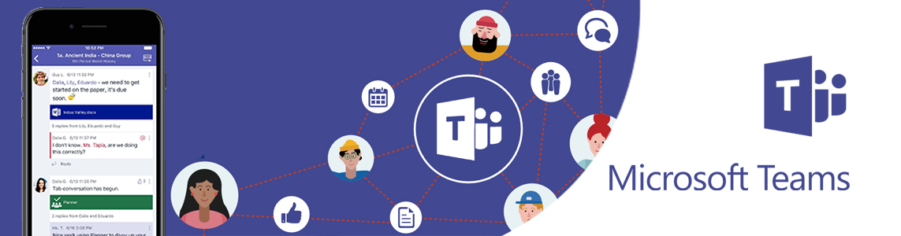
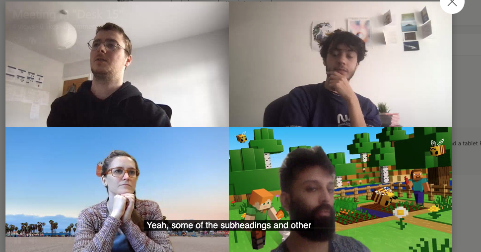

## Table of contents

* [Group working methods used](#first)
* [Discussion of team roles](#second)
* [Documentation of our sprints](#third)
* [Git and continuous integration](#fourth)

## Group collaboration strategy

### Communication infrastructure

Due to COVID-19 we were unable to meet up in person, this made it extremely important to keep every group member engaged and involved throughout project. Effective communication online is underpinned by the platform used. At a bare minimum we needed to be able to instantly message, send files and send pictures amongst the group.

The two tools that the group was familiar with and facilitate these needs were [Microsoft Teams](https://www.microsoft.com/en-ww/microsoft-teams/group-chat-software) and [Discord](https://discord.com/). Both platforms offer [similar features](https://droplr.com/how-to/productivity-tools/discord-vs-microsoft-teams/). Microsoft Teams allows for sharing of larger files however this was not a concern of ours given the majority of our file sharing was done on github. We chose to use Discord as our main platform for communication primarily because we preferred the GUI and were familiar with the platform having used it in the past. However we did also make use of Microsoft Teams.

Teams was useful for allowing us to receive feedback from our lectures on the Thursday sessions. We also used teams to host our scrum video meetings.
  
  

  
  

The advantages of Microsoft Teams:

* We could record meetings, and that allowed us to review advice given to us. For example Allison offered some feedback on our report and how we could improve it as well as clarifying certain elements of the mark scheme. A couple of team members were unable to attend the meeting however they were able to re-watch the video.  

* Microsoft Teams was also used to share code via sharing screens. For example, there was a time when Hari explained how the routing of the API should be structured. We had a meeting where he shared his screen so members could understand how routing works with ExpressJs. This was very useful as we were unable to discuss the code face to face due to COVID-19, and really sped up development time. This was particularly useful for demonstrating new features to the group before agreeing to make a push or demonstrating issues with the site. Another example when this came in handy is when Tarn discovered that our site didn't function properly on his larger screen. He was able to demonstrate this to the group via screen share so it could be fixed.

The disadvantages of Microsoft Teams:

* The UI was not as satisfying to use when compared to discord.

* Teams felt less responsive and smooth than discord.

* We were more familiar with discord than Microsoft Teams.

[Discord](https://discord.com/) is a free instant messaging platform where users can communicate through messages, voice calls and video calls, send files and more. Users can also set up private chat "servers" which can be divided into specific chat rooms.

We set up a private server on Discord right at the start of the project. We found the following features particularly useful throughout our project:

**Specific chat rooms:** Initially we had one chat thread but as the project progressed we created more specific channels as previous messages were getting difficult to find.  When using a single chat thread team members would also miss important conversations. This prompted us to better organise our methods of communication. 

  

  
  

Having the group chat divided into specific areas kept our workflow and ideas organised. If we were looking for a particular file or idea we had previously mentioned we could look under the relevant area instead of trawling through one massive chat. Specific chats also enhanced our workflow. For example when our team split having 2 working on the front end and 2 on the back end we each used the corresponding chat. This meant that the team working on the front end wouldn't have to waste time reading irrelevant messages on the backend and visa versa which saved time.

**Message pinning:** Discord has a feature where you can pin messages. These messages are then saved to the pinned messages in the chat they were sent and can be viewed easily. This came in handy when we wanted to save a particular idea or link and because pinned messages were specific to each chat they were especially easy to find. For example when formulating initial project ideas we wrote a description of each idea and pinned it to the chat for reference. Without this feature these ideas would have had to be put together on a separate document to avoid them being potentially lost. Another important use of pinning was to save the important documentation required for both the back and front end. For example we could go to the pins on the front end chat and instantly see the documentation relating to marker implementation using GeoJson.

  

  
  

**Keyword searching:** Discord allows you to search chats for messages by keyword returning any message featuring the entered keyword along with the position in the chat it appears. This saved time when looking for certain parts of our discussions that we may not have pinned as we didn't realise they would be useful later on. This feature was particularly useful when working on the write up. We had documented most key points throughout our project but for ones we had missed it was simple to look them up. For example finding our discussions regarding Mapbox was as simple as searching in 'Mapbox' and we would have all parts of the chat where this word was mentioned.

  

  
  

We did notice some disadvantages to using discord:
  
* Unable to share videos.
* Unable to share screens.
* The video chat is very basic in comparison to teams.

We used Discord as our primary platform for text communication but used Microsoft Teams for video calls. Using a combination of these two meant we got the benefits of the fast and smooth GUI of Discord along with the superior video chat features provided by Microsoft Teams.

### Workflow strategy

With the ongoing COVID-19 lock downs and other modules requiring attention, we knew our workflow strategy had to be flexible. We wanted our website to be as user driven as possible and given the short time frame it was essential that we had user feedback throughout the design process. For both these reasons we chose to adopt the agile framework.

### [Agile](https://en.wikipedia.org/wiki/Agile_software_development)
  
  

  
  

It was suggested by our professors that Agile software development would be an adequate way of developing this project. Agile software development refers to software development methodologies which are based around an iterative design process where in each iteration stakeholder input is incorporated. This method provides frequent delivery of small portions of functionality, each portion being fitting with stakeholder requirements.

Aside from the data analyist, the primary stakeholder we considered in our project was the end user. Therefore all feedback at each iteration came from user surveys and interviews. As documented in the sprints and [UX](uxDesign.md) at each stage of the development process we set goals based upon feedback collected in the last sprint. Once we had implemented the features described by our sprint goals we then repeated the process, evaluating what we had done and getting more user feedback.

This flexible but clearly defined process of developing, evaluating then setting out goals provided the following benefits:

* **Each element of functionality well thought out:** Every time a new feature was implemented it was thoroughly reviewed by both the group and end users before it could be finalised. It required us to make small commits, to ensure the code worked and was well tested thoroughly. This meant that every feature of the end product was well thought out and user approved.

* **Encouraged regular and more productive meetups:** Given the time constraints from both the project deadline and work from other modules, it was important to keep meetings productive and not get sidetracked. Basing design decisions heavily on user feedback meant every video call had a purpose. Agile development hinders on "Face-Face" communication. Fresh user feedback and having each individually reviewed the relevant features before each meeting meant there was always useful content to be discussed. From the start of the sprints we set up biweekly meetings. We would have the meetings at the end of the Group Project lectures. Initially this enabled us to act on the advice given by our professors and ask them questions in our meeting room. We also felt this was a good time to have these meetings because the content was fresh in our minds. We could come up with suggestions of how to proceed with the rest of the week while with the structure the module in mind. These meetings gave us time to look back and reflect upon our progress, identify weaknesses and issues within the project, allow team members to voice their opinion and offer suggestions and set goals for the remaining week or until the next meeting. If we felt they were no important issues or change in our project we would decide not to meet until the next scrum.

* **Avoids final product being unfinished / not user friendly:** Constant feature creation and reviewal meant at each stage we added fully functional features. Working on smaller goals as opposed to thinking of the final product and having a lot of features as a work in progress meant we had a better idea of realistic time frames. This allowed us to know what features we would be able to implement in the limited time frame. This meant we didn't become over ambitious and end up getting to the hand in date with an unfinished product. Working on smaller, well refined and fully functional features also meant if we did run out of time we would still have something to show for our work.

Its also worth mentioning the disadvantages we discovered while using this this method:

* **Long development time:** Occasionally some components would take a while to develop. After an interaction, user feedback was not instant, meaning we had to move onto other aspects of the software.

* **No structure to the project:**  There were times where we were unsure when the project will finish. If we used a more rigid method, we could set this time for ourselves. However, iterations were unpredictable. This did cause some anxiety in the project. A large chunk of your project is dependent on an external partner/client. That brings a sense of unpredictability.

  

  
  

## Discussion of team roles

Specialisation and utilising individual's strengths is an extremely important part in getting the best out of a team. For this reason we decided to discuss team roles early on. Our team was made up from a variety of different academic backgrounds, from anthropology to engineering, with some members strengths leaning towards the numerical and logic side of the spectrum and others in the direction of research and writing. These factors along with personal preference and discussion guided use towards choosing our individual roles. Although we agreed these roles would be flexible where need be, we felt it made sense to specialise early as to not waste time researching areas that could be covered by other members. This was a tactical decision as given the time constraints it was unrealistic for all members to learn the full stack.

Individual member contributions:

### Edward

In this project I carried out two main roles; foremost was working on the frontend, specifically in the mapbox implementation; after we picked the mapbox API to display a map on our website, I read through the mapbox documentation and examples and implemented and adapted the heatmap example, and added in the pop up functionality, as described in our [System Implementation](sysImp.md) document. I was also responsible for the initial implementation of an api to fetch data into the mapbox api, though this was quickly and heavily further developed by Hari. As well as this, I also created the `postbutton.component`, and the initial implementation of the `userpost.component` utilising angular forms and dialogs.

The other role I fulfilled was project management, both on a coding and teamwork basis; I was responsible for implementing elements from the boilerplate code into our website, i.e. setting up docker-compatibility and `server.js`. On the teamwork side, I overviewed the projects progress and helped make sure we were working towards the goals set out in the mark scheme and that each team member had something to be working on at each stage in the development process. I was also responsible for the structure and initial design and set up of our github report.

### Alfie

Along with contributing to the sprints section of the write up, my primary focus was on the backend of the website, most notably working with mongoDB. When we initially got our map working we used some example data from a https link provided by mapbox. I downloaded the example data to our project file and served it from there. After having done this I then set up new MongoDb account and help Hari on the backend.

One other feature I implemented was the frontend component of the basic search bar. This allowed non-authenicated users to enter a keyword and all posts featuring something similar to the entered keyword would be logged to the console. This however was scrapped, as we made a complex search feature for authenticated users only.

Although my contribution to writing actual source code was less when compared to some group members, throughout the project I played an important role in discussion and formulation of ideas and remained as active as possible on our Discord server.

### Hari

I was the leader of the project. I instilled an initial vision for how the application concept be. I was explict to my team on the way we should go about building the application. I assigned team members tasks to do when developing the app, while offering advice when asked at how to get something to work in the code. I also, helped oversee the write up, offering feedback and extra things I thought should have been mentioned in the documentation, as well as writing the system implementation section.

My main task was building the application, and ensuring its quality. I got the initial prototypes working in the browser to give the team an idea of how the app will look on the computer. I then lead the development for the backend, defining the routes and the initialization of the Express app as well as the MongoDB schemas. I also worked on the front end. I was responsible for the styling of the application with css. I also implemented of the services and defined interfaces in the model's folder. I also implemented the user authentication, the user-search functionality, as well as the following components: login, signup, descript-popup, sidebar, toolbar, user, user-search, userpost, userpost-display, usersearch-display, and setting up the routing and allowing the data to flow dynamically between the full stack. I helped develop some functionality in Mapbox, like rendering different data streams on the map (from post and search service), as well as implementing the fly function.

### Tarn

During the development of the application, I took on a front-end role. For example, I wrote, designed and built the 'about' section of the application. I also designed the icons found in the map's 'key', as well building the feature itself. Another contribution I made to the project was concept development; the original proposed idea was very similiar, but involved writing longer journal-like posts. It was my idea to instead shorten these into quick and easy-to-read updates. I also recorded and produced the trailer/overview video of the application. Finally, I was responsible for writing the 'user experience' part of the write-up.

### Zaki

## Pre-sprint idea formulation

This time was used to get to know the other group members and project brief itself. Having all come from different backgrounds a lot of varied and interesting project ideas were put forward. After some discussion we drafted up 4 potential ideas:

**Higher or lower:** A simple game in which the user was asked which was item is "higher or lower", if they get the answer correct they are given a fact about the item which was lower. The questions could be on a wide variety of topics from population size to song release dates. When the correct answer is selected the user is given a fact about one of the items. The intention of this game was to be addictive, fun and educational.

**Altitude explorer:** A 2D platformer game with similar mechanics to the app [Doodle Jump](https://apps.apple.com/gb/app/doodle-jump/id307727765) but the user explores different altitudes on earth and in space. The player starts at the bottom of the sea and works their way up into space. As they travel up through different levels they learn facts about what is present at each altitude. For example at 10,927m below sea level the user would be told that this was the deepest manned sea dive ever recorded or at 10,668m above sea level they would be informed that this is the average height at which passenger planes fly. As the user went higher they would then learn about different planets and objects in space. Similar to the other idea this served to be entertaining but also educational.

**Musical instruments through time:** A web page where users can browse musical instruments through time and when they are clicked the sound of the instrument is played. Aimed to teach users about musical anthropology in an engaging way, an interesting topic which our group consider to be overlooked and undervalued compared to other areas of music.

**EmoteMap:** A geographical diary where users can post diary entries which include their current location. Users can then look on the map at their archived posts and see how they were feeling in certain locations. This website idea aims to help users track and improve upon their mental wellbeing.

A lot of time was spent discussing which project idea to use. The idea needed to be useful, original and also fit the brief. We decided that although we felt all the ideas were good, EmoteMap addressed the particularly relevant issue of mental health and isolation. COVID-19 has left many people isolated and struggling to cope with ongoing lock downs and we felt EmoteMap could help solve this issue.

## Sprints

## Sprint 1: Project idea finalisation & set up CI infrastructure

[15-27th Feb]

After having got to grips with the brief and decided on an idea, this sprint was concerned with putting together an initial paper draft for our website, and setting up all the things we needed to enable continuous development and integration; namely our angular project and our github repository. We also tentatively began to collect feedback on our initial paper prototype designs.

### Meeting log

**[15th Feb]** - This was the first meeting after having agreed upon our project goals. With the whole team attending we used this meeting to scope out exactly what functionality our website would have. A lot of ideas were proposed and bounced around, particularly regarding the GUI of the site; for example we initially envisioned all interaction with the website to take place in section that would slide in from the side. We decided to trial different GUIs using paper prototypes. We also used this time to designate team roles - [Discussion of team roles](#second). The goals we came up for in this period are as follows;

### Sprint aims:

* Clarify project idea and scope
* Create draft of website UX & create paper prototype
* Conduct user survey using paper prototype
* Set up a github repository

This sprint mainly involved discussing what features our website should have and roughly how they might be implemented. We all agreed the webpage's focal point would be a world map in which user posts can be seen and would appear as a heatmap in different colours depending on the mood rating of the post. We also discussed other features such as account creation and post filtering. Being unsure how complex it would be to implement the map we chose to leave these features until after we had implemented the map and posts.

There were some different opinions among the group regarding how the website should be laid-out. Some felt that the login bar should slide in from the side and others felt that a whole new page should open. We decided to draw up paper prototype (see our [UX Design](uxDesign.md) document) of both of these cases and conduct a user study to decide. We wanted our product to be as user driven as possible so getting user feedback early on was crucial. One of our professors also mentioned that having the application being as unique as possible is must.

As well as discussing project ideas this period was used to get familiar with the tech stack we were going to be using and github. We each watched the lectures on Angular and github, set up a shared github repository and got familiar with its protocols by making a few pushes and pulls. Although we intended to specialise into certain areas later on, we all got familiar with the frontend and Angular so further down the line it would be possible to be more flexible if required.

## Sprint 2: Work on feedback + find suitable API

[27th Feb - 10th Mar]

With the scope of the project and the basic functionalities required established, we began building our website. Adding in the outlines of our eventual GUI, deciding on which map api we would use and starting to implement it.

### Meeting log:

With each member assigned and working on a task and being in constant contact through Discord we decided to only meet once during this sprint.

**[29th Mar]** - During this meeting (again the whole team attended) we focused on how we could iterate off of our paper prototype. We agreed for one group member (Zaki) to make some wire frames to be used in a user survey. We also debated which api to use for the map aspect of our idea; although some team members wanted to use google maps, we eventually decided upon the mapbox api, with some of the reasoning discussed later in this sprint. Now that we were also starting to get to grips with angular, we had a more in depth discussion of what features were feasible to produce in the timeframe we had for the project; at this stage Hari was keen on implementing user authentication, but as a group we decided on focusing purely on the map interface at this stage, as we were not sure how much time it would take to add in the features we wanted (we did eventually add in user authentication towards the end of the project). The goals for this period that we decided on are below.

### Sprint aims:

* Review feedback from paper prototyping survey
* Create basic GUI (initially buttons had no functionality)
* Select API for displaying data in a map format
* Integrate Mapbox API

With group members now familiar with Angular and Github we began adding basic, purely visual, features to our site. Results from our paper prototyping survey helped us decide how our GUI should operate. For example, initial feedback suggested users preferred the login page being a separate page, rather than a slide in as we had originally envisioned. We also added a navbar, making use of the angular material toolbar element, to the website which included a mockup of our logo and a home button.

After some research it was apparent that mapbox provided all the functionality we required, with us choosing it over google maps because of its open source nature and large number of styling options, allowing us to more readily make changes as the project developed. Initially, we simply got a basic map to display along with the aforementioned navbar, as at this stage we were still familiarising ourselves with the mapbox api.

At this point in the project we were intending to use this template data from one of the examples from the documentation (the extensive examples being another reason we chose the mapbox api) in our final product as it showcased how our site would look once many posts had been made. With fairly big steps made towards how we would like the finished project to look aesthetically we were now ready to start adding in some of the websites key functionality!

### Key implementation issues found:
<table>
<tr>
  <th>Area</th>
  <th>User Story</th>
  <th>Issue</th>
  <th>Solution</th>
</tr>
<tr>
  <td>Front End</td>
  <td>
  Sarah said she can now see how I can post my emotions on the App! "Hurry up please as I cant use it yet. I need to connect with others and see how others are doing. Also, the map is really buggy, it is not scrolling properly, and it is moving around the screen"
   </td>
  <td>
  Navbar and mapbox component were not interacting nicely, with strange scrolling issues panning around the map. 
  </td>
  <td>
  implement routing using angular so that instead of the toolbar and the map being in the mapbox html, the mapbox is loaded from `app.component.html` using a router outlet. We then fixed the position of the map, and had it under the toolbar. All routing will now be done on the toolbar and replace the map. All components related to the map will now be nested in the mapbox component.
  </td>
</tr>
</table>

## Sprint 3: Serve dummy data from directly from API to frontend + set up data model:

[11th Mar - 27th Mar]

This stage of the project is where we began to implement the key features that we would need later for collecting and sending information to and from the backend; we built what would become `geopost.js`. On the backend, we began building the mongo schemas that we would require to store our post data in later stages. This is also when we established a test process involving docker to facilitate continuous integration. We also began collecting user feedback on our initial boilerplate website.

### Meeting log:

**[11th Mar]** - At this meeting the whole team was present, and we decided use the time to designate key tasks to achieve the key features for the website. One member was allocated the task of conducting a user survey using the wire frames they had put together in the previous sprint (Zaki). The rest of the team was split into two working pairs, 2 on the front end (Ed and Tarn) and 2 on back end (Hari and Alfie). The two on the front end were tasked with integrating a mapbox example from the documentation.

**[22nd Mar] (Back end specifically)** -  The two team members working on the backend (Alfie and Hari) decided to have a meeting to discuss which portions of the backend each would work on. It was decided that Alfie would work towards getting the example data to be served from a local file and Hari would put together the Mongo Schemas, look into MongoDB and Mongoose, and how we would store the geoJSON data required. Here we discussed how we needed to connect MongoDb to our API, and define routes relevant to posts, and fetching GeoJson data from the front end.

### Sprint aims we decided on for this period:

* Collect initial user feedback
* Set up site so dummy data is served through API route + Add linking to front end + making sure data model working in front end
* Build Data Model (user, post) + set up mongo schemas
* Implementing docker functionality for continuous integration
* Begin to implement mapbox heat map example
* Build the EmotePost feature
* Get docker working

The Geopost.js route was initially set up to just serve static dummy data from an external URL - a geoJSON file containing earthquake data from an example in the mapbox api documentation, to the front-end. We then implemented a heatmap template from the mapbox documentation, to both test the api was correctly returning data but also as a base to build off when we add in our own data in later stages; we wanted a heatmap like effect for users emotions rather than earthquake magnitudes! We used Angular's HTTP client to link the GET request to the API URL.

Upon having a team conversation with Marceli, it was recommended that we look into Mongoose as an Object Document Manager to make our lives easier and save time.
After some research, we decided to use Mongoose as the middleman between incoming/outgoing HTTP requests/responses between the API and our database.
The syntax of Mongoose was a lot simpler than raw MongoDb and because of this we were able to build the data models in a shorter time.
Mongoose models are a lot easier to initialize as they are capable of setting up default values automatically, and makes it easy to validate the data with simple commands.
MongoDB is inherently schema-less, however, Mongoose allows the developer to define schemas for their data type. This was used fully at the start as we were able quickly, prototype our data models on the backend. Queries are a lot easier to deal with as they allow functions to chain onto the Model and don't require the embedded mnemonics that MongoDb requires so the developer experience was a lot smoother. This is akin to comparing using C to using Python. While C is more efficient and allows more room for flexibility in our code, Python provides a layer of abstraction that makes it a lot easier for scripting and experimenting with abstract ideas.

We used GeoJson from mapbox to help define and develop our `geoJSON.js` mongo schema; i.e. a data structure that all user posts would follow, including a mood rating, keyword and an explanation (and eventually the username and date/time). We made sure this integrated with the data model of the application. Over the rest of this sprint we also developed a model with the purpose of eventually adding user profiles to the website through our `user.js` model. This contained the revelent data needed for user authentication, and their details. We built the functions in the corresponding route's functionality to process user authentication. We experimented with the models by building multiple Entity-Relationship-Diagrams. We then decided we need this route to also handle post requests from the front-end and store the data in the database. We used the Mongoose Models to design the routes. Defining Interfaces on the front end to match.

On the front end we also need to build the forms that allows the user to post. We decided that the user would click the on a button and the form component will render, saving the users coordinates, so when they post the pin with be saved at their location on the map. We used mat-dialog with a form nested into it.

### Key implementation issues found:

<table>
<tr>
  <th>Area</th>
  <th>User Story</th>
  <th>Issue</th>
  <th>Solution</th>
</tr>
<tr>
  <td>Api/Express</td>
  <td> Sarah will eventually be able to see up to date data on displayed on the map and can add to that data by making a post. "Wow I can now see the application" </td>
  <td>Initially the api returned a url to some data - however whilst we were exploring how to implement our backend, we discovered that serving GeoJson data statically from a external URL source would add unnecessary processing time and be difficult to update with live data; we would have to transfer data from the database into another server, essentially having to call http fetch requests twice, and requiring a refresh to update the data </td>
  <td>We decided to return an array of geoJSON objects from the api (also supported by mapbox), which would allow us to easily update and manipulate the data in memory by using our post-service to send the data to different components, manipulate the array, and eventually send information to the database, and reduce http get and post requests. We defined GeoJson interface on the front end, and used this to convert the data from the backend into GeoJson objects and store that in an array.</td>
</tr>
</table>

## Sprint 4: Set up mongoDB and import dummy data + user authentication

[28th Mar - 10th Apr]

This sprint was where we finally began to pull together the disparate elements of the website; our aims involved connecting the data fetching service to a function backend using HTTP client in Angular, instead of just returning static template data. This is where we also wanted to begin implementing some user feedback based off user questionnaires centred around our initial mockup. We also set a stretch goal of actually adding a user authentication, rather than have the posts be completely anonymous.

### Meeting log:

**[29th Mar] (Backend and frontend)** - As an outcome of this meeting we wanted a list of remaining features that we needed in order to deliver a minimal viable product (see our goals for this sprint). We also wanted to discuss the feedback we had received on the state of the current website (this is discussed in more detail later in the sprint). We also decided at this stage that we would change the the emotion rating from a scale of 1-10 to 3 choices of happy, coping and sad, to make the trends/patterns of emotions on the map be more clear.

**[9th Apr]** - This was a short meeting where the whole team met to discuss their progress. We also used this time to discuss some features we would like to add as extensions to the project, for example, connecting users who post with similar keywords (see our [Evaluation and Conclusion](evalSect.md) document for more detail).

### Our agreed goals for this period were:

* Add the functionality to make posts (i.e. sending data to the front end)
* Begin working on feedback from our user study and lecturers
* Finalize key mapbox api functionality (pop ups when hovering over a point on the map)
* If time permits, add users to the database as well

To implement displaying the post data when a user hovers over a data point on the map required the use of a couple of the features offered by mapbox api. Foremost was labeling the map marker layer with the interactive tag; `this.map.addLayer({ id: 'markers', interactive: true, .....})`. This allows the layer to be interacted with through mouse events. We first had the popup be triggered by clicking on the point, but decided it would be more intuitive for it to appear on a mouse hover; we made use of mapbox's `this.map.on('mouseenter', 'markers', (e)....` command to trigger mapbox's pop up feature, which then displays the data points geoJSON properties - which we are fetching from mongoDB as discussed above.

From our user feedback it was clear that first time users struggled to grasp the point of the website, and in fact some suggested we add a section to explain the site; so we did exactly that! We added an "about" component and a link in the toolbar that users could click through to, to learn more about the website. We also changed our colour scheme to a white toolbar on a black map, rather than pink on white, from feedback from our lecturers, and to make more clear the colourful data points on the map (the colours contrasted the black map far more than the white).

We also finally implemented a user-post component, which allows new data to be added to website; this component makes use of angular forms to collect inputted data, which we then transform into geoJSON format using our post-service, to be added to our database. As we had time at the end of this sprint, we also began to add in actual user functionality to the website, along with the `user.js` route to enable this - the sign up/login buttons on the navbar where changed to actually route through to signup/login pages, which also use angular forms to collect user input and add new users to the database/verify users who are logging in. At this point we developed the `authentication-service` and the `url-state-service` to deal with user authentication on the frontend, and to make the username appear on the toolbar.

Here we also wanted to our application to be compiled through docker. We made sure our server was returning the index.html file. When we set this up there was an issue with docker and bcrypt library (used to hash user passwords). We could not fix this issue, so we had to remove bcrypt from our application, and we decided to leave user  authentication unhashed.

### Key implementation issues found:
<table>
<tr>
  <th>Area</th>
  <th>User Story</th>
  <th>Issue</th>
  <th>Solution</th>
</tr>
<tr>
  <td>Login Route API</td>
  <td>Sarah forgot her password when creating an account, so she had two accounts with the same username stored in our database</td>
  <td>Initially we had it so one the user only had to type their password once when registering. They might have made a typo, and now their password is forgotten. They could also create a user with the same username. However, this is bad as we want each user to have a unique username</td>
  <td>Set up the API so mongoDb makes sure every username in unique in the database. Added a re-type password on the front end to ensure the user enters the correct password</td>
</tr>
<tr>
  <td>Mapbox</td>
  <td>Sarah can hover over points on the map to see more detail, and can create their own posts to add to the map. Christina can now view the heatmap to see the spread over user's emotions with all of the new functionality.</td>
  <td>Initially we had the users click on the marker, however this made the pop-up freeze</td>
  <td>Changed it to use the mapbox hover feature</td>
</tr>
<tr>
  <td>Logging out when refreshing</td>
  <td>Sarah said it was really annoying that every time she refreshed she got logged out.</td>
  <td>What Sarah said</td>
  <td>Every time there was a refresh the authentication lost the JWT,username and auth state. We needed to store this in local storage and fetch every time the application reloaded so she remained logged in.</td>
</tr>
</table>

## Sprint 5 Users enter more details + can filter by them:

[11th Apr - 20th Apr]

In this sprint we aimed to add some of the more complex feature to our website, like searching through posts, and a user being able to view a timeline of the posts they have made, building upon the core foundation of sending and viewing posts we had established by the end of sprint 4. At this stage we also began transitioning from working on the website proper into gathering final user feedback and beginning to write our project report.

### Meeting log:

**[11th Apr]** - At this meeting we again discussed the aforementioned 'more complex features' and decided on the sprint aims below. We also discussed the visual design elements of these new features; initially wanting the user information to be accessible through popups, we decided on displaying it through a sidebar, in order to distinguish it from the popup that appears when a user makes a post; as the user posting was the most important feature we wanted it to be distinct.

**[19th Apr]** - This was our first 'write-up' meeting; though we had been adding small sections to the project report up until this point, we used this meeting to review the current state of our report and delegate tasks; Zaki focusing on the introduction, Tarn the UX, Hari the System Implemention and Ed and Alfie the Sprints and project management (the whole team would work on the evaluation and conclusion).

### Our sprint aims were:

* Users now enter age, gender and can now can be filtered by this (posts linked to user accounts)
* Implement sidebar
* Implement search functionality
* Implement user post history
* At this stage almost feel website is complete. Conduct one last survey for UX
* Users now have to log in to be able to filter results, encourages posting and engaging with site
* Began to start formatting write up/readme

To add more functionality when a user logs in, we implemented a sidebar, the state of which was determined by our `sidebar.service`, which we triggered through button presses in our `sidebar.component.html` and `sidebar.component.ts`. Depending on the state of our `sidebar.service` different visual elements would be displayed; for example if the user clicks the postlist icon, the `userpost-display` component is called, which shows a scrollable timeline of the users post history. Another key aspect was the `usersearch-display` which required extensive use of angular services and api calls to our back end in order to return the correct results - the detailed implementation of this is discussed in our [System Implementation](sysImp.md) document. We also implemented the other services, `user-service`, `user-search-service`. This fetchs data to be displayed on the user timeline, and data the user search for respectivly.

As the website was nearing completion, we carried out a further round of user questionnaires to gather feedback on the final website design, with some of the resulting design changes discussed in our [UX Design](uxDesign.md) document. We also began to start working on the project write up, initially focusing on formatting our README producing a rough outline of the content we needed to fill in.

As the complexity of our project began to grow we decided to implement a test process before each git commit and push, to ensure any local changes made did not break the website, which helped facilitate continuous integration as we were constantly compiling and testing our website after changes, and could be confident that code on the live repository was stable. See [our test plan](/src/app/test_plan.txt) on our repository for details of this testing process.

### Key implementation issues found:
<table>
<tr>
  <th>Area</th>
  <th>User Story</th>
  <th>Issue</th>
  <th>Solution</th>
</tr>
<tr>
  <td>Back-end</td>
  <td>Sarah's age and birthday were not set, however her posts were appearing in the search</td>
  <td>The issue was that our search route was sending values that were null from the database for age an gender in the search component</td>
  <td>We made sure that the api filtered out these result to give a more accurate search result for the end user</td>
</tr>
<tr>
  <td>Front-end</td>
  <td>Website has clear ui; user can easily navigate the website</td>
  <td>We had two components allowing search, one in the sidebar but also a separate component for non-logged in users. We had a lot of difficulty getting this component to position itself on the page correctly, and to get it to not break after a user clicked a button</td>
  <td>We decided to remove the component and only let logged in users search so we didn't have a duplication of functionality. This also made the display of the map clearer for non-logged in users</td>
</tr>
<tr>
  <td>Front-end</td>
  <td>Sarah said that she really likes the time line and the fact she can fly to locations/delete posts</td>
  <td>The posts were in reverse order</td>
  <td>The posts started from oldest to newest, meaning it was reversed. We sorted the posts via data on the backend to display the posts in the correct order.</td>
</tr>
<tr>
  <td>Search data mixing with the normal data initally fetched from database.</td>
  <td>Christine and Dan both noticed that when they were searching for data, it just added duplicated data on the map, meaning the heapmap intensity would get bigger every time</td>
  <td>What Dan and Christine said above, also they keyword search was not in sync with the other search parameters.</td>
  <td>In order to fix this, we needed to stated the map would use to display the two data streams. We also performed the keyword search on the current search data in memory</td>
</tr>
</table>

## Sprint 6 Project Write up:

[21st apr - hand in]

W ith our minimal viable product completed we used this stage to primarily focus on the write up however we were making small changes to design elements as we continued to gather feedback.

### Meeting log:

Most of our communication at this stage was through our discord chat, where we were keeping each other up to date on the progress of our write up sections.

**[27th Apr]** - In this meeting we discussed any final changes we thought we needed to make to the website based on the user feedback (discussed below), and also discussed the structuring of our project write up and its progress.

### Our aims for this sprint;

* Finish the write up
* Implement any final changes

Most of our time for this sprint was spent writing, though again we also spent some time formatting and designing our report, and making UX design changes - for example we changed our login buttons to text instead of icons, as our feedback suggested that users found where to login unclear.

  

  
  

## Team use of Git, how our team used continuous integration / continuous deployment.

Our development process for each sprint first began with a group meeting, where we would discuss features we envisioned the user would need, or that were suggested from user feedback. Once we had decided on which features we needed, we would work out what team member needed to do what / what elements of the stack would the feature require; e.g. does this new features require a back end element, and what is it? At this point we would begin working on the feature, utilising git and docker as described below.

On our project github, in addition to the main branch, a 'dev' (development) branch was also created. This served as the branch which we continuously pushed to. We used git to enable collaborative work on a large project, making sure to git fetch and pull every time before starting work and every time before pushing any changes to the dev branch. This allowed us to maintain up to date files across our different machines and even when we were working on the same files; by fetching and pulling before pushing, we made sure that any conflicts were fixed before being pushed to the dev branch. Some group members also used their own branches split off of the dev branch to privately work and iterate on a new feature before merging back into dev branch.

At regular intervals, usually at the end of sprints where we had achieved significant progress, we merged into our main branch, this time by submitting a pull request on github. After the pull request we would all pull the latest update and make sure we could all compile and run the website on docker (we would also do this before every push, but this step served as a key point of verification that the website was in fact working), as described in our [System Implementation](sysImp.md) document, and run  [our test plan](/src/app/test_plan.txt)  as described in sprint 3. We would then commit the merge to main. In this way, throughout the development process, we continuously compiled and utilised all elements of the MEAN stack from a very early point, helping us achieve continuous integration and deployment. We didn't feel the need to use the staging branch as we weren't going to deploy the site live during the project. We when we pushed to the main branch we would use the latest commit here in our user testing.

After new features were added we would then also get user feedback and as a group assess the current project, helping us evaluate the said feature but also to start off the CI (continuous integration) pipeline again for the next sprint. As an example, one feature we developed was a search bar for non-users; we discussed, developed and tested the feature using the CI pipeline as described - based on user feedback, we decided it wasn't needed and removed this from our code (see implementation issues for sprint 5).

Next section: [Evaluation and Conclusion](evalSect.md)
