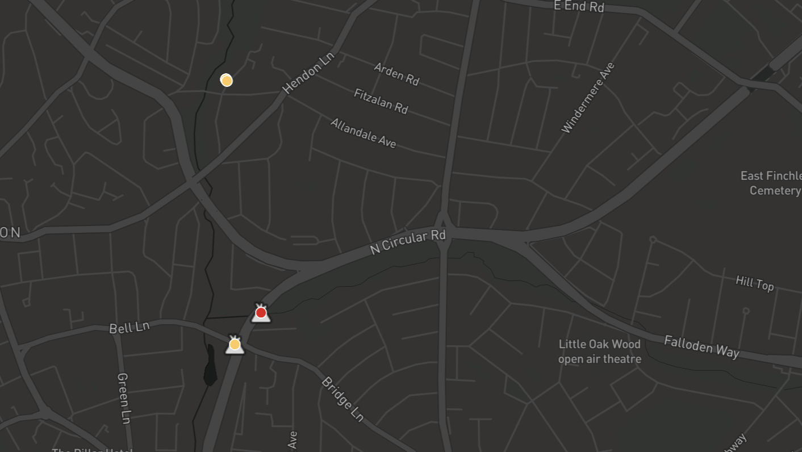
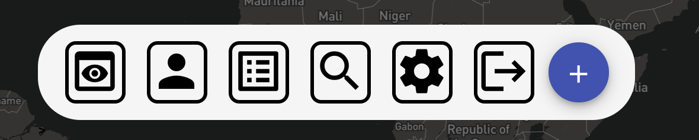
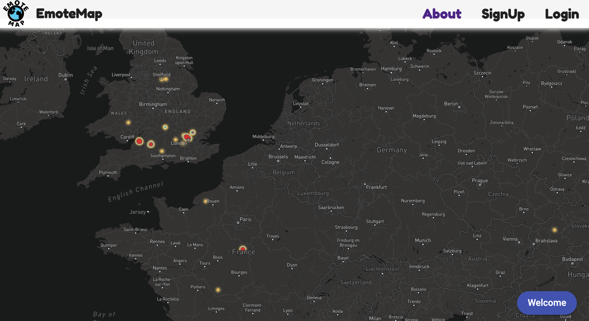
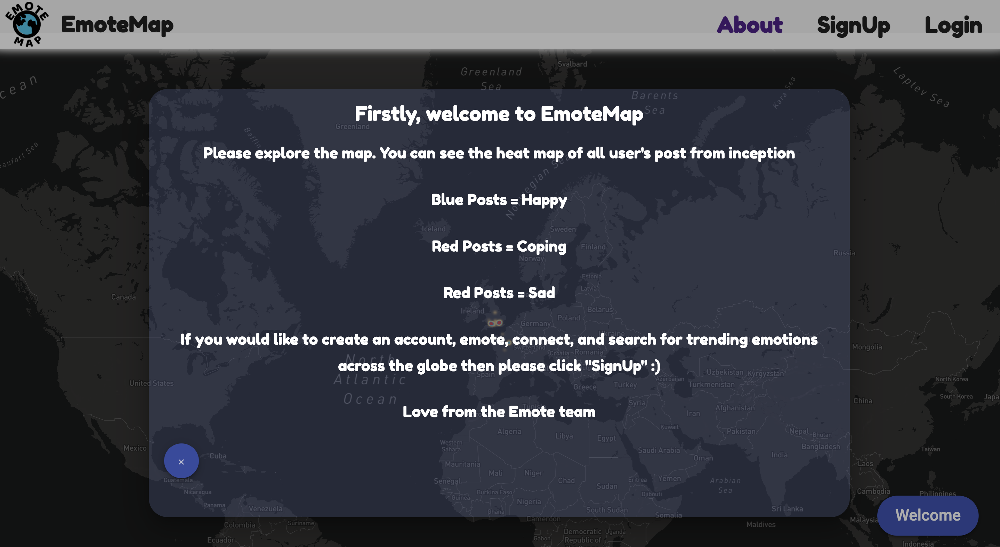
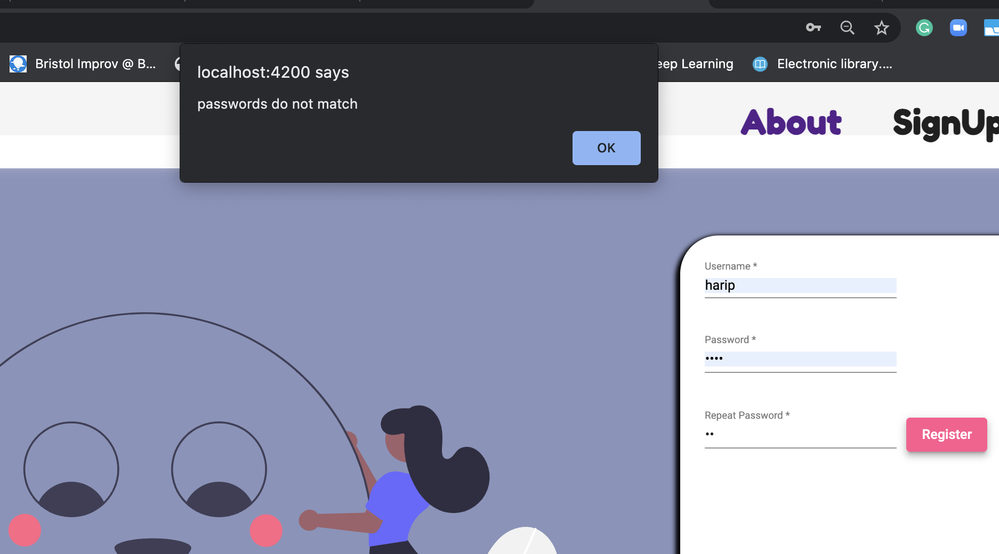
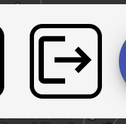
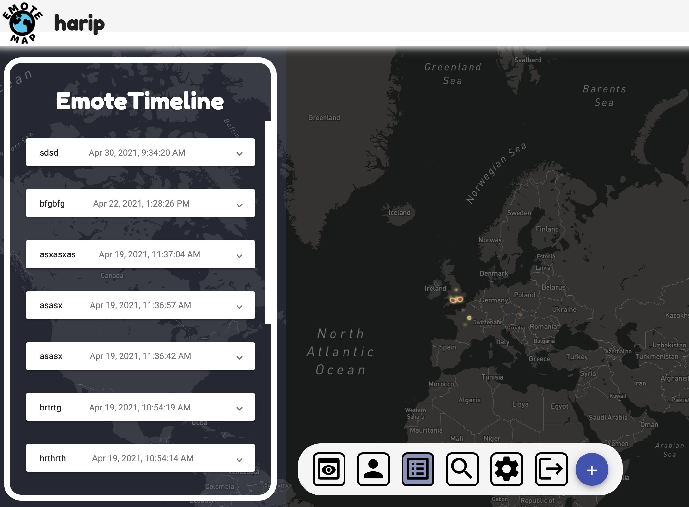
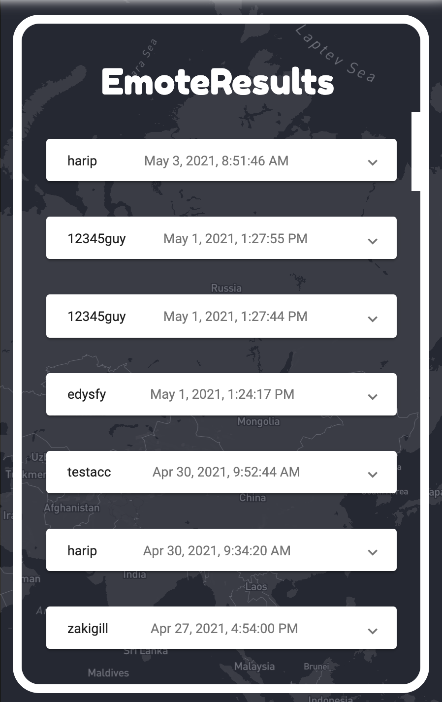
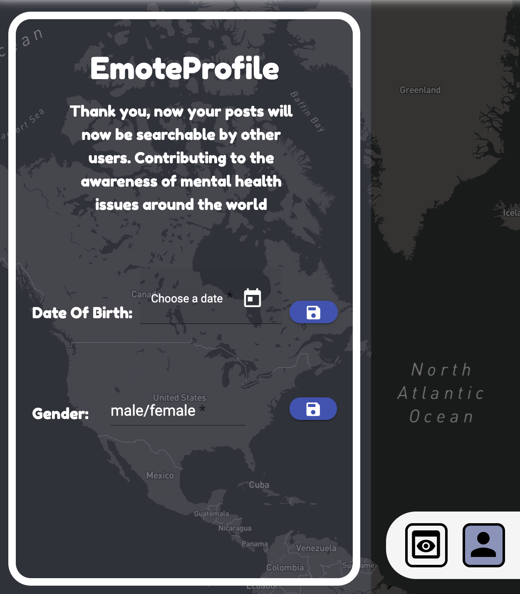
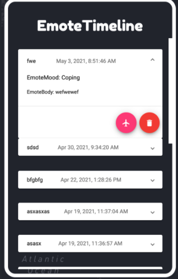

<p align="center">

</p>


## Table of contents

* [Stack architecture and system design](#first)
* [MongoDB - database implementation](#second)
* [Middle Tier - Express, Node, the RESTful API](#third)
* [Front End - Angular](#forth)
* [Deployment details](#fifth)


## Stack architecture and system design

<a name="first"></a>

Before diving into the details of each stack, how they work and link together. Lets talk about the System Architecture as a whole.

From a very broad perspective this is how application skeleton is structured:

<br/>
<p align="center">

</p>

The stack was made up of three main components:

1. The MongoDB database: <br/>
    To store GeoJson and User data through two separate collections. This will communicate with the REST API through the ODM, Mongoose. It will have no direct connection to the front end due to security reasons. All data that is created on the front end will filter throughout API.

2. The REST API: <br/>
    This is capable of dealing with incoming HTTP requests and adequately responds to the client. It is built with NodeJs and a framework called ExpressJs. It makes use of the HTTP protocol to send data from the client to the database. The client submits an HTTP request to the server. This request will have an HTTP param id, which is used to send data through the URL path. This is useful for sending user information like a username from the client to the API. A HTTP body, which sends the main data structure created on the front end. As an example, when the user makes a new EmotePost, a javascript object is created and that is sent via Angular's HTTP client with that object as a payload. The server will have access to that via the body method. HTTP headers are also sent. We intend to use the headers to send the JWT token to guard our routing paths on the back end. This essentially makes them accessible to users. Once a request has been detected at one of the servers' paths, it will perform adequate data processing i.e storing data in the database, querying the database for data, and then send a response back to the client. This will contain the data required or messages that tell the client this request couldn't be handled in some way.

3. The front end/ UI: <br/>
    This is responsible for the user experience and data creation through the use of Angular forms. The user can explore the map, create an account, log in, create Emote posts, view other users' posts, have access to their posts in a timeline, delete their posts, fly to a post, and search for other users' posts (by date, age, and gender). To display a map, we needed to connect to an external API. We considered two options: Mapbox and GoogleMaps. After digesting Mapbox's API, we realised it is capable of doing everything we wanted, in particular displaying a heat map. It accepts geoJson data and provides the developer with a lot of support to customize and visualize that data on the map. It also accepts data via a direct link to a URL path, or through building your objects. This was useful as it allowed us to use geoJson objects that are stored in memory on the front end. As an example (this will be explained in a lot more detail in the front end), when the user makes a post it would automatically update the UI as we stored the new post in a service. This, combined with the apis open source nature meant we chose to use Mapbox over google maps. The Mapbox component listens to changes in the geoJson array and re-renders the data on the map. We used a set of Angular Services to maintain state and allow data to flow between components on the frontend as well as providing a link between the data flowing to the REST API.

Lets go into some more depth...

## MongoDB - database implementation

<a name="second"></a>

### Why MongoDB?

We chose to use MongoDb as our database due to the nature of the GeoJson data structure required by Mapbox to display posts on the screen. Initially, we were unsure of how to display user posts, create a Heatmap, and whether to allow users to search for posts using polygons. Marceli also recommended using MongoDb as it has a special part of the API designed to dealing with GeoJson queries.

We considered using a SQL database due to the simple nature of our data model. As shown below, through the ERD, we could easily use join queries on the data which would have been beneficial in the search path of our API. However, due to the reason above, as well as being taught MongoDB in lectures. We stuck with MongoDB.

### How did we connect MongoDb To our API?

Firstly, we needed to initialize the MongoDB database - we created a free MongoDB account and created a cluster. We set the IP access to all, so all of our team members can be sent requests through to the database, which useful for testing, as we could all perform CRUD operations on the database. We created '.env' file that stores all of our MongoDB connection credentials, like username and password and then added this to '.gitignore' so these details are not accessable through git. We then imported these variables using the `dotenv` library, and created a MongoDb connection URL.We then stored the connection URL as a variable: 'mongoDBConnect', in the Express application file. Mongoose has a simple method called "connect" that allows you to connect to the URL easily. Once Node is run, the database can now communicate with our API.

```js
const mongoDBConnect = `mongodb+srv://${MONGO_USERNAME}:${MONGO_PASSWORD}@${MONGO_HOSTNAME}/${MONGO_DB}?retryWrites=true&w=majority`;
mongoose.connect(mongoDBConnect,{ useNewUrlParser: true, useUnifiedTopology: true })
.then(connection => {
    console.log("Rest Api has successfully connected to mongoDb Database");
})
.catch(err=>{
    console.log("Failed to connect ot mongoDb");
})
```

## MONGOOSE MODELS

### ERD of the whole data model

<p align="center">

</p>

The ERD above shows the final data model that is utilised by our application. We defined a schema for each block in the ERD diagram. However, we only have two seperate collections in our database, which was defined by two mongoose models.
```js
module.exports = mongoose.model("User", userSchema);

module.exports = mongoose.model("GeoJson", geoJsonSchema);
```

### GeoJsonModel : <br/>
This schema was the initial schema we started to develop. As a team, we decided that we needed a data structure that allowed anyone to make a post and display it on the Mapbox component. That was our priority. If we didn't have this functionality then users wouldn't be able to Emote their feeling, see the heatmap, and view other people's posts. After some research, it was found that there is a pre-defined data structure called: "GeoJson". This standard builds upon JSON data format, however, it requires certain attributes. GeoJson is a data structure that
allows one to represent features like "Geometry", along with any non-spatial attributes that the developer has the freedom to define. When discovering this data structure we felt a sense of relief as we were unsure as to model the data. 

<p align="center">

</p>

We gathered that you can display a set of GeoJson data by creating a "FeatureCollection". Each one of these will contain a set of GeoJson of type: "Feature". This was then the basis of our GeoJson model. We needed a model that accurately modeled a GeoJson "Feature", which could then be collected as a "FeatureCollection" on the front end.
This is the geoJsonSchema that the GeoJson model is made from:
```js
const geoJsonSchema = new mongoose.Schema({
  type: {
    type: String,
    required: true,
    enum: ['Feature']
  },
  geometry: {
    type: geoPositionSchema,
    required: true,
  },
  properties: {
    type: postSchema,
    required: true,
  },
});
```
Each geoJson by default has type "Feature".
"Geometry" is an attribute that contains the *geoPositionSchema*, which is Mongoose sub-document and likes the two schemas together. The *geoPositionSchema* has an attribute: "type", which refers to the type of geometry. This could be "LineString", "Point" etc. We instantly knew it needed to be "Point", and we used the enum field in Mongoose to set it as a default. Each geometry attribute is required to have a set of coordinates. As we are representing a "Point", this needed to be an array of numbers, where the first element was the longitude and the second was the latitude. <br/>
This is the *geoPositionSchema* that the GeoJson model is made from:
```js
const geoPositionSchema = new mongoose.Schema({
  type: {
    type: String,
    enum: ['Point'],
    required: true,
  },
  coordinates: {
    type: [Number],
    required: true,
  },
});
```
The other attribute is "properties". This is where we have the freedom to design the EmotePost data, and combine that with the geometry so the user's EmotePost can be displayed on the map.
The *postSchema* is Mongoose sub-document that connected to the GeoJsonSchema via the "properties" attribute, this holds all information relating to user posts.
It contains the mood value, which is a number between 1-3 (inclusive) that models the emotions" Happy, Coping and Sad respectively. The textBody is the string that contains the user's actual Emote description. The keyword sums up the post and is used so the users can search for specific keywords. The dateTime attribute contains the exact date time at which the post was made.The username is the user who made the post. The user details are an objectId type, which is referenced to the 'User' model. This is essentially a string that is the unique identifier for the user that creates the post. It allows Mongoose to search for a user in the User collection with the same ID and populate the userDetail field with the data specific to that user. This essentially allows us to join the user details, from the User model to each geoJson post. Analogous, to a many to one relationship in relational databases. Where the user can have many posts but the post has one user.
```js
const postSchema = new mongoose.Schema({
  userDetails: {
    type: mongoose.Schema.Types.ObjectId,
    required: true
    ref: 'User',
  },
  username: {
    type: String,
    required: true
  },
  dateTime: {
    type: Date,
    required: true,
  },
  keyword: {
    type: String,
    required: true,
  },
  mood: {
    type: Number,
    required: true,
  },
  textBody: {
    type: String,
    required: true,
  },
});
```

### UserModel: <br/>
This holds all the information relating to registered user accounts. Initially, we simply made a guess as to what the attributes the userSchema should hold.
It made sense for there to be a username, email, password, and geoPost attributes. We thought that the geoPost attribute will contain an array of GeoJson data that the user made, defined by the models above.
So we would just have one Model called User, and whenever the user made a post-it will store the GeoJson data in the User Collection under the user. However, we thought this wouldn't be a good idea as it would complicate the storing of the GeoJSON data. It's easier to get all GeoJson data and manipulating that array on the API or frontend, than getting all the user's GeoJson data and merging them into an array, before manipulating it. Especially when it would to come searching the GeoJson with complex queries. We also got rid of the email as it was mentioned from numerous user feedback that it wasn't needed. When posting such sensitive information, users wanted to remain anomalous. We also added, date of birth, gender and age attributes to support searching for GeoJson by age and gender. <br/>
Mongoose automatically adds and _Id attribute. This is the ID stored with each GeoJson data that's created from the user 'Emoting'.
We set the username to be unique. So only unique values can be stored in the database. To do with we used a library called "mongoose-unique-validator".
```js
const userSchema = new mongoose.Schema({    
  username: {
    type: String,
    unique: true,
    required: true,
  },
  password: {
    type: String,
    required: true,
  },
  dob: {
    type: Date,
    default: null,
    required: false,
  },
  gender: {
    type: String,
    default: null,
    required: false,
  },
  age: {
    type: Number,
    default: null,
    required: false,
  },
  userSchema.plugin(uniqueValidatorPlugin);
});
```

## Middle Tier - Express, Node, the RESTful API
<a name="third"></a>

### Node:
We used Node as a runtime environment allowed us to run javascript code outside  the web browser. As, we built the front-end with Angular, we decided that to use Node to build the backend API, as the languages needed for both are the same. This really helped team members work on both the front and the backend. The node server is built with the HTTP module, and listens for HTTP request/responses on a local port. We didn't build the whole api with Node. We use ExpressJs build to an Express app. The Express app is a comprised of a series of function calls and custom middleware that we developed. The Express app is passed into the Node Server as an argument. Every time a request is made against the server, the Express middleware will essentially run and deal with the request. The server object is an event is an "EventEmitter", we use Express CRUD methods to listen to when an HTTP event is triggered.
```js
/*create server using express app and listen on port*/
const server = http.createServer(app);
server.listen(port);
```

### Express Application:
Express made dealing with responses and requests a lot easier. In the express app, when a request arrives to the server's url path, it filters down the subsequent HTTP methods in the path until it is resolved with a response. There is also a next function which directly tells the request to move to the next method. However in our application we never felt the need to use this.
Lets break down this Express application and describe how it works:
1. app.js:
      - This is the file that initializes the Express app object and exports it to the Server.js. We initialized the app with 'Cross-Origin-Referencing (cors)'. This is a middleware that makes sure our application can accept requests coming from different clients. For testing, some of us had our client running on running on a different port so this came in handy. The App also uses 'Bodyparser'. This parses incoming requests to JSON and allows the app to receive params data. We then issue a get request to the Index HTML file that is generated using Ng Build. So we can serve the Angular front end without using Ng Serve. Meaning it is compatible with Docker.
        ```js
        app.use(express.static(path.join(__dirname, '../../dist/demosite')));
        // Catch all other routes and return the index file
        app.get('/', (req, res) => {
          res.sendFile(path.join(__dirname, '../../dist/index.html'));
        });
        ```
        Also, app.js uses the express router from the different files. The different paths of our API are joined together through this file.
        ```js
        app.use("/api/user",userRoutes);
        app.use("/api/geopost",geopostRoutes);
        app.use("/api/search",searchRoutes);
        ```

2. API Routes:
    <br/>
    This segment of the API was very important. It allowed us split the Express application into paths that deal a specific type request from the client. We had three routes.
    <br/>
    1. geopost.js => "/api/geopost": <br/>
        Here we dealt with all the requests that are related to the EmotePosts.
          - We have a GET method on the route. Once the GET request from the frontend hits this path it calls a 'find' method on the GeoJson model that was created from the GeoJson schema. This finds all of the GeoJson points in the database and returns a promise. It's an asynchronous function. Once the promise returns all the GeoJson data points, we send a response back to the front end. The payload contains a JSON object that contains the GeoJson array (all Data), and a message, with a status code 200 (meaning it was successful). This data is then utilized by the Post Service on the front end, which pipes the data into components where needed. If there is an error with the request, the server sends back the default error message.
            ```js
            /*gets all post from the db*/
            router.get("", (req, res, next) => {
              GeoJson.find()
                .then((allGeoPost) => {
                  res.status(200).json({
                    message: "Coordinates sent from database",
                    geoPost: allGeoPost,
                  });
                })
                .catch((error) => {
                  res.status(401).json({
                    message: "unable to retrieve the data",
                    error: error,
                  });
                });
            });
            ```
          - We have a POST method on this route. This saves the user's post in the database. The client has a GeoJson interface, which conforms to the GeoJson schema. The POST accepts a HTTP request from the client with a GeoJson payload. We then get the username from this payload and call the find method on the User model, with the username as a filter query. This returns a promise. We then chain the then method, to wait for the promise. Once the user details return from the database, we create a new GeoJson Mongoose object. When we initialize it, we pass a javascript object (as a parameter) that conforms to the GeoJson schema. The object is comprised of attributes from the request body sent from the client, and the user details send from the database. We add the user's _id type to the userDetail attribute. This stores the user's unique id on the post, so we can join this data with the user's details, when searching. We then call the save method on this object, once the database returns the response that it saved, we create a new response to be sent back to the client that contains the _id of the saved GeoJson post. This _id essentially gets added to the GeoJson object in the Post-service (that was created on the frontend). We also have supplementary error handling to respond to the client if there is an issue.
            ```js
              /*saves a post to the database*/
              router.post("", (req, res, next) => {
                const username = req.body.properties.username;
                User.find({ username: username })
                  .then((user) => {
                    const newPost = new GeoJson({
                      type: req.body.type,
                      geometry: {
                        type: req.body.geometry.type,
                        coordinates: [
                          req.body.geometry.coordinates[0],
                          req.body.geometry.coordinates[1],
                        ],
                      },
                      properties: {
                        userDetails: user[0]._id,
                        username: username,
                        dateTime: req.body.properties.dateTime,
                        keyword: req.body.properties.keyword,
                        mood: req.body.properties.mood,
                        textBody: req.body.properties.textBody,
                      },
                    });
                    newPost
                      .save()
                      .then((dbResponse) => {
                        return res.status(200).json({
                          message: "geoPost saved in database",
                          id: dbResponse._id,
                        });
                      })
                      .catch((error) => {
                        res.status(400).json({
                          message: "unable to save this data",
                          error: error,
                        });
                      });
                  })
                  .catch((error) => {
                    res.status(500).json({
                      message: "user doesnt exist",
                      error: error,
                    });
                  });
              });
            ```
          - Also, we have another GET request on this route. However, we added a param variable to the URL path. So the URL is now: 'api/geopost/:username'. This is similar to the normal GET request. However, when we call the find method on the GeoJson Model, we use the username param as a filter query, meaning the database returns a GeoJson array that only contains posts related to that user. We sort it via DateTime using the Mongoose 'sort' method, meaning the newer posts are at the start of the array. We did this so our UI will display the user's timeline in that order. This is then sent back to the User-Search-service on the front end. Error handling response was also implemented.
              ```js
              /*sort the date by -1*/
              router.get("/:username", (req, res, next) => {
                GeoJson.find({
                  "properties.username": req.params.username,
                })
                  .sort({ "properties.dateTime": -1 })
                  .then((posts) => {
                    res.status(200).json({
                      message: "sucessfull",
                      userposts: posts,
                    });
                  })
                  .catch((error) => {
                    res.status(500).json({
                      message: "internal error",
                      error: error,
                    });
                  });
              });
              ```
          - Finally, we have a DELETE request. We added a param variable to the URL path. So the URL is now: 'api/geopost/:id'. The id is the _id of the GeoJson Post to be deleted. The _id is sent by the User-service on the front end. We then call the 'deleteOne' method on the GeoJson Model and use the request param as a filter query. This then removes that user's post from the GeoJson collection. This allows the user to delete their posts. Error handling response was also implemented.
            ```js
            /*removes post from the db*/
            router.delete("/:id", (req, res, next) => {
              console.log(req.params.id);
              GeoJson.deleteOne({ _id: req.params.id })
                .then((result) => {
                  res.status(200).json({
                    message: "Post deleted",
                    result: result,
                  });
                })
                .catch((error) => {
                  res.status(401).json({
                    message: "Post doesn't exist",
                    error: error,
                  });
                });
            });
            ```
            <br/>
    2. search.js => "/api/search": <br/>
        - This route deals with the search queries sent to the API from the User-Search-service. We defined a SearchQuery interface on the front end. When the user makes a query, a Search Object is created on the front end and sent via HTTP POST method by the User-Search-Service to "/api/search".
        This route needs to filter the GeoJson collection with parameters set by the search query. So we use the 'find' method on the GeoJson model to get all GeoJson data. We chain ;;'populate' method. This method populates the attribute "userDetails" of each GeoJson with the age, gender, and date of birth of the corresponding user with the same _id as the value stored in "userDetails". We sort it via DateTime, meaning the newer posts are at the start of the array. We did this so our UI will display the search results in that order. <br/>
        This returns a promise. When we receive the GeoJson from the database, we embark on a filtering process. We use the filter method to filter out GeoJson data that are false in the callback function.
        1. Filter posts bound by min and max-age:
            - If the age is null then we remove the data. This means the user has not set their age, thus we decided that their data will not be included in the search. We then make sure all posts are within the age range.
        2. Filter posts bound by a min date from the present to a max date from present;
            - The search query contains a min day and a max day. The maximum value the day can be is 0, which is the present day, and the minimum day is -3650 (10 years ago). We return all posts that were made between the minimum and maximum values.
            - We create a function that generates a Date object from both day value. We apply 'getTime' method on the minDate and maxDate, and to the dates at which the GeoJson Posts were made. This gives the literal time in seconds. Dates closer to the present have a large value, thus we can compare dates and filter out the relevant ones.
        3. Filter posts by gender:
            - The search query contains a boolean for males and females. We filter out GeoJson if the gender is null, or male/female is false. The logic for this was held in filterGender.
        4. Filter posts by Mood:
            -The search query had boolean values for Happy, Coping, and Sad. Each GeoJson Post contains an emotion by default. As the user has an option to choose any combination of the 3 emotions, we filter out the false emotions. The logic for this was held in filterMood.
        Once the GeoJson array has been filtered, we send it in a JSON object as an HTTP response to the User-Search-Service. It is then piped to other components that display the search query.
          ```js
          router.post("", (req, res, next) => {
            GeoJson.find()
              .populate("properties.userDetails", ["age", "gender", "dob"])
              .sort({ "properties.dateTime": -1 })
              .then((data) => {
                  data = data.filter(
                    (geoPost) =>
                      geoPost.properties.userDetails.age != null &&
                      geoPost.properties.userDetails.age >= req.body.minAge &&
                      geoPost.properties.userDetails.age <= req.body.maxAge
                  );
                let minDate = generateDate(req.body.minDay);
                let maxDate = generateDate(req.body.maxDay);
                data = data.filter(
                  (geoPost) =>
                    minDate.getTime() <= geoPost.properties.dateTime.getTime() &&
                    maxDate.getTime() >= geoPost.properties.dateTime.getTime()
                );
                data = filterGender(req.body.male, req.body.female, data);
                data = filterMood(
                  req.body.happy,
                  req.body.coping,
                  req.body.sad,
                  data
                );
                res.status(200).json({ message: "search", geoSearchArray: data });
              })
              .catch((err) => {
                res.status(401).json({ error: err });
                return;
              });
          });
          ```
          <br/>
    3. user.js => "/api/user": <br/>
        This route deals user registration, and authentication:
          - "/api/user/signup" deals with registration. When a user signs up on the front end, the Authentication-service sends a payload containing the username and password. Firstly our API checks if the username is equal to  "null" string. If it is "null" it sends a response to the client with a message saying that the username is taken, and regSuc == false. This is because the Authentication-service checks if the username is "null" when the component initializes, so users cannot use "null" as their username. If this is fine, then we create a new User Mongoose Object, that takes the username and password as a parameter. We then save that into the User collection in that database. If the process is successful we send a response back to the client, with regSuc == true. The front end uses regSuc to throw alerts to the user. Ie "Registration successful". If the promise from the database returns an error, this means that the username has been taken. We send this response back to the client, with regSuc == false. The UI then displays an alert saying the "username is taken". As a side note, we initially were using Bcrypt to hash the passwords, however, due to issues with Docker, we decided to leave it out for the project. However, we fully understand the importance of hashing the passwords.
            ```js
              router.post("/signup", (req, res, next) => {
                /*cant use null as a username*/
                if (req.body.username === "null") {
                  return res.json({
                    message: "Username Taken",
                    regSuc: false,
                  });
                }
                const user = new User({
                  username: req.body.username,
                  /*store hashed password in database*/
                  password: req.body.password,
                });
                /*save the data in mongoDb*/
                user
                  .save()
                  /*when promise arrives send the response back to the frontend*/
                  .then((confirmDoc) => {
                    res.status(201).json({
                      message: "The user has been successfully registered",
                      result: confirmDoc,
                      regSuc: true,
                    });
                  })
                  /*this error will be if the email/username isn't unique*/
                  .catch((error) => {
                    res.json({
                      message: "Unable to login with these credentials",
                      regSuc: false,
                    });
                  });
              });
              // });
              ```
          - "api/user/login" deals with user authentication. When a user logs in up on the front end, the Authentication-service sends a payload containing the submitted username and password. Firstly our API checks if the username null. Initially, this was a precaution we made on the server. We instantly sent a response back to the client, if by chance no username was submitted. We then called the 'findOne' method on the User Model, with the username as the filter query. The usernames are guaranteed to be unique by MongoDb, so we can safely assume that only one user will return. Once the user details have been sent from the database, via a promise, we store the password and send it to the password match function. This takes in the password from the client and the database and checks if they are identical. If they don't match we send an error response back to the client with regSuc == false. This will alert the user that the passwords do not match. If successful, we create a JWT token that is made from the username, password, and secret key. To ensure the JWT is not hackable by people that don't know the key, we send a response with the JWT and username back to the Authentication-service, so it will be stored in the client's local storage. The main use of the JWT was to guard routes on the API. So when a request was made, if the HTTP header contains a valid JWT token then the function will carry on with its execution. However, we didn't have time to implement this.
              ```js
              router.post("/login", (req, res, next) => {
                User.findOne({ username: req.body.username }).then((query) => {
                  /*if username not in the database query is null*/
                  if (query === null) {
                    return res.json({
                      message: "Incorrect username",
                    });
                  }
                  /*get the password in db and compare to the request body password*/
                  const userPassword = query.password;
                  passwordMatch(req.body.username, req.body.password, userPassword, res);
                });
              });
              ```
              <br/>
        This route also deals with supplying user details to the User-Service, as well as allowing the users to enter/edit their date of birth and gender:
          - We have a GET method on route "api/user/login/:username". We used a params variable on the URL to send the username from the User-Service to the API.
           Now, this is coming from the User-Service on the front end. This service is only functional when the user is authenticated, and their details are stored on the client's browser. So we are not worried if the username is null. We then called the 'findOne' method on the User Model, with the username as the filter query. When the database fulfills the promise, we need to do some data manipulation on the date and the gender. When a user creates an account, by default the date of birth and gender are null. Date of birth is also of type Date. The front end has a User interface, the User - date of birth attribute, is of type string (it was easier to deal with string on the front end). So we have two functions, convertDateToString - this takes in the date of birth from the database. If null it returns a string 'n/a', else it converts the Date to a string. CheckIfGenderIsNull takes the fender from the database and returns 'n/a' if it null. As the gender is already a string, if it is not null we don't need to alter it. We then return a response to the user, with an object that conforms to the user details on the front end. The service then pipes these details to the relevant UI components. Again, if there is an error we return that to the front end.
              ```js
                router.get("/:username", (req, res, next) => {
                User.findOne({ username: req.params.username })
                  .then((user) => {
                    const date = convertDateToString(user.dob);
                    const gender = checkIfGenderNull(user.gender);
                    res.status(200).json({
                      user: {
                        username: user.username,
                        dob: date,
                        gender: gender,
                        age: user.age,
                      },
                    });
                  })
                  .catch((error) => {
                    res.json({
                      exist: false,
                    });
                  });
              });
              ```
          - We have a PUT method on this route "api/user/login/:username". We used a params variable on the URL to send the username from the User-Service to the API.
           Now, this is coming from the User-Service on the front end. This service is only functional when the user is authenticated, and their details are stored on the client's browser. So we are not worried if the username is null. This allows the user the manually update their age/gender. If the user submits a new edit on the front end the User-Service will send a payload with the gender or date of birth to this path. We check to see which values are null then perform the appropriate update of the non-null value. We do this by calling the 'updateOne' method on the User model. This takes two parameters, the first is an object that specifies the user you want to update. We enter the username as it is a unique identifier. The second parameter takes in an object that describes specifies attributes that will be updated, with that data to replace the old data. Also, we calculate the user's age on the front end every time the user opens their profile. Whenever this happens, we update the user's age in the database. To keep it updated when each year passes.
              ```js
                /*path which updated the user details*/
                router.put("/:username", (req, res, next) => {
                  if (req.body.gender != null) {
                    User.updateOne({ username: req.params.username }, { gender: req.body.gender })
                      .then((result) => {
                        res.json({message: "update gender sucessfull"})
                      })
                      .catch((error) => {
                        res.json({message: "no user"})
                      });
                  } else if(req.body.dob != null) {
                    User.updateOne({ username: req.params.username }, { dob: req.body.dob })
                      .then((result) => {
                        res.json({message: "update dob sucessfull"})
                      })
                      .catch((error) => {
                        res.json({message: "no user"})
                      });
                  } else {
                    User.updateOne({username: req.params.username}, {age: req.body.age})
                    .then((result) => {
                      res.json({message: "update age sucessfull"})
                    })
                    .catch((error) => {
                      res.json({message: "no user"})
                    });
                  }
                });
              ```


# Front End - Angular, Details of implementation
<a name="forth"></a>

Note we made use of [DefinitelyTyped](https://github.com/DefinitelyTyped/DefinitelyTyped) for some type definitions in our project.

### Angular Material/Font-Awesome
We heavily relied on the use of the [Angular Material](https://material.angular.io) library. This us provided pre-build UI components, that can be styled easily.
Any word starting with 'mat-' is a component from Angular Material. <br/>

We also made use of [Font-Awesome](https://github.com/FortAwesome/Font-Awesome) for some fonts and icons in our project.

#### Mapbox
We used the [Mapbox API](https://docs.mapbox.com/mapbox-gl-js/api/), which provided us with a customizable map. That met our needs adequately. <br/><br/>
The implementation of these API's are mentioned in more detail throughout the rest of the application.

We also made use of these [type definitions](https://github.com/yuhki50/types-mapbox-gl) in our mapbox implementation.


Our front end is comprised of many components. We felt the best way to break down the implementation of the front end is by grouping the application by Services as they are heart of how each process works.

## Post Service:

  ### Class Diagram:

  <p align="center">
  
  </p>

We inject the HTTP Client module into this service, so we can connect this service to our API.
### How to get and display data:
When the map is initialized for the first time, we want the user to see all the GeoJson Post's made by previous users, along with the heat map. This service is responsible for 'getting' all GeoJson data from the back end and passing it to the Mapbox component. As well as managing new entries being created by the user and 'posting' them to the backend. It also holds the latest updated coordinates that the user has registered.
For Mapbox to be able to render the GeoJson data from the backend, we need to convert it to a GeoJson javascript object. We defined a GeoJson class in the model folder.
  ```js
  export class GeoJson {
      type = 'Feature';
      geometry!: IGeoPosition;
      properties!: IPost;
      _id: string;

      constructor(properties: IPost, cord: number[], _id: string) {
          this.properties = properties;
          this.geometry = {
              type: 'Point',
              coordinates: cord,
          };
          this._id = _id;
      }
  }
  ```
We have a method 'getGeoPostData' in the Post Service; when this is called it sends a GET request to our API to retrieve the data. Once the data arrives, we convert each data into a GeoJson object as described above (by passing the relevant data through the GeoJson constructor), and push it to the 'geoPost' array stored in the service. Once this is complete, we have a Behaviour Subject called 'geoPostSubject', this maintains the state of the 'geoPost' array. It can return Observables, meaning other components in the application can subscribe to it and trigger functions when there is a change of state. We called the 'next' method on this 'geoPostSubject' and pass in the 'geoPost' array to update the state with the data from the backend. We also need a check. We only push data from the backend into the service if the 'geoPost' array length doesn't equal the array coming in from the back end. As this function, can be called multiple times by the Mapbox component - if this check wasn't in place it will render duplicate data. Once we update the state we return 'geoPostSubject.asObservable'.

This service is injected into the Mapbox component. When the component is initialized, it calls 'initMap', which initializes the map as per our specifications. Mapbox provides numerous styles of world maps to display (we chose a dark colour scheme to better highlight the information in our data layers, to be covered shortly), which we initialise in the components ngOnInit function.
```javascript
initMap(): void {
  (mapboxgl as any).accessToken = environment.mapboxToken;
  this.map = new mapboxgl.Map({
    container: 'map',
    style: 'mapbox://styles/mapbox/dark-v10',
    zoom: 2,
    center: [-0.2101765, 51.5942466],
  });
}
```
We then call the map.on('load'). This is a function that allows us to manipulate the map when the event 'load' is triggered.
```js
this.map.on('load', (e) => {
      this.userSearchService
        .getIsInSearchState()
        /*susbscrice to user search state*/
        .subscribe((activatedUserSearch) => {
          if (!activatedUserSearch) {
            if (this.userSearchIconClickAmount > 0) {
              this.removeAllLayerAndSource('data');
            }
            this.userSearchIconClickAmount++;
            this.pullAndDisplayGJPointsFromDB();
            this.initMapLayersForData('data');
            this.isMapLoading = false;
          } else {
            this.removeAllLayerAndSource('data');
            this.pullAndDisplayGJPointsFromSearchQuery();
            this.initMapLayersForData('data');
          }
        });
      })
```
Firstly, this function combines the GeoJson data retrieved through the User-Search Service, and the GeoJson data retrieved via the Post Service. We don't want both sets of data to be rendered simultaneously. We subscribe to this boolean in the User Search Service. It is true when the search state is activated, and false otherwise (more details in User Search Service).  By default is it set to false when the user renders the app for the first time. As we alternate between the search-state and the post-state, we need to use a function called 'removeAllLayerAndSource('data')'. This essentially removes all the layers built from the GeoJson data sent from the previous Service. Ie it creates a blank map for the new data from the other service to be rendered. So it removes all the markers, heat-map, and user's markers. As well as removing the Mapbox 'data' source (source in Mapbox allows the developer Mapbox layers to create layers).
When '!activatedUserSearch', and the previous Mapbox 'data' source has been wiped, we call 'pullAndDisplayGJPointsFromDB'. This calls 'createDataSource('data')', and creates a data source called 'data', of type 'geojson'. The data it contains is of a type 'FeatureCollection' and initialised with and an empty array, which is going to contain the 'geoPost' array from the Post Service. We then subscribe to the 'getGeoPostData' method in the Post Service, as it returns an observable.  

```javascript
createDataSource(name: string): void {
  this.map.addSource(name, {
    type: 'geojson',
    data: {
      type: 'FeatureCollection',
      features: [],
    },
  });
}
```
```javascript
pullAndDisplayGJPointsFromDB(): void {
  this.createDataSource('data');
  this.source = this.map.getSource('data');
  this.postService.getGeoPostData().subscribe((geoPostArr) => {
    this.source.setData(new FeatureCollection(geoPostArr));
  });
}
```
Now we can retrieve the 'geoPost' array. When the GET request has been fulfilled, the data has been processed, and state updated. Mapbox will take that data, then call the 'setData' function on the 'data' source we created. This takes a data set. We create a Feature Collection object (a class pre-defined in the model folder), that just takes in the 'geoPost' array from the service. Mapbox uses the coordinates in 'geometry' attribute to position the data on the map.
```js
export class FeatureCollection {
    type = 'FeatureCollection';
    constructor(public features: Array<GeoJson>) {}
}
```
The source now contains the data. This data can use manipulated through the use of Mapbox's layers, and each layer can be displayed on the map in a customizable way.

### Now is a good time to describe how Mapbox creates the markers, user markers and heat map:

The function initMapLayersForData(layer: string) takes in the name of the source that contains the data. We create three layers, as a way to display the GeoJson Posts to the user. The first layer is called 'markers':
```js
    this.map.addLayer({
      id: 'markers',
      interactive: true,
      type: 'circle',
      source: layer,
      minzoom: 9.2,
      paint: {
        'circle-stroke-color': '#fff',
        'circle-stroke-width': 1,
        'circle-radius': 5,
        'circle-color': [
          'step',
          ['get', 'mood'],
          '#EC986F',
          1,
          'rgb(65,182,196)',
          2,
          'rgb(254,204,92)',
          3,
          'rgb(227,26,28)',
        ],
      },
    });
  ```
  <p align="center">
  
  </p>

The API allows us to display circles at each location, defined by the coordinates in the 'geometry' attribute from the geoJson data point. We colour these circles based on the so-called mood-rating that a user picks when making a post to our website – this provides the key functionality of the entire site, allowing users to see patterns in people’s emotions across the map, based on the circle colours. Blue => Happy, Yellow => Coping, Red => Sad. As the data is in GeoJson format, for each point Mapbox looks at the 'properties' attribute. You can use this attribute to display custom data on the map. We tell Mapbox to use the 'mood' attribute inside 'properties'. We assign a colour for each value. The addLayer function can also be configured such that its visibility is based on a certain zoom level of the map; we utilize this so that when a user has zoomed in (to zoom > 9.2) the circle layer appears, but when they are zoomed out, the second layer – a 'heatmap' layer – appears:

  <p align="center">
  
  </p>

The 'heatmap' type is another layer type, and we use it to display the density of the user's emotion values at a location. We interpolate the colors of the heatmap, it varies from blue (positive emotion in the area) to red (negative emotions in the area). The heatmap operates on a max zoom greater than 9. Again, it takes in the 'mood' values, we give a set of colors for each mood, the colors are spread linearly depending on the mood value. <br/>
This final layer allows the user to distinguish their posts from other user's posts. We create a new layer called 'user-markers', from the 'data' source. Mapbox has a setFilter method.
```js
    this.map.setFilter('user-markers', [
      '==',
      'username',
      this.authService.getUsername(),
    ]);
```   
We pass the 'user-marker' layer into it. Then we say if the property 'username' is equal to the username stored in the auth service, load the GeoJson point with a marker that is built from an icon image: 'volcano-11' (this was taken from Mapbox's GitHub Page. You can see below how the user pin also comes with a 'volcano'.

  <p align="center">
  
  </p>

For the 'markers' layer, we utilized Mapbox's popup feature, such that when the 'markers' layer is rendered (i.e. the user is zoomed in enough) and the user hovers over one of the displayed circles, a pop up appears, displaying the specific post data (keyword, mood and description) from the GeoJson data's 'properties' attribute. We also have a hover off event, that essentially destroys the popup.

  <p align="center">
  
  </p>


### How to post data:
The user has to be authenticated before making a post. So the first thing we do is call upon the Authentication Service, inject it into Mapbox, and subscribe to 'getAuthMethod' in the service. This allows Mapbox to know if the user is authenticated, and can update the UI if the user logs off. Allowing a user to make EmotePosts is a core feature of our application. We need to display the Userpost component, which holds a form that the user can submit. We render this form on a mat-dialog component. Mat-dialog is an Angular Material module, that pops a component to the screen with the highest z-index out of the other components.<br/>
Lets talk about the dybamics of the Userpost form...
Angular comes reactive forms. This a module that allows the develop to build the form with more customization. This was the first form we built, and thought it would be complex, so we decided to build it with a reactive form. To build the form you have to define a FormGroup variable, which we called 'form'. You then have to equal this to a new FormGroup object, with a javascript objact as a paramter. This object with contain the fields of the form, as attributes. For each attribute to can add custom validation, as shown below.
```js
    this.form = new FormGroup({
      rating: new FormControl(null),
      keyword: new FormControl(null, {
        validators: [Validators.required, Validators.minLength(3)],
      }),
      post: new FormControl(null, {
        validators: [Validators.required, Validators.maxLength(2000)],
      }),
    });
```
We create a form template, in the HTML file and bound the 'formGroup' attribute in the HTML to the 'form' variable initialized in the component. This allows us to manipulate the reactive form, and send its data to the Post Service. The most interesting attribute of 'form', what the rating. An interesting attribute of 'form' was 'rating'. We had a mat-slider component in the form and combined this to a mat-input field. This input field's NgModel is bound to the 'ratings' variable we defined. Its default value was 'Coping'. So the field initially displays this text to the user. The user can use the slider to choose values 1,2 and 3. Whenever the user used the slider and changed its value, an event was sent to the 'onSliderChange' method. If the value of the event was 1, it set 'ratings' to be 'Happy', and set the respective emotions for 2 and 3. Now as 'ratings' is bound to the NgModel of the input field. The new emotion will be displayed to the user. It will also set another variable called 'sliderValue' to the value of the event the slider emits, ie 1,2 or 3. This value is sent to the Post Service with the other input field values when the form is submitted. This value is the mood attribute of the GeoJson 'properties' attribute.

  <p align="center">
  
  </p>

The user can display this dialog in two ways.
1. By clicking on the map:
If the user is operating on a zoom level greater than 12 and is logged in, we can use the 'map.on('click')' method. This is an event listener. When the event is triggered, it will open a mat-dialog on top of the map - this dialog contains the Userpost component, which is a form that allows the user to submit their emotion, keyword, and post. Also, this event will update the longitude and latitude values in the Post Service, with the coordinates of the map where the user clicked.
```javascript
this.map.on('click', (e) => {
  if (this.isLoggedIn) {
    const zoom = this.map.getZoom();
    console.log(zoom);
    if (zoom > 12) {
      const dialogConfig = new MatDialogConfig();
      dialogConfig.autoFocus = false;
      dialogConfig.width = '55%';
      dialogConfig.height = '70%';
      dialogConfig.hasBackdrop = true;
      dialogConfig.panelClass = 'custom-dialog';
      dialogConfig.position = { bottom: '8%', right: '20%' };
      this.dialog.open(UserpostComponent, dialogConfig);
      this.postService.updateLongLat({
        long: e.lngLat.lng,
        lat: e.lngLat.lat,
      });
    }
  }
});
```
2. By clicking the blue + icon on the sidebar (postbutton component):
  <p align="center">
  
  </p>

If the user is logged in, the Mapbox component will render the Sidebar component (using *ngIf directives), meaning they now can access the navbar. On the navbar, there is a blue + button. When the user clicks on this button, the same process happens as above, except the coordinates updated in the Post Service represent the User's actual location. We get the coordinated by using the Javascript inbuilt navigator module:
```js
  if (navigator.geolocation) {
    navigator.geolocation.getCurrentPosition((position) => {
      this.postService.updateLongLat({
        long: position.coords.longitude,
        lat: position.coords.latitude,
      });
    });})
```    
Once the coordinates have been obtained we update the coordinate state in the Post Service.
This is an asynchronous function. If the user submits the form before the program fetches their coordinates, we alert the user that they can not proceed.

  <p align="center">
  
  </p>

**How to submit?**  
The Post Service is injected into the Userpost component. When the user presses the submit button. There is a series of steps until the submission is complete.
1. We decided that the user cannot post when in search mode. So the Userpost component listens to the User-Search service, by subscribing to 'getIsInSearchState' method, to see if search mode is activated. If in search mode then the UI will display an alert to the user saying it is unable make a post.

  <p align="center">
  
  </p>

2.  We validate the form using the FormControl object. We define this object for each attribute when initializing a new FormGroup. The 'keyword' input field must contain one word ONLY and has a min length of three characters. The keyword is also bound to be an alphanumeric single word by defining a Regex pattern attribute on the HTML. So it will mean the field is invalid if the user won't match that pattern. The 'post' input field couldn't be empty and had a max character limit of 3000.  We then have a div, that conditionally renders if the input fields are invalid, thus displaying the error message to the user. We check vis using this boolean 'form.controls['form' ATTRIBUTE].invalid'.

  <p align="center">
  
  </p>

If the measures have been overcome, then the 'createPost' method in the Post Service is called, and the values of the form are sent into the service. We create GeoJson data out of the form values, which matches the Mongoose GeoJson Schema on the backend. We use local storage to add the user's username to the GeoJson. We add the current coordinates in Post Service (obtained by the methods above) to the 'geometry' attribute. We use the HTTP POST method to send to the '/api/geopost' route on the API. After the response has arrived from the API and is successful, we push the GeoJson data to the 'geoPost' array and update the 'geoPostSubject' with the altered array, rendering the new Post onto Mapbox's layers dynamically. We also add posts to the user's GeoJson array stored in the User Service, so the new post will render dynamically on the Userpost-Display component (there is more detail in User Service Section).

## Authentication Service:
  ### Class Diagram:

  <p align="center">
  
  </p>
  We inject the HTTP Client module into this service, so we can connect this service to our API.  

  The Authentication Service was a key part of our application. It allows users to gain extra functionality over users without an account. For example, only users can make posts, view their posts in a timeline, delete their posts, search for others user's posts, and set their age and gender. For this to work, the Authentication Service distributes the authentication state throughout the application.

  Lets take a look of the application when the user is NOT logged in:

  <p align="center">
  
  
  </p>

  The user can only see the heatmap, pins, and can hover over the pins to read the post. Mapbox renders a button called welcome, when the user is not logged in. This displays a dialog that describes what you can do if you are not logged on.

  Here is how the user can authenticate themselves:
  -  They can click the 'Signup' or 'Login' text in the toolbar it it will route to these corresponding pages.

  <p align="center">
  
  
  </p>


  ### The process to register an account:
  - We built signup UI using Angular's template-driven forms. The user has to enter a username, password, and repeat password to be able to submit the form. We didn't implement any fancy validation or password patterns using regex - just made sure the entries were not null. We had basic validation on the fields and used mat-error from Angular material to throw errors back to the user through the input fields. You can see in the left screenshot above, how the field is red, and display a message if they are empty when the user presses submit. This validation is simple with Angular Template forms. We added, ngModel, matInput, and the 'required' attributes to the HTML input fields within the form. This allows us to check if the NgModel value for the field is invalid. We conditionally render a mat-error HTML tag, if this is true. When the 'register' button is pressed, we send the NgForm to an 'onSubmit' function, in the Signup component. Here, we check if the password value is equivalent to the password match value. If not then we through an alert to the user saying the passwords don't. This is a feature to ensure the user enters the password they intend.

  <p align="center">
  
  </p>

  The Authentication Service is injected into the Signup component. After the password match check has completed in the 'onSubmit' function, we pass the form's username and password values to Authentication Service's by calling its 'createUser' method. Here, we create a javascript object out of this data and return the HTTP POST method. Which posts the payload to the 'signup' path in the API. This means the 'createUser' is essentially returning an Observable. This just another way we allowed the Signup component to subscribe to the 'createUser' method in the 'onSubmit' method and directly act accordingly when a response is sent by the server.
  ```js
    createUser(username:  string, password: string) {
    const userData = {
      username: username,
      password: password,
    };
    return this.http
      .post<{ message: String; error: Error, regSuc: boolean }>(
        'http://localhost:3000/api/user/signup',
        userData
      )}
  ```
 The response is either a success or failure, determined by the 'regSuc' boolean the server sends to the client. If successful, we route to the Login page, so the user can log in. If it fails, that means the username has been taken and we alert the user.

  <p align="center">
  
  </p>

  ### The process to login:
 Firstly, it is important to mention that the FIRST time the Authentication Service is run by the browser it gets 'token' from local storage. If this token is not null, that means the user hasn't logged out and the browser still has a hold of the user's the JsonWebToken (JWT). We then set the 'authState' to true using the 'next' method, as 'authState' is a Behaviour Subject. If the 'token' is null, the user hasn't logged in, and 'authState' maintains false as its value.
```js
  constructor(private http: HttpClient) {
    /*get jwt token from storage, if empty user not logged in*/
    this.authToken = localStorage.getItem('token');
    this.authState = new BehaviorSubject<boolean>(false);
    if(this.authToken!=null) {
      this.authState.next(true);
      this.username = localStorage.getItem('username');
    }else {
      this.username="null";
    }
  }
```
The Login component is very similar to the SignUp component. It is built using the same form, methods and is validated the same way (except the need to validate whether passwords match). The Authentication Service is injected into the Login component. Once the user presses the 'login' button and the form is valid, the 'onLogin' method takes the NgForm and passes the form's username and password values to Authentication Service's 'login' method. Again, the process here is similar to the 'createUser' method. However, the difference is that the payload is sent to the 'login' path on the API, and the response from the server contains a JWT token. We subscribe to the 'login' method in the 'onLogin' method in the Login component. When the server sends a response to the front end, checking if the JWT exists. If it does exist, we send the JWT and the username to the Authentication service using its 'setLogin' method, and route to the Mapbox component. If not then we send an alert to the user. The failure can arise due to the username not existing or the password being incorrect. The server sends an adequate message, so we can alert the user accordingly.
```js
  onLogin(form: NgForm) {
    this.authService.login(form.value.username, form.value.password)
    .subscribe((response) => {
      if (response.token) {
        this.authService.setLogin(response.token, response.username);
        this.route.navigate([''])
      }
      else if(response.message == "Incorrect password") {
        alert("Incorrect password");
      } else {
        alert("Incorrect username");
      }
    });
  }
  ```
  The 'setLogin' method, stores the JWT and username in memory and in local storage to allow the user to remain logged in even if they close/refresh the application. We then set the 'authState' to true. As 'authState' is a Behaviour Subject, other components can subscribe to 'authState.asObservable' and listen to dynamic changes in the Authentication state, and update the UI accordingly.  <br/>

  Once the user is logged in the UI looks like this:

  <p align="center">
  
  </p>

Notice above, that the toolbar has the user's username; we explain more in the section about the url-state service below.
The Mapbox component subscribes to the 'authState', and sets the isLoggedIn variable to what value the 'authState' observable emits. We then use *ngIf to conditionally render components on the map, depending on if the user is logged in or not.

```html
<div class="full">
    <app-user *ngIf="isLoggedIn && sidebarState.profile" [@inOutAnimation]></app-user>
    <app-userpost-display *ngIf="isLoggedIn && sidebarState.userPosts" [@inOutAnimation] (flyToCords)="flyTo($event)">
    </app-userpost-display>
    <app-user-search *ngIf="isLoggedIn && sidebarState.search" [@inOutAnimation]></app-user-search>
    <app-key *ngIf="isLoggedIn && sidebarState.key" [@inOutAnimation]></app-key>
    <div id="map">
    </div>
    <app-usersearch-display *ngIf="isLoggedIn && sidebarState.search" [@inOutAnimation] (flyToCords)="flyTo($event)">
    </app-usersearch-display>
</div>
<button *ngIf="!isLoggedIn" class="button" mat-raised-button color="primary" (click)="openDesDialog()">
    Welcome
  </button>
<app-sidebar *ngIf="isLoggedIn && !isMapLoading"></app-sidebar>
```

As you can see from above, the navbar, the user's timeline, key, search are all dependent on the user being authenticated, and the 'welcome' button is not. <br/>
Methods in the User Service also retrieves the 'username' from local storage, to send the username in the API's URL as a parameter, when updating user details, or retrieving user data through the API (more in User Service section).

### How to log out?

The Authentication service is injected into the sidebar component. When the user presses the logout icon in the navbar. It calls the 'logout' in the Authentication Service. This then sets the authToken and username variables in memory to null, and sets 'authState' to false, while wiping all content in local storage. 'Window.location.reload' is called, and that essentially takes the application back to its original state, refreshing the Mapbox component, altering the UI to reflect the fact that the user logged out.

<p align="center">
  
</p>

## Sidebar Service:

  ### Class Diagram:

  <p align="center">
  
  </p>

  We defined a Sidebar Interface:
  ```js
  export interface Sidebar {
    key: boolean,
    profile: boolean,
    userPosts: boolean,
    search: boolean,
    settings: boolean,
  }
  ```
  The Sidebar Service contains a Behaviour Subject of type Sidebar (defined by the interface above), as an attribute and called 'sideBarState'. Its state is initialized with an object of type Sidebar with all attributes set to false. This service is injected into the Sidebar component.
  When the Sidebar component is initialized, it calls 'getSideBarObvs' from the Sidebar Service (that returns an observable from 'sideBarState') and subscribes to it. It then takes the value emitted from this observable and stores it as a variable, called 'sidebarState' within the component. The Sidebar component is comprised of several icons as shown below.

  <p align="center">
  
  </p>

  Let's talk about the process of clicking the profile icon. The procedure is the same for the other icons, itt's just the respective methods associated with the other icons that are triggered that change. When the user clicks the profile icon, a click event is triggered and it calls the "onProfileClick method in the Sidebar component. This then calls this 'setProfileState' from the Sidebar service. This method takes a boolean as a parameter. This boolean will essentially represent the next state of the profile attribute. So we get the current state of the profile attribute from the 'sidebarState' variable (within the component) and pass the opposite value into the function.
  ```js
    clickProfileIcon():void {
    this.sidebarService.setProfileState(!this.sidebarState.profile);
  }
  ```
  Now in the 'setProfileState' method, we create a new Sidebar object, but the profile attribute will take the value of the parameter, and all other attributes are set to false. This ensures only one component can be rendered at a time. We call the 'next' method on 'sideBarState' in the service, and pass the new Sidebar object into this state. However, we set a time out of 200ms. This is the same time as it takes for the components to ease in and out via a custom animation. This ensures a smooth transition from a component easing out to the new component easing in. Without this time out, the new component will appear before the old component disappears. This resulted in a horrible animation.
  ```js
  /*set the profile state*/
  setProfileState(isClicked: boolean): void{
    this.sideBarState.next(this.offState);
    const newSBState = {
      key: false,
      profile: isClicked,
      userPosts: false,
      search: false,
      settings: false,
    }
    setTimeout(() => {
      this.sideBarState.next(newSBState);
    },200)
  }
  ```
  The Mapbox component also subscribes to 'sideBarState'. When there is a state change in the service, Mapbox listens to the new state emitted, and stores the new state as a variable called 'sidebarState' within the component. This state conditionally renders the components with the *ngIf directive. Eg, the profile component with render if the 'sidebarState.profile' is true, (and if logged in). We also defined a custom InOutAnimation and decorated the Mapbox component with it. We bound this decorator to the components rendered by the Sidebar Service so they can use the animation. We used Angular's built-in browser animation module.
  ```js
      <app-user *ngIf="isLoggedIn && sidebarState.profile" [@inOutAnimation]></app-user>
  ```
  Also, the Sidebar component will receive this new state, as it is subscribed to 'sideBarState' from the service. The profile icons changes colour depending on whether the 'profile' attribute is true or false. If true, it will change to purple. Again, we manage this by using the *ngIf directive.
  ```html
    <div class="material-icons" (click)="clickProfileIcon()" *ngIf="!sidebarState.profile">
        person
    </div>
    <div class="material-icons" (click)="clickProfileIcon()" *ngIf="sidebarState.profile" id="clicked">
        person
    </div>
  ```
  This is the UI state when 'sideBarState.profile' is true:

  <p align="center">
  
  </p>

  Again, this is the same process for the other icons on the navbar.


## URL-State Service:

  ### Class Diagram:

  <p align="center">
  
  </p>

  This service provides very a simple function. It wasn't needed but added a nice touch to the UI. It updated the title next to the EmoteMap logo with a title that was dependant on the URL parameter state. This state was held in the URL-State Service. Eg, If the Login Component was rendered, we updated the URL State in the URL Service, with the value of the parameter of the router. In this case, it would be 'login'. The Toolbar listens to this state and renders a title accordingly. Ie if the login component was rendered, it would display 'Login'. The Signup page will display 'SignUp'. The Mapbox component, if logged in will display the user's username, else will display 'EmoteMap'.
  ```js
    ngOnInit(): void {
    /*listen to obesrvable path paramter in url service*/
    this.urlStateService.getUrlObservable().subscribe((param) => {
      /*change toolbar color and title due to different param*/
      if (param === 'login') {
        this.title = 'Login';
      } else if (param === 'signup') {
        this.title = 'Sign Up';
      } else if (param === 'about') {
        this.title = 'EmoteMap';
      } else {
        if(this.isLoggedIn) {
          this.title = this.authService.getUsername();
        }else {
          this.title = 'EmoteMap';

        }
      }
    });})
  ```

  <p align="center">
  
  
  
  </p>

  ### How does navigation work?:
  Firstly, we created a link between components and their respective URL paths, on the 'app-routing.ts' file. We also added an Authentication guard on the '/login' and '/signup' paths. This is another inbuilt module that comes with Angular. Checks the Authentication state, any time these paths have been triggered by the router. We set it so that if a user is logged in, and manually type in those URL paths on the browser, they will be re-routed back to the Mapbox Component. We felt it would be odd if the user is logged in and they still have access to the Login page and can log in again.
  ```js
    const routes: Routes = [
    { path: '', component: MapboxComponent},
    { path: 'login', component: LoginComponent, canActivate: [AuthGuard] },
    { path: 'signup', component: SignupComponent, canActivate: [AuthGuard] },
    { path: 'about', component: AboutComponent },
  ];
  ```
  Now we have the routing paths set up, we can make use of them in the Toolbar Component. When initialized the Toolbar subscribes to the 'authState' in the Authentication Service, and stores the boolean as a local variable called 'isLoggedIn'. When the user is not logged in, this value will be false. So the Toolbar will show the 'Signup' and 'Login' anchor tags. The 'About' anchor tag is always displayed, regardless of the authentication state. These tags contain the Angular's routerLink attribute, and we set them equal to the corresponding URL path defined in the 'app-routing.ts' file.

  <p align="center">
  
  </p>

  So when the user clicks on the tags, it will render that component. When the user logs in, and 'isLoggedIn' is true, we use the *ngIf directive to remove the anchor tags mentioned above. Only the 'About' anchor tag will remain.

  <p align="center">
  
  </p>

  The EmoteMap log, is also an anchor tag with a routerLink embedded into it. It routes the user back to the Mapbox component when on the on the other pages

  ```html
  <mat-toolbar class="toolbar_white" color="header">
  <a routerLink=''> </a>
  <span class="Title">{{title}}</span>
  <div class="loginSect" *ngIf="!isLoggedIn">
    <span class="about">
      <a style="text-decoration: none;" routerLink='/about'>About</a>
    </span>
    <span routerLink='/signup' class="signUp">
      <a>SignUp</a>
    </span>
    <span routerLink='/login' class="login">
      <a>Login</a>
    </span>
  </div>
  <span class="aboutLI" *ngIf="isLoggedIn">
    <a style="text-decoration: none;" routerLink='/about'>About</a>
  </span>
</mat-toolbar>
```

## User-search Service:
  ### Class Diagram:

  <p align="center">
  
  </p>

This service is responsible for allowing the users to search for other user's posts, by age, gender, date and mood. <br/>

Lets start by discussing the anatomy of the User-Search Service. This is defined by three attributes:
```js
  hasSearchInit!: BehaviorSubject<boolean>;
  searchQueryState!: BehaviorSubject<Search>;
  private geoSearchState!: BehaviorSubject<Array<GeoJson>>;
```
HasSearchInit is a Behaviour Subject variable of type boolean. This variable is responsible for communicating to other components that the user has activated search mode.
When the user clicks the search icon in the navbar, Mapbox will initialize the User-Search component. This component has the User-Search Service injected into it. We use the 'onInit' in the component, and call the 'setHasSearchInit' method in the User-Search Service. It takes a boolean as a parameter and we pass true. This function calls the 'next' method on 'hasSearchInit', and updates the state with the boolean sent from the User-Search component. This new state is broadcast to the components subscribed to this observable.
```js
  setHasSearchInit(set: boolean): void {
    this.hasSearchInit.next(set);
  }
```
When the user changes the Sidebar state again, We make use of 'ngOnDestroy' directive in the User-Search component. This method calls the same function as above, but the boolean sent is false. This tells the components subscribed that the search mode has been deactivated. <br/>
There are two components in our application that subscribe to this Behavior Subject using the 'getIsInSearchState' method in the 'User-Search' service:
```js
  getIsInSearchState(): BehaviorSubject<boolean> {
    return this.hasSearchInit;
  }
```
1. The Userpost Component:
- If the search mode is activated, then it will not allow to submit their EmotePost.
```js
    if(this.searchActivated) {
      this.dialogRef.close();
      alert("Unable to post in search mode");
      return;
    }
```
2. The Mapbox Component:
- We mentioned, in the Post Service section, that when the map initialize sand calls the 'map.on('load')' event emitter we subscribe to 'hasSearchInit.asObservable'. When the search mode is false, the map will render the data coming from the Post Service. When true, Mapbox will clear all the layers created by the data from the Post Service. It Then calls the 'pullAndDisplayGJPointsFromSearchQuery' method. This creates a new 'data' source, and calls the 'getGeoSearchObvservable' from the User-Search service. This returns the 'geoSearchState.asObservable'. We then subscribe to this observable. The 'geoSearchState' Behaviour Subject contains state of type Array<GeoJson>. When the state of this Observable changes, Mapbox will obtain the new array and call the 'setData' method on the 'data' source. And pass the new FeatureCollecion object, which is made from the updated GeoJson array. Mapbox then creates the layers from this new 'data'. Again can refer to the "How to get and display data" section of this documentatoin. This how we get the map to instantly update the GeoJson points, without refreshing the page, when the user makes a new search query.
```js
  pullAndDisplayGJPointsFromSearchQuery(): void {
    this.createDataSource('data');
    this.source = this.map.getSource('data');
    this.userSearchService.getGeoSearchObvservable().subscribe(geoSearchArr => {
      this.source.setData(new FeatureCollection(geoSearchArr));
    })
  }
```
### How does the user make a search query?

 Mentioned previously, when the user clicks the Search icon on the navbar, our Mapbox component will render the User-Search and Usersearch-display component due to that in Sidebar state. Here is how the UI will appear when this event occurs:

  <p align="center">
  
  </p>

We needed to define a Search interface, which holds the parameters that the API will use to filter through all the GeoJson data stored in the database. After some feedback from Marceli. He suggested that we search by age, date, gender. We thought it would be a good idea to use sliders to define the min and max-age, min and max days from the present day, and check boxes for gender and mood. This is the Search interface we defined:
```js
export interface Search {
    minAge: number,
    maxAge: number,
    minDay: number,
    maxDay: number,
    happy: boolean,
    coping: boolean,
    sad: boolean,
    male: boolean,
    female: boolean,
}
```
The User-Search Service has a Behaviour Subject called 'searchQueryState', which has a type Search. This Behaviour Subject holds the state of the most recent search query.
When the User-Search component renders for the first time, we call the 'setSearchQueryState' from the User-Search Service in the 'onInit' directive of the component. We create a new object of type Search, and pass it though the method as a parameter. This object is the first search query held in the User-Search service's state. This method takes the Search object and passes it into the 'next' method on 'searchQueryState' to store the new search query as state in the service.
```js
    this.userSearchService.setSearchQueryState({
      minAge: 0,
      maxAge: 100,
      minDay: -3650,
      maxDay: 0,
      happy: true,
      coping: true,
      sad: true,
      male: true,
      female: true,
    });
```
We then call:
```js
    this.userSearchService.getSearchQuery();
```
When this function is called, it subscribes to 'searchQueryState.asObservable()'. Now, whenever the search query changes, it will use the HTTP client module to send an HTTP POST request to the 'api/search', with the search query held in the current state as the payload. The first query it will send when the search mode is activated in the query above. The reason we chose those values for the attributes is that we wanted to retrieve all the GeoJson data points and display them on the UI when search mode is activated. The API will send data from all ages, within the last 10 years, from both genders, and all the moods we defined, with that query. The API will send an HTTP response containing a GeoJson array. We iterate through the array, creating a GeoJson object out of each element, and pushing it 'geoSearchArr', which's stored within the method. When this is this process is finished, we then pass this array into the 'next' method on the 'geoSearchState' behavior subject, so the array that has been filtered with the most recent search query is stored within the User-Search Service.
```js
  getSearchQuery(): void {
    this.sub = this.searchQueryState.asObservable().subscribe((searchQuery) => {
      console.log(searchQuery);
      this.http.post<{ message: string, geoSearchArray: IGeoJson[] }>(
        'http://localhost:3000/api/search',
        searchQuery
      )
      .subscribe(response => {
        let geoSearchArr: Array<GeoJson> = new Array<GeoJson>();
        for(let i = 0; i<response.geoSearchArray.length; i++) {
          let incomingGJ = new GeoJson(
            response.geoSearchArray[i].properties,
            response.geoSearchArray[i].geometry.coordinates,
            response.geoSearchArray[i]._id
          );
          geoSearchArr.push(incomingGJ);
        }
        this.geoSearchState.next(geoSearchArr);
      });
    });
  }
```
The user can generate a new search query by interacting with the search form built in the User-Search component. Let us discuss how each component of the form works.
1. The Age Slider:
- This is built using an ngx-slider. We store variables called, 'ageMin' and 'ageMax' in the component. We then 'two-way' bind the ngx attributes 'value' and 'highValue' to these variables. Whenever the user moves the min or max slider handle, the variables' values stored in the component will update dynamically, and depend on the attributes in the ngx-slider. We initialized the ngx-slider the with and object, called 'optionAge' of type Options. This has attributes, min, max, and step. We set this based on the age ranging from 0 to 100 and set the step to 1. We bind this to the 'options' attribute of the ngx-slider.
```html
  <ngx-slider class="slider" [(value)]="ageMin" [(highValue)]="ageMax" [options]="optionAge"
    (valueChange)="onChange()" (highValueChange)="onChange()"></ngx-slider>
```
2. The Days Slider:
- This is set up the same as the Age slider, but the initial values range from -3650 to 0, and we use the variables 'minDay, and 'maxDay'. The range means the user can search for EmotePosts, which is bound between posts made 10 years ago to the present day.
3. The Mood Checkboxes:
- Here we grouped three mat-checkbox components. We defined a 'mood' object in the component, with the 'happy', 'coping', and 'sad' as attributes. These are booleans. We initialized these values to true. We used two-way data binding on the NgModel attribute for each checkbox to the mood attributes. As the mood values are initially true, the checkbox's appear ticked.  When the user clicks the checkbox, the value in NgModel will alternate its boolean value, and these values are bound to the mood object. So its attribute values will also change.
```html
          <p>Mood:</p>
        <section class="moodCheck">
          <mat-checkbox [(ngModel)]="mood.happy" (change)="onChange()" color="primary">Happy
          </mat-checkbox>
          <mat-checkbox [(ngModel)]="mood.coping" (change)="onChange()" color="accent">Coping
          </mat-checkbox>
          <mat-checkbox [(ngModel)]="mood.sad" (change)="onChange()" color="warn">Sad</mat-checkbox>
        </section>
```          
4. The Gender Checkboxes:
- This is set up the same as the mood checkboxes, but the checkboxes are bound to a 'gender' object with attributes 'male' and 'female'. They are booleans.

As a side note, we needed to initialize the variables that are bound to the form with the same values we used to create the search query when the User-Search component is initialized. So the form's UI will match the initial data received and displayed on the map when search mode is initialized.

Now, whenever the user makes a change to the UI, ie move the slider or check a box, a change event is triggered and we bound that to the 'onChange' method in the component. When this method is called we create a new Search object. We equal the attributes to the corresponding variables stored in the component, which are data-bound to the components on the form. We then call the 'setSearchQueryState' method and pass through the new search query object.
```js
  onChange() {
    this.keywordWarning = false;
    let search = {
      minAge: this.ageMin,
      maxAge: this.ageMax,
      minDay: this.daysMin,
      maxDay: this.daysMax,
      happy: this.mood.happy,
      coping: this.mood.coping,
      sad: this.mood.sad,
      male: this.gender.male,
      female: this.gender.female,
    };
    this.userSearchService.setSearchQueryState(search);
  }
```
This updates the 'searchQueryState' with the new search query. At initialisation, we subscribed to 'searchQueryState.asObservable'. So this state change will trigger an HTTP POST request to the API with the new search query as the payload. As stated previously, when the API sends a response, we process the data and update 'geoSearchState' with this new array. <br/><br/>
There are two components that are subscribed to 'geoSearchState' and listen to its change in state:
1. Mapbox Component subscribes to this when 'pullAndDisplayGJPointsFromSearchQuery()'. The details have been explained previously.
2. Usersearch-Display component.

The user can also search by keyword. When the user submits this keyword, the 'sendKeyword' method gets called, which then uses the User-Search service to get the GeoJson array in memory, filter through it using the keyword, and update the state with that new array. Which will automatically update the Mapbox UI, and the Usersearch-Display.

### How does the Usersearch-display work?
<a name="us"></a>
This component's purpose is to display the search results in a way similar to the user's timeline. In its 'onInit' directive, we subscribe to the 'geoSearchState' in the User-Search Service. When the state changes, the new array returned from the API will get stored in this component in a variable called 'search results. We do a length check on the array. If the length of the array is 0, we set a boolean called 'noResults' to true. This conditionally renders a title 'No Results' on the UI, using *ngIf on a div.

<p align="center">

</p>

We used the mat-accordion component to display each element in the 'searchResults' array, along with the *ngFor directive. This allows the user to hide and extend elements of the GeoJson data. For the mood, we didn't want to just display the mood value in the GeoJson element - we wanted to display the actual mood. So we created a static array called 'moodArr':
```js
  moodArr: string[] = ["filler","Happy", "Coping", "Sad"]
```
The "filler" element is needed as the mood values are 1,2 and 3. We take the mood value from the GeoJson, and display moodArr[moodvalue], in the mat-accordion element. We used Angular's text interpolation to display the GeoJson data in the mat-accordion component.
```html
<mat-expansion-panel>
    <mat-expansion-panel-header>
        <mat-panel-title>
            {{ result.properties.username }}
        </mat-panel-title>
        <mat-panel-description>
            {{ result.properties.dateTime | date: "medium" }}
        </mat-panel-description>
    </mat-expansion-panel-header>
    <h3>EmoteMood: {{ moodArr[result.properties.mood] }}</h3>
    <h3>EmoteKeyword: {{ result.properties.keyword }}</h3>
    <p>EmoteBody: {{ result.properties.textBody }}</p>
    <mat-action-row>
```                    

We also implemented a fly-to button, on each accordion. When the user clicks the button, it triggers the 'onFlyTo' method in the component. This function takes the GeoJson's coordinates and passed them through an event emitter.
```js
  onFlyTo(lngLat: number[]):void {
    this.flyToCords.emit(lngLat);
  }
```
This component is the child component of Mapbox. Mapbox is bound to this event emitter. When an event is emitted, the Usersearch-Display components pass the coordinates up to Mapbox, and the 'flyTo' function in Mapbox is triggers. Flying the user to the GeoJson EmotePost on the map.
```js
  flyTo(lngLat: number[]) {
    if(!isNaN(lngLat[0])&&!isNaN(lngLat[1])){
      this.map.flyTo({
      center: [lngLat[0], lngLat[1]],
      zoom: 15,
    });
  }
  }
```
Here is how the Usersearch-Dislay component looks (accordion closed and open):

  <p align="center">
  
  
  </p>

## User Service:

  ### Class Diagram:

  <p align="center">
  
  </p>

This service allows the user to set and edit their gender and dob, as well as facilitating getting the users posts and displaying it on a timeline. It works with two components; the User and the Userpost-Display component.

### This is how the User component looks on the UI, when the user has not entered their gender or date of birth:
  <p align="center">
  
  </p>

We defined a User interface:
```js
export interface User {
    username: string,
    dob: string,
    age?: number,
    gender: string,
}
```
When the user clicks on the profile icon on the sidebar, it sets the corresponding sidebar state to true, meaning Mapbox will render the component. The User service is injected into the User component. In its 'onInit' directive, we call the 'getUserFromDB' method from that User Service, and subscribe to it. This method obtains the user's username from local storage and makes an HTTP GET request to the 'api/user/' route. While sending the username as a request param in the URL. The server responds with an object of type User, defined by the interface above. Then we store this in a Behaviour Subject called 'userDetails'. We then return 'userDetails.asObservable' observable, which is what we subscribe to in the component. We store the result from this observable in a local variable called 'userDetails'. The username obtained from local storage can not be null, as this method is only called from a component that requires the user to be logged in to access. <br/>

```js
  getUserFromDB(): Observable<User> {
    const username = localStorage.getItem('username');
    this.http
      .get<{ user: User }>('http://localhost:3000/api/user/' + username)
      .subscribe((res) => {
        if (res != null) {
          this.userDetails.next(res.user);
        }
      });
    return this.userDetails.asObservable();
  }
```
Let us discuss how the gender section of the form works. We check if the user's gender value is 'n/a'. We define booleans, 'isGenderNull' (set to true is == 'n/a') and is  'genderEdit' (is true when the user clicks the edit button). These booleans conditionally render the components on the User components HTML form. This is a template form. The gender input field is shown to the user if 'isGenderNull' or 'genderEdit' is true. So this means if the user is new, and has not set their gender, or made a mistake and wants to change their gender, they can re-enter it into the input field. We used the Regex Pattern attribute that comes with Angular Material and set the pattern to 'male|female'. If the user submits a value different to this, mat-error, with throw an error, halting the submission process. The save button, as shown in the picture above, is rendered when either of these booleans is true. When the user clicks save, and there is no error. The form calls 'saveGender' method and passes the form values as a parameter.
```js
    <div class="gender" style="display: flex; margin-left: 5%; margin-top: 40px; position: relative; top: 120px">
      <mat-label>Gender: </mat-label>
      <form (submit)="saveGender(genderForm)" #genderForm="ngForm" class="gender-tick" autocomplete="off">
        <mat-form-field *ngIf="isGenderNull || genderEdit" style="position: relative; bottom: 30px; left: 30px;">
          <mat-label>male/female</mat-label>
          <input matInput name="gender" ngModel type="text" #gender="ngModel" required pattern="male|female"/>
          <mat-error *ngIf="gender.invalid">Please enter male or female (lowercase).</mat-error>
        </mat-form-field>
        <button *ngIf="isGenderNull || genderEdit" class="dob-button" mat-raised-button color="primary"
          style="position: relative; left: 78px; bottom: 32px;" type="submit">
          <mat-icon>save</mat-icon>
        </button>
      </form>
      <div *ngIf="!isGenderNull && !genderEdit" style="width: 200px; position: relative; margin-left: 10px">
        {{userDetails.gender}}
      </div>
      <button *ngIf="!isGenderNull && !genderEdit" class="editgender-button" mat-raised-button color="primary"
        (click)="onGenderEdit()" style="position: relative; left: 58px; bottom: 10px;">
        <mat-icon>edit</mat-icon>
      </button>
    </div>
```
In 'saveGender' method, we set both 'genderEdit' and 'isGenderNull' to false. Store the forms gender value in the 'userDetails.gender' variable, then call the 'updateGender' method in the User Service, passing the form's gender value as a parameter. This method gets the username from local storage and passes the gender, with the username, to the API, which then stores the gender with the user's data in the User Collection. So the next time the user opens the User component, 'isGenderNull' will be false. When 'isGenderNull' and 'genderEdit' are both false, the form renders the user's gender on the UI, using text interpolation on the variable 'userDetails.gender'. Also, the save button disappears, and the edit button appears.  When the user clicks the edit button, it calls 'onGenderEdit' method, which sets 'genderEdit' to true. This initiates the process discussed above. We used the *ngIf directive to control the form's state.
```js
  /*update the users gender in the database*/
  updateGender(gender: string): void {
    const username = localStorage.getItem('username');
    this.http
      .put<{ message: string }>('http://localhost:3000/api/user/' + username, {
        gender: gender,
      })
      .subscribe((message) => console.log(message));
  }
```  
The date of birth is analogous to this, except we use an input field, combined with a mat-datepicker to allow the user to 'pick' their date. The date is bound to dates up to 100 years from today. To match the Age limit in the User-Search component. The booleans that control the form are called 'isDobNull' and 'dobEdit'. Also, when the user presses the save button the method 'saveGender' is called in the component. This sets both booleans to false and calls the 'updateDate' method in the User Service to save the date of birth in the database. It also saves the date of birth as a string in the 'userDetails.age' variable. It also calls the 'calculateAge' method in the component. Thisbirth the date of birth to calculate the age of the user. This is then displayed to the user, along with the date of brith using text interpolation. This method also calls 'updateAge' in the User Service, to store the age value in the database. Also, this function is called in the 'onInit' directive when the date of birth and gender are not equal to 'n/a'. We need to do this to continually keep the age up to date, and consistent with the current year.
```js
  calculateAge(dob: string) {
    const birthday = Date.parse(dob);
    const ageDifTime = Date.now() - birthday;
    const age = new Date(ageDifTime);
    this.age = Math.abs(age.getUTCFullYear() - 1970);
    this.userService.updateAge(this.age);
  }
```
This is how the User component looks on the UI, when the user has not entered their gender but has entered their date of birth:
  <p align="center">
  
  </p>
When either of these values are null, then the users EmotePost wont appear on the search results from the User-Search. We ask the user for these values to allow users to search for EmotePosts by age and gender. See the future work section in our [Evalutation document](evalSect.md) for possible future changes around gender.

### This is how the Userpost-Display looks on the UI:
  <p align="center">
  
  
  </p>

When the user, clicks on the list icon on the sidebar, it sets the corresponding sidebar state to true, meaning Mapbox will render the component. The User service is injected into the Usersearch-Display component. In its 'onInit' directive, we call the 'getUserPosts' method from that User Service and subscribes to it. This method obtains the user's username from local storage and makes an HTTP GET request to the 'api/user/' route. While sending the username as a request param in the URL. It returns a GeoJson array, with posts ONLY made by the user. The Userpost-Display gets this array as it is subscribes to the state in the User Service and stores it in a local variable called 'userPosts'. We use *ngFor directive to display the posts on the UI using the mat-accordion component. It also has a fly-to button. This is the same as in the Usersearch-Display component. More information on the implementation and fly-to functionally can be found in the [User-Search Service](#us) section above.

The difference is that each mat-accordion component comes with a delete button. When the user clicks this it passes the '_id' of the GeoJson element to the 'onDelete' method. This deletes the element with that _id stored in state in the User Service. Which is automatically re-renders the UI in User-Display component, and in the Post Service, which automatically re-renders the data displayed through Mapbox.
```js
  onDelete(_id: string): void{
    /*delete the geoPost in the postService/database and map*/
    this.postService.deletePost(_id);
    /*delete the post in memory*/
    this.userService.deletePostFromUserList(_id);
  }
```
The method in the Post Service also sends an HTTP DELETE request to the API, send the _id as URL param. This deletes the post from the database so when the application refreshes, the post doesn't get sent back to the client-side.
```js
  /*takes is and then filters array if not in and sets new state
  and deletes the post in the db*/
  public deletePost(_id: string): void {
    this.geoPosts = this.geoPosts.filter(post => post._id != _id);
    this.geoPostSubject.next(this.geoPosts);
    this.http.delete<{message: string}>('http://localhost:3000/api/geoPost/' + _id)
    .subscribe(response => {
      console.log(response.message);
    })
  }
```

<br/>
<br/>


# Deployment details (including Docker), include how you have been achieving continuous integration and deployment
<a name="fifth"></a>

We implemented a docker-compose script from early on in the development process, which ended up being crucial in maintaining code quality and compatibility - we made sure that before each push to our group repository that the website was functioning both when running node server.js and docker-compose up. Docker was especially important for this as it provides a repeatable environment in the form of a docker container; we can be sure that if the project is working on one machine in docker, it will work on others. We primarily achieved continuous integration by utilising docker in this way, but also crucial was the factoring in of all the components of the MEAN stack from a very early stage. After deciding on the api we would use to present the map (mapbox) and setting up a basic template website using it, we quickly added an api (this api eventually became geopost.js) in order to deal with fetching the data for the map; even though this was collecting static data at first, it meant that functionally our website was behaving as it would when we we utilising all parts of the mean stack (i.e. when we added in a mongoDB database, this api would now fetch data from the database instead of using static data). This allowed us to test and run our website using node server.js (and docker-compose up) after every change as previously mentioned. As we also made use of github, allowing us to all share and download the most up to date files, we were able to continuously implement and integrate changes throughout the development process (see [Project Management & development process](sprints.md) for more details).

Next section:  [Project Management & development process](sprints.md)
