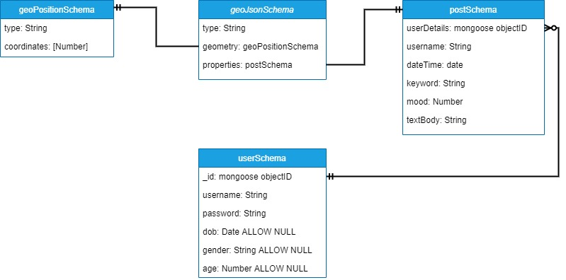

## Table of contents
* [System Implementation](#system)
* [UX Design](#uxdesign)
* [Sprints & Project Management](#sprints)

<a name="system"></a>
## System Implementation
### Stack architecture and system design (e.g. class diagrams, sequence diagrams)
stuff
### Back End - MongoDB - database implementation, the data model that you developed your back end from (e.g. entity relationship diagrams)
**MongoDB**

**geoJsonSchema**: This holds all information relating to user posts. For user posts to be displayed ont the map correctly the post content (*postSchema*) and coordinates (*geoPositionSchema*) are required. *userDetails* in *postSchema* connects posts to the account which created the post and is used when filtering results.

**userSchema**: This holds all the information relating to registered user accounts.



EmoteMap provides 5 integral features which interface with the back end:

**Account creation**: The user is asked to enter a username and password (password is entered twice to ensure user has entered the password correctly). These details are then sent to the database via the API route user.js. Once received on the backend a response is returned through the API which is either successful, in which case an account is added to the database, or it is unsuccessful meaning the requested username is already in use and the account could not be created. If the response was unsuccessful the user is informed their account could not be created and that they should use a different username. Date of birth, gender and age are all set to null by default and can only be set once the user has logged in.   

**Login**: After the user has created an account, they are then able to log in using their set credentials. The user’s entered username and password are sent to the backend via the API route user.js and queried on the database. If no matching username is found an unsuccessful response is returned and the user is prompted that they have entered an incorrect username. If a matching username is found (password is hashed and compared? Check with hari)
**Post creation**: Posts can only be created when the user is logged in and are sent from the front end to the database via the API route geopost.js. The content of the post along with the users account name are added to the post database.

**Display all user posts**: When a user first opens EmoteMap every single user post is displayed. To achieve this, once the website opened a request for every single user post is made via the API route geopost.js. These posts are then passed to Mapbox as a geoJSON array and displayed on the map.

**Filter user posts and display**: User posts can be filtered by date, gender, age, mood and keyword.  Initially all these parameters are set to show all posts, for example the age range is set to 0 – 100 and gender is set to both male and female. Excluding the keyword, these parameters determine what posts are fetched from the database. Before the database is queried userSchema is joined with geoJsonSchema so each post contains also the user’s attributes. Whenever one of these parameters is changed the database is queried again loading in all the geoJSON points which adhere to the criteria into a geoJSON array in memory. This geoJSON array is then passed to Mapbox to be displayed on the map. When a user enters a keyword and presses search all posts found in the pre filtered geoJSON array with similar keywords are returned.

### Middle Tier - Express, Node, the RESTful API
Our project makes use of ExpressJs to build 3 core RESTful apis for our application; search.js, user.js, and geopost.js. The most important api is likely geopost.js; it serves as the main link between the front and backend, handling fetching and posting geoJSON data to and from our mapbox component and our mongoDB database. It uses http get requests to fetch an array of geoJSON data (all of the user posts – data points containing location, keywords, date/time of the post, user details and the post description) which is utilised by our services to pipe the data into components where needed.  Similarly, http post requests are used to take data from user input forms in components in the front end, and send them to our database for permanent storage. Http delete requests are also utilised for removing posts from the database, should a user request it from the front end.
```js
/*gets all post from the db*/
router.get("", (req, res, next) => {
  GeoJson.find()
    .then((allGeoPost) => {
      res.status(200).json({
        message: "Coordinates sent from database",
        geoPost: allGeoPost,
      });
    })
    .catch((error) => {
      res.status(401).json({
        message: "unable to retrieve the data",
        error: error,
      });
    });
});
```

The user.js and search.js apis function similarly, but instead focus on fetching user data and search results respectively. User.js handles adding new users to the database when they sign up on the front end, and then consequently logging them in (http post), updating that data when a user chooses to input their date of birth and gender (using http put) and fetching user data if needed (http get).
```js
router.put("/:username", (req, res, next) => {
  if (req.body.gender != null) {
    User.updateOne({ username: req.params.username }, { gender: req.body.gender })
      .then((result) => {
        res.json({message: "update gender sucessfull"})
      })
      .catch((error) => {
        res.json({message: "no user"})
      });
  }
})
```

The search.js api is primarly concerned around generating constraints for fetching data from the database based on the users input in the searchfield in the side bar (e.g. fetching all posts made 10 or less days ago); it again does this through a http post request, but then also utilising functions from our GeoJson schema and filtering functions from the api to correctly populate an array to return to our user-search service which is then piped to the front end components to be displayed.
```js
router.post("", (req, res, next) => {
  GeoJson.find()
    .populate("properties.userDetails", ["age", "gender", "dob"])
    .sort({ "properties.dateTime": -1 })
    .then((data) => {
        data = data.filter(
          (geoPost) =>
            geoPost.properties.userDetails.age != null &&
            geoPost.properties.userDetails.age >= req.body.minAge &&
            geoPost.properties.userDetails.age <= req.body.maxAge
        );
      let minDate = generateDate(req.body.minDay);
      let maxDate = generateDate(req.body.maxDay);
      data = data.filter(
        (geoPost) =>
          minDate.getTime() <= geoPost.properties.dateTime.getTime() &&
          maxDate.getTime() >= geoPost.properties.dateTime.getTime()
      );
      data = filterGender(req.body.male, req.body.female, data);
      data = filterMood(
        req.body.happy,
        req.body.coping,
        req.body.sad,
        data
      );
      res.status(200).json({ message: "search", geoSearchArray: data });
    })
    .catch((err) => {
      res.status(401).json({ error: err });
      return;
    });
});
```

### Front End - Angular. Details of implementation
#### Angular Material
[Angular Material](https://material.angular.io)

We extensively utilised angular material to quickly implement well designed graphic and interactive html elements into our website; for example in our userpost component, we utilise mat (angular material) form fields to encapsulate and display all the user input elements - one of which is a mat slider, used for entering a users 'mood rating'. We also utilise the mat icon library for the button icons on this form (i.e. the send and close buttons).
```html
<div class="slider">
  <mat-form-field class="sliderForm">
    <mat-label>Mood</mat-label>
    <input formControlName="rating" matInput [(ngModel)]="rating" type="text"
      onkeydown="return false" style="height: 30px;"/>
  </mat-form-field>
  <mat-slider class="sliderSl" tickInterval="auto" [displayWith]="formatLabel" min="1" max="3" step="1"
    [value]="sliderVal" (input)="onSliderChange($event)"></mat-slider>
</div>
```

In fact the userpost component itself is displayed using the mat dialog element, which we trigger from a click event (either from clicking on the map in the mapbox component or the post button in the sidebar component, which itself utilises a mat icon). This dialog allows us to display the component as a popup on top of the rest of the website.
```javascript
createPost() {
  if (navigator.geolocation) {
    navigator.geolocation.getCurrentPosition((position) => {
      this.postService.updateLongLat({
        long: position.coords.longitude,
        lat: position.coords.latitude,
      });
    });
  }

  /*open a new diaglog object and set the parameters*/
  const dialogConfig = new MatDialogConfig();
  dialogConfig.autoFocus = false;
  dialogConfig.width = '55%';
  dialogConfig.height = '70%';
  dialogConfig.hasBackdrop = true;
  dialogConfig.panelClass = 'custom-dialog';
  dialogConfig.position = {bottom: '8%', right: '23%'};
  this.dialog.open(UserpostComponent, dialogConfig);
}
```
```html
<div class="button" (click)="createPost()">
  <button mat-fab color="primary" aria-label="Example icon button with a delete icon">
    <mat-icon class="icon-display" inline=true>add</mat-icon>
  </button>
</div>
```
#### Forms
We make use of angular forms primarily in order to pass data from our user input elements to services and other components in our website; for example our login component uses angulars' ngForm directive to pass the users username and password from the html to our user authentication service (note the use of mat forms on the html side for displaying the form to the user).
```js
onLogin(form: NgForm) {
  this.authService.login(form.value.username, form.value.password)
  .subscribe((response) => {
    if (response.token) {
      this.authService.setLogin(response.token, response.username);
      this.route.navigate([''])
    }
  });
}
```
```html
<mat-card class="loginForm">
    <mat-spinner *ngIf="isLoading"></mat-spinner>
    <form (submit)="onLogin(loginForm)" #loginForm="ngForm" *ngIf="!isLoading">
        <mat-form-field>
            <input matInput name="username" ngModel type="text" placeholder="Username" #usernameInput="ngModel"
                required>
            <mat-error *ngIf="usernameInput.invalid">Please enter a valid username.</mat-error>
        </mat-form-field>
        <mat-form-field>
            <input type="password" name="password" ngModel matInput placeholder="Password" #passwordInput="ngModel"
                required>
            <mat-error *ngIf="passwordInput.invalid">Please enter a valid password.</mat-error>
        </mat-form-field>
        <button mat-raised-button color="accent" type="submit" *ngIf="!isLoading">Login</button>
    </form>
</mat-card>
```
#### Mapbox
[Mapbox API](https://docs.mapbox.com/mapbox-gl-js/api/)

As our application is centred around displaying information on a map, one of the key aspects in developing the front end was to find and utilise a mapping api which could provide us with the display and interactivity features we needed. We considered other services, the most obvious being google maps, but decided to go with mapbox as not only is it open source, but had a far higher number of free map requests (50k vs 28k for google), and is comparatively lighter on resources to render the map within an application. It also has numerous graphical display options with easy-to-use documentation and examples to help us get our application running quickly. The mapbox-component is the central component within our angular application, with most of the central components being called from the mapbox-component html.

```html
<div class="full">
    <app-user *ngIf="isLoggedIn && sidebarState.profile" [@inOutAnimation]></app-user>
    <app-userpost-display *ngIf="isLoggedIn && sidebarState.userPosts" [@inOutAnimation] (flyToCords)="flyTo($event)">
    </app-userpost-display>
    <app-user-search *ngIf="isLoggedIn && sidebarState.search" [@inOutAnimation]></app-user-search>
    <app-key *ngIf="isLoggedIn && sidebarState.key" [@inOutAnimation]></app-key>
    <div id="map">
    </div>
    <app-usersearch-display *ngIf="isLoggedIn && sidebarState.search" [@inOutAnimation] (flyToCords)="flyTo($event)">
    </app-usersearch-display>
</div>

<app-searchfield *ngIf="!isLoggedIn" (flyToCords)="flyTo($event)"></app-searchfield>
<app-sidebar *ngIf="isLoggedIn && !isMapLoading"></app-sidebar>

```

The following is an overview of the key aspects of the api which we utilised. The first and most obvious is the map layer; the api provides numerous styles of world maps to display (we chose a dark colour scheme to better highlight the information in our data layers, to be covered shortly), which we initialise in the components ngOnInit function.

```javascript
initMap(): void {
  (mapboxgl as any).accessToken = environment.mapboxToken;
  this.map = new mapboxgl.Map({
    container: 'map',
    style: 'mapbox://styles/mapbox/dark-v10',
    zoom: 2,
    center: [-0.2101765, 51.5942466],
  });
}
```
The next and arguably most important aspect is the use of the “map.addSource” and “map.addLayer” api functions; within the addSource function is a key use of our geopost api and post service in angular; the component uses the service to call the api, which in turn fetches geoJson data (a special format of json files which stores coordinates and properties of data points) which contains all of the user posts. The mapbox api then stores this geoJson data in the component, which we then utilise in two addLayer functions.

```javascript
createDataSource(name: string): void {
  this.map.addSource(name, {
    type: 'geojson',
    data: {
      type: 'FeatureCollection',
      features: [],
    },
  });
}
```
```javascript
pullAndDisplayGJPointsFromDB(): void {
  this.createDataSource('data');
  this.source = this.map.getSource('data');
  this.postService.getGeoPostData().subscribe((geoPostArr) => {
    this.source.setData(new FeatureCollection(geoPostArr));
  });
}
```
The addLayer function from the api provides numerous different styles of data presentation for displaying data on top of the map layer. Our first use of the function uses the “circle” type; the api allows us to display circles at each data-points’ location from the geoJson, and colour these circles depending on the data-points’ properties; we colour these circles based on the so called mood-rating that a user picks when making a post to our website – this provides the key functionality of the entire site, allowing users to see patterns in people’s emotions across the map, based on the circle colours. The addLayer function can also be configured such that its visibility is based on a certain zoom level of the map; we utilise this so that when a user has zoomed in the circle layer appears, but when they are zoomed out, the second layer – a heatmap layer – appears. The “heatmap” type is another layer type, and we use it to display the density of user points at a location, with different colours indicating more or less points clustered in a specific location.

```js
this.map.addLayer({
  id: 'markers',
  interactive: true,
  type: 'circle',
  source: layer,
  minzoom: 9.2,
  paint: {
    'circle-stroke-color': '#fff',
    'circle-stroke-width': 1,
    'circle-radius': 5,
    'circle-color': [
      'step',
      ['get', 'mood'],
      '#EC986F',
      1,
      'rgb(65,182,196)',
      2,
      'rgb(254,204,92)',
      3,
      'rgb(227,26,28)',
    ],
  },
});
```

There are a few other key features of the api we use, centred around mouse events. Firstly, we utilise the api’s popup feature, such that when the circle layer is rendered (i.e. the user is zoomed in enough), when a user hovers the mouse over one of the displayed circles, a pop up appears, loading in the specific post data (keyword, rating and description) of that data point from the geoJson data. We also utilise the map.on(click) function to call our userpost-component in a dialog box, so a user can make a post at a specific location by clicking there if they are zoomed in enough. This component also utilises our geopost api and post service, but this time to send data to our database rather than fetch it.

```javascript
this.map.on('click', (e) => {
  if (this.isLoggedIn) {
    const zoom = this.map.getZoom();
    console.log(zoom);
    if (zoom > 12) {
      const dialogConfig = new MatDialogConfig();
      dialogConfig.autoFocus = false;
      dialogConfig.width = '55%';
      dialogConfig.height = '70%';
      dialogConfig.hasBackdrop = true;
      dialogConfig.panelClass = 'custom-dialog';
      dialogConfig.position = { bottom: '8%', right: '20%' };
      this.dialog.open(UserpostComponent, dialogConfig);
      this.postService.updateLongLat({
        long: e.lngLat.lng,
        lat: e.lngLat.lat,
      });
    }
  }
});
```

Finally, we use the api’s map.flyto function to move and zoom in on specific data points, which we call using an event listener in the mapbox-component html from a button click in the usersearch-display-component (which displays posts resulting from a user search).

```javascript
flyTo(lngLat: number[]) {
  if(!isNaN(lngLat[0])&&!isNaN(lngLat[1])){
    this.map.flyTo({
    center: [lngLat[0], lngLat[1]],
    zoom: 15,
  });
}
}
```

### Additional elements and components e.g. authentification. Tell us about any other aspects not covered above!
stuff
### Deployment details (including Docker), include how you have been achieving continuous integration and deployment
stuff

<a name="uxdesign"></a>
## UX Design
stuff

<a name="sprints"></a>
## Sprints & Project Management
stuff
