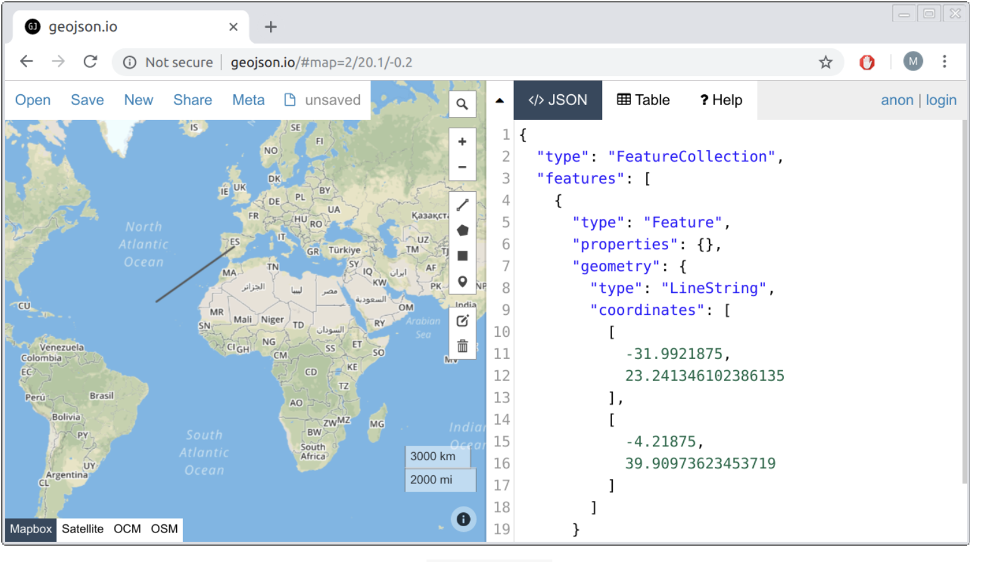
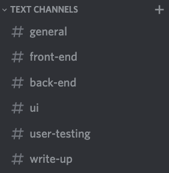

## Table of contents
* [System Implementation](#system)
* [UX Design](#uxdesign)
* [Sprints & Project Management](#sprints)

<a name="system"></a>
## System Implementation
### Stack architecture and system design (e.g. class diagrams, sequence diagrams)
stuff
### Back End - MongoDB - database implementation, the data model that you developed your back end from (e.g. entity relationship diagrams)

**Why use MongoDB?**

We choose MongoDb as a suitable database for our backend due to the nature of the GeoJson data structure required by Mapbox to display posts on the screen.
Initially, we were unsure of how to display user posts, create a Heatmap, and whether to allow users to search for posts using polygons. Marceli recommended
using MongoDb as it has a special part of the API designed to dealing with GeoJson queries. He mentioned that was a huge benefit of MongoDB. So to maximize our chances of success with being able to manipulate the Mapbox component in the front end, we chose MongoDB. 

There was some consideration to implement an SQL database due to the simple nature of our data model. As shown below, through the ERD, we could easily use join queries on the data which would have been beneficial in the search path of our API. However, due to the reason above, as well as being taught MongoDB in lectures. We stuck with MongoDB.

**Why use Mongoose**

Upon having a team conversation with Marceli, it was recommended that we look into Mongoose as an Object Document Manager to make our lives easier and save time.
After some research, we decided to use Mongoose as the middleman between incoming/outgoing HTTP requests/responses between the API and our database.
The syntax of Mongoose was a lot simpler than raw MongoDb, and it was the right decision as we were able to build the data models in a shorter time.
Mongoose models are a lot easier to initialize as they are capable of setting up default values automatically, and makes it easy to validate the data with simple commands.
MongoDB is inherently schema-less, however, Mongoose allows the developer to define schemas for their data type. This was used fully at the start as we were able quickly,
prototype our data models on the backend. Queries are a lot easier to deal with as they allow functions to chain onto the Model and don't require the embedded mnemonics that MongoDb requires so the developer experience was a lot smoother. This is akin to comparing using C to using Python. While C is more efficient and allows more room for flexibility in our code, Python provides a layer of abstraction that makes it a lot easier for scripting and experimenting with abstract ideas.

**How did we connect MongoDb To our API?**

Firstly, we needed to initialize the MongoDB database. So we created a free MongoDB account and created a cluster. We set the IP to all, so all of our team members can be sent requests through to the database, which usefull for testing, as we could all perform CRUD operations on the database. We then took the connection URL (which has our account details stored) and stored it as a variable: 'mongoDBConnect', in the Express application file. Mongoose as a simple method called "connect" that allows you to connect to the URL easily. Once Node is run, the database can now communicate with our API.

```js
mongoose.connect(mongoDBConnect,{ useNewUrlParser: true, useUnifiedTopology: true })
.then(connection => {
    console.log("Rest Api has successfully connected to mongoDb Database");
})
.catch(err=>{
    console.log("Failed to connect ot mongoDb");
})
```

**MONGOOSE MODELS**

**ERD of the whole data model**


The ERD above shows the final data model that is utilised by our application. We defined a schema for each block in the ERD diagram. However, we only have two seperate collections in our database, which was defined by two mongoose models.
```js
module.exports = mongoose.model("User", userSchema);

module.exports = mongoose.model("GeoJson", geoJsonSchema);
```

Lets talk about how the schema were made, why they were made and how they link together.

**geoJsonSchema**:
This schema was the initial schema we started to develop. As a team, we decided that we needed a data structure that allows anyone to make a post and display it on the Mapbox component. That was our first priority. If we didnt have this functionality then users wouldn't be able to Emote their feeling, see the heatmap, and view other peoples posts. After some research, it was found that there is a pre-defined data strucuture called: "GeoJson". This standard builds upon JSON data format, however it requires certain attributes. GeoJson is a data structure that
allows one to represent featues like geometry, along with any non-spatial attributes, that the developer has the freedom to define. When discovering this data structure we felt a sense of relief as we were really unsure as to model the data. This was the first GeoJson data structure we found in use: 



We gathered that you can display a set of GeoJson data by creating a "FeatureCollection". Each one of these will

This holds all information relating to user posts. For user posts to be displayed ont the map correctly the post content (*postSchema*) and coordinates (*geoPositionSchema*) are required. *userDetails* in *postSchema* connects posts to the account which created the post and is used when filtering results.

**userSchema**: This holds all the information relating to registered user accounts.

EmoteMap provides 5 integral features which interface with the back end:

**Account creation**: The user is asked to enter a username and password (password is entered twice to ensure user has entered the password correctly). These details are then sent to the database via the API route user.js. Once received on the backend a response is returned through the API which is either successful, in which case an account is added to the database, or it is unsuccessful meaning the requested username is already in use and the account could not be created. If the response was unsuccessful the user is informed their account could not be created and that they should use a different username. Date of birth, gender and age are all set to null by default and can only be set once the user has logged in.   

**Login**: After the user has created an account, they are then able to log in using their set credentials. The user’s entered username and password are sent to the backend via the API route user.js and queried on the database. If no matching username is found an unsuccessful response is returned and the user is prompted that they have entered an incorrect username. If a matching username is found (password is hashed and compared? Check with hari)
**Post creation**: Posts can only be created when the user is logged in and are sent from the front end to the database via the API route geopost.js. The content of the post along with the users account name are added to the post database.

**Display all user posts**: When a user first opens EmoteMap every single user post is displayed. To achieve this, once the website opened a request for every single user post is made via the API route geopost.js. These posts are then passed to Mapbox as a geoJSON array and displayed on the map.

**Filter user posts and display**: User posts can be filtered by date, gender, age, mood and keyword.  Initially all these parameters are set to show all posts, for example the age range is set to 0 – 100 and gender is set to both male and female. Excluding the keyword, these parameters determine what posts are fetched from the database. Before the database is queried userSchema is joined with geoJsonSchema so each post contains also the user’s attributes. Whenever one of these parameters is changed the database is queried again loading in all the geoJSON points which adhere to the criteria into a geoJSON array in memory. This geoJSON array is then passed to Mapbox to be displayed on the map. When a user enters a keyword and presses search all posts found in the pre filtered geoJSON array with similar keywords are returned.

### Middle Tier - Express, Node, the RESTful API
Our project makes use of ExpressJs to build 3 core RESTful apis for our application; search.js, user.js, and geopost.js. The most important api is likely geopost.js; it serves as the main link between the front and backend, handling fetching and posting geoJSON data to and from our mapbox component and our mongoDB database. It uses http get requests to fetch an array of geoJSON data (all of the user posts – data points containing location, keywords, date/time of the post, user details and the post description) which is utilised by our services to pipe the data into components where needed.  Similarly, http post requests are used to take data from user input forms in components in the front end, and send them to our database for permanent storage. Http delete requests are also utilised for removing posts from the database, should a user request it from the front end.
```js
/*gets all post from the db*/
router.get("", (req, res, next) => {
  GeoJson.find()
    .then((allGeoPost) => {
      res.status(200).json({
        message: "Coordinates sent from database",
        geoPost: allGeoPost,
      });
    })
    .catch((error) => {
      res.status(401).json({
        message: "unable to retrieve the data",
        error: error,
      });
    });
});
```

The user.js and search.js apis function similarly, but instead focus on fetching user data and search results respectively. User.js handles adding new users to the database when they sign up on the front end, and then consequently logging them in (http post), updating that data when a user chooses to input their date of birth and gender (using http put) and fetching user data if needed (http get).
```js
router.put("/:username", (req, res, next) => {
  if (req.body.gender != null) {
    User.updateOne({ username: req.params.username }, { gender: req.body.gender })
      .then((result) => {
        res.json({message: "update gender sucessfull"})
      })
      .catch((error) => {
        res.json({message: "no user"})
      });
  }
})
```

The search.js api is primarly concerned around generating constraints for fetching data from the database based on the users input in the searchfield in the side bar (e.g. fetching all posts made 10 or less days ago); it again does this through a http post request, but then also utilising functions from our GeoJson schema and filtering functions from the api to correctly populate an array to return to our user-search service which is then piped to the front end components to be displayed.
```js
router.post("", (req, res, next) => {
  GeoJson.find()
    .populate("properties.userDetails", ["age", "gender", "dob"])
    .sort({ "properties.dateTime": -1 })
    .then((data) => {
        data = data.filter(
          (geoPost) =>
            geoPost.properties.userDetails.age != null &&
            geoPost.properties.userDetails.age >= req.body.minAge &&
            geoPost.properties.userDetails.age <= req.body.maxAge
        );
      let minDate = generateDate(req.body.minDay);
      let maxDate = generateDate(req.body.maxDay);
      data = data.filter(
        (geoPost) =>
          minDate.getTime() <= geoPost.properties.dateTime.getTime() &&
          maxDate.getTime() >= geoPost.properties.dateTime.getTime()
      );
      data = filterGender(req.body.male, req.body.female, data);
      data = filterMood(
        req.body.happy,
        req.body.coping,
        req.body.sad,
        data
      );
      res.status(200).json({ message: "search", geoSearchArray: data });
    })
    .catch((err) => {
      res.status(401).json({ error: err });
      return;
    });
});
```

### Front End - Angular. Details of implementation
#### Angular Material
[Angular Material](https://material.angular.io)

We extensively utilised angular material to quickly implement well designed graphic and interactive html elements into our website; for example in our userpost component, we utilise mat (angular material) form fields to encapsulate and display all the user input elements - one of which is a mat slider, used for entering a users 'mood rating'. We also utilise the mat icon library for the button icons on this form (i.e. the send and close buttons).
```html
<div class="slider">
  <mat-form-field class="sliderForm">
    <mat-label>Mood</mat-label>
    <input formControlName="rating" matInput [(ngModel)]="rating" type="text"
      onkeydown="return false" style="height: 30px;"/>
  </mat-form-field>
  <mat-slider class="sliderSl" tickInterval="auto" [displayWith]="formatLabel" min="1" max="3" step="1"
    [value]="sliderVal" (input)="onSliderChange($event)"></mat-slider>
</div>
```

In fact the userpost component itself is displayed using the mat dialog element, which we trigger from a click event (either from clicking on the map in the mapbox component or the post button in the sidebar component, which itself utilises a mat icon). This dialog allows us to display the component as a popup on top of the rest of the website.
```javascript
createPost() {
  if (navigator.geolocation) {
    navigator.geolocation.getCurrentPosition((position) => {
      this.postService.updateLongLat({
        long: position.coords.longitude,
        lat: position.coords.latitude,
      });
    });
  }

  /*open a new diaglog object and set the parameters*/
  const dialogConfig = new MatDialogConfig();
  dialogConfig.autoFocus = false;
  dialogConfig.width = '55%';
  dialogConfig.height = '70%';
  dialogConfig.hasBackdrop = true;
  dialogConfig.panelClass = 'custom-dialog';
  dialogConfig.position = {bottom: '8%', right: '23%'};
  this.dialog.open(UserpostComponent, dialogConfig);
}
```
```html
<div class="button" (click)="createPost()">
  <button mat-fab color="primary" aria-label="Example icon button with a delete icon">
    <mat-icon class="icon-display" inline=true>add</mat-icon>
  </button>
</div>
```
#### Forms
We make use of angular forms primarily in order to pass data from our user input elements to services and other components in our website; for example our login component uses angulars' ngForm directive to pass the users username and password from the html to our user authentication service (note the use of mat forms on the html side for displaying the form to the user).
```js
onLogin(form: NgForm) {
  this.authService.login(form.value.username, form.value.password)
  .subscribe((response) => {
    if (response.token) {
      this.authService.setLogin(response.token, response.username);
      this.route.navigate([''])
    }
  });
}
```
```html
<mat-card class="loginForm">
    <mat-spinner *ngIf="isLoading"></mat-spinner>
    <form (submit)="onLogin(loginForm)" #loginForm="ngForm" *ngIf="!isLoading">
        <mat-form-field>
            <input matInput name="username" ngModel type="text" placeholder="Username" #usernameInput="ngModel"
                required>
            <mat-error *ngIf="usernameInput.invalid">Please enter a valid username.</mat-error>
        </mat-form-field>
        <mat-form-field>
            <input type="password" name="password" ngModel matInput placeholder="Password" #passwordInput="ngModel"
                required>
            <mat-error *ngIf="passwordInput.invalid">Please enter a valid password.</mat-error>
        </mat-form-field>
        <button mat-raised-button color="accent" type="submit" *ngIf="!isLoading">Login</button>
    </form>
</mat-card>
```
#### Mapbox
[Mapbox API](https://docs.mapbox.com/mapbox-gl-js/api/)

As our application is centred around displaying information on a map, one of the key aspects in developing the front end was to find and utilise a mapping api which could provide us with the display and interactivity features we needed. We considered other services, the most obvious being google maps, but decided to go with mapbox as not only is it open source, but had a far higher number of free map requests (50k vs 28k for google), and is comparatively lighter on resources to render the map within an application. It also has numerous graphical display options with easy-to-use documentation and examples to help us get our application running quickly. The mapbox-component is the central component within our angular application, with most of the central components being called from the mapbox-component html.

```html
<div class="full">
    <app-user *ngIf="isLoggedIn && sidebarState.profile" [@inOutAnimation]></app-user>
    <app-userpost-display *ngIf="isLoggedIn && sidebarState.userPosts" [@inOutAnimation] (flyToCords)="flyTo($event)">
    </app-userpost-display>
    <app-user-search *ngIf="isLoggedIn && sidebarState.search" [@inOutAnimation]></app-user-search>
    <app-key *ngIf="isLoggedIn && sidebarState.key" [@inOutAnimation]></app-key>
    <div id="map">
    </div>
    <app-usersearch-display *ngIf="isLoggedIn && sidebarState.search" [@inOutAnimation] (flyToCords)="flyTo($event)">
    </app-usersearch-display>
</div>

<app-searchfield *ngIf="!isLoggedIn" (flyToCords)="flyTo($event)"></app-searchfield>
<app-sidebar *ngIf="isLoggedIn && !isMapLoading"></app-sidebar>

```

The following is an overview of the key aspects of the api which we utilised. The first and most obvious is the map layer; the api provides numerous styles of world maps to display (we chose a dark colour scheme to better highlight the information in our data layers, to be covered shortly), which we initialise in the components ngOnInit function.

```javascript
initMap(): void {
  (mapboxgl as any).accessToken = environment.mapboxToken;
  this.map = new mapboxgl.Map({
    container: 'map',
    style: 'mapbox://styles/mapbox/dark-v10',
    zoom: 2,
    center: [-0.2101765, 51.5942466],
  });
}
```
The next and arguably most important aspect is the use of the “map.addSource” and “map.addLayer” api functions; within the addSource function is a key use of our geopost api and post service in angular; the component uses the service to call the api, which in turn fetches geoJson data (a special format of json files which stores coordinates and properties of data points) which contains all of the user posts. The mapbox api then stores this geoJson data in the component, which we then utilise in two addLayer functions.

```javascript
createDataSource(name: string): void {
  this.map.addSource(name, {
    type: 'geojson',
    data: {
      type: 'FeatureCollection',
      features: [],
    },
  });
}
```
```javascript
pullAndDisplayGJPointsFromDB(): void {
  this.createDataSource('data');
  this.source = this.map.getSource('data');
  this.postService.getGeoPostData().subscribe((geoPostArr) => {
    this.source.setData(new FeatureCollection(geoPostArr));
  });
}
```
The addLayer function from the api provides numerous different styles of data presentation for displaying data on top of the map layer. Our first use of the function uses the “circle” type; the api allows us to display circles at each data-points’ location from the geoJson, and colour these circles depending on the data-points’ properties; we colour these circles based on the so called mood-rating that a user picks when making a post to our website – this provides the key functionality of the entire site, allowing users to see patterns in people’s emotions across the map, based on the circle colours. The addLayer function can also be configured such that its visibility is based on a certain zoom level of the map; we utilise this so that when a user has zoomed in the circle layer appears, but when they are zoomed out, the second layer – a heatmap layer – appears. The “heatmap” type is another layer type, and we use it to display the density of user points at a location, with different colours indicating more or less points clustered in a specific location.

```js
this.map.addLayer({
  id: 'markers',
  interactive: true,
  type: 'circle',
  source: layer,
  minzoom: 9.2,
  paint: {
    'circle-stroke-color': '#fff',
    'circle-stroke-width': 1,
    'circle-radius': 5,
    'circle-color': [
      'step',
      ['get', 'mood'],
      '#EC986F',
      1,
      'rgb(65,182,196)',
      2,
      'rgb(254,204,92)',
      3,
      'rgb(227,26,28)',
    ],
  },
});
```

There are a few other key features of the api we use, centred around mouse events. Firstly, we utilise the api’s popup feature, such that when the circle layer is rendered (i.e. the user is zoomed in enough), when a user hovers the mouse over one of the displayed circles, a pop up appears, loading in the specific post data (keyword, rating and description) of that data point from the geoJson data. We also utilise the map.on(click) function to call our userpost-component in a dialog box, so a user can make a post at a specific location by clicking there if they are zoomed in enough. This component also utilises our geopost api and post service, but this time to send data to our database rather than fetch it.

```javascript
this.map.on('click', (e) => {
  if (this.isLoggedIn) {
    const zoom = this.map.getZoom();
    console.log(zoom);
    if (zoom > 12) {
      const dialogConfig = new MatDialogConfig();
      dialogConfig.autoFocus = false;
      dialogConfig.width = '55%';
      dialogConfig.height = '70%';
      dialogConfig.hasBackdrop = true;
      dialogConfig.panelClass = 'custom-dialog';
      dialogConfig.position = { bottom: '8%', right: '20%' };
      this.dialog.open(UserpostComponent, dialogConfig);
      this.postService.updateLongLat({
        long: e.lngLat.lng,
        lat: e.lngLat.lat,
      });
    }
  }
});
```

Finally, we use the api’s map.flyto function to move and zoom in on specific data points, which we call using an event listener in the mapbox-component html from a button click in the usersearch-display-component (which displays posts resulting from a user search).

```javascript
flyTo(lngLat: number[]) {
  if(!isNaN(lngLat[0])&&!isNaN(lngLat[1])){
    this.map.flyTo({
    center: [lngLat[0], lngLat[1]],
    zoom: 15,
  });
}
}
```

### Additional elements and components e.g. authentification. Tell us about any other aspects not covered above!
stuff
### Deployment details (including Docker), include how you have been achieving continuous integration and deployment
We implemented a docker-compose script from early on in the development process, which ended up being crucial in maintaining code quality and compatibility - we made sure that before each push to our group repository that the website was functioning both when running node server.js and docker-compose up. Docker was especially important for this as it provides a repeatable environment in the form of a docker container; we can be sure that if the project is working on one machine in docker, it will work on others. We primarily achieved continuous integration by utilising docker in this way, but also crucial was the factoring in of all the components of the MEAN stack from a very early stage. After deciding on the api we would use to present the map (mapbox) and setting up a basic template website using it, we quickly added an api (this api eventually became geopost.js) in order to deal with fetching the data for the map; even though this was collecting static data at first, it meant that functionally our website was behaving as it would when we we utilising all parts of the mean stack (i.e. when we added in a mongoDB database, this api would now fetch data from the database instead of using static data). This allowed us to test and run our website using node server.js (and docker-compose up) after every change as previously mentioned. As we also made use of github, allowing us to all share and download the most up to date files, we were able to continuously implement and integrate changes throughout the development process (see [Sprints & Project Management](#sprints) for more details).

# Sprints

## Sprint 1: Project idea finalisation & set up CI infrastructure

[16-27th feb]

After having got to grips with the brief and decided on an idea, we began putting together an initial paper draft for our website.

Sprint aims:

* Clarify project idea and scope
* Create draft of website UX & create paper prototype
* Conduct user survey using paper prototype
* Set up a github repository

There were some different opinions amung the group regarding how the website should be layed out. Some felt that the login bar should slide in from the side and others felt that a whole new page should open. We decided to draw up paper prototype of both of these cases and conduct a user study to decide (_SEE PAPER PROTOTYPING_). We wanted our product to be as user driven as possible so getting user feedback early on was crucial.

As well as discussing project ideas this period was used to get familiar with the tech stack we were going to be using and github. We each watched the lectures on Angular and github, set up a shared github repository and got familiar with its protocols by making a few pushes and pulls. Although we intended to specialise into certain areas later on, we all got familiar with the frontend and Angular so further down the line it would be possible to be more flexible if required. 


## Sprint 2: Work on feedback + find suitable API

[27th feb - 10th mar]

- review feedback from paper prototyping survey (eg: decide that log in bar should go from side)
- begin working on boilerplate
- decide on API required and add to site (list some other map api other than mapbox and why we chose mapbox?); added mapbox functionality and nav bar
- mapbox comes with dummy earthquake data, which we used to begin testing out data presentation using the mapbox api

## Sprint 3: Serve dummy data from directly from API to frontend + set up data model:

[11th mar - 27th mar]

- getting user feedback (add description, some people said unclear what function of site is)
- Set up site so dummy data is served through API route + Add linking to front end + making sure data model working in front end
- build Data Model (user, post) + set up mongo schemas
- adding user login functionality
- implementing docker functionality for continuous integration
- implemented mapbox heatmap example

- began to implement mapbox heatmap example
## Sprint 4: Set up mongoDB and import dummy data + user authentification

[28th mar - 10th apr]

- set up so dummy data is stored in mongoDB + user posts add to this
- implemented mapbox popup
- after this decided to actually scrap the dummy data and instead populate with our own data
- added functionality for users making posts
- set up user authentication link to DB
- changed colour scheme advice from lecturers
This sprint was where we finally began to pull together the disperate elements of the website; our aims involved connecting the data fetching service to a function backend using mondoDB, instead of just returning static template data. This is where we also wanted to begin implementing some user feedback based off user questionnaires centered around our intial mockup. We also set a stretch goal of actually adding user profile, rather than have the posts be completely anonymous.

Our agreed goals for this period were;
* connect mondoDB to front end (so the front end is fetching data from our database)
* add the functionality make posts (i.e. sending data to the front end)
* begin implementing feedback from user study and from lecturers
* finalize key mapbox api functionality (pop ups when hovering over a point on the map)
* if time permits, add users to the database as well


[ADD HOW MONGODB WAS IMPLEMENTED]

To implement displaying the post data when a user hovers over a data point on the map required the use of a couple of the features of the mapbox api. Foremost was labeling the map marker layer with the interactive tag; `this.map.addLayer({ id: 'markers', interactive: true, .....})`. This allows the layer to be interacted with through mouse events. We first had the popup be triggered by clicking on the point, but decided it would be more intuitive for it to appear on a mouse hover; we made use of mapbox's `this.map.on('mouseenter', 'markers', (e)....` command to trigger mapbox's pop up feature, which then displays the data points geoJSON properties - which we are fetching from mondoDB as discussed above.

From our user feedback it was clear that first time users struggled to grasp the point of the website, and in fact some suggested we add a section to explain the site; so we did exactly that! We added an "about" component and a link in the toolbar that users could click through to, to learn more about the website. We also changed our colour scheme to a white toolbar on a black map, rather than pink on white, from feedback from our lecturers, and to make more clear the colourful data points on the map (the colours constrasted the black map far more than the white )

We also finally implemented a user-post component, which allows new data to be added to website; this component makes use of angular forms to collect inputted data, which we then transform into geoJSON format using our post-service, to be added to our database. As we had time at the end of this sprint, we also began to add in actual user functionality to the website - the singup/login buttons on the navbar where changed to actually route through to signup/login pages, which also use angular forms to collect user input and add new users to the database/verify users who are logging in.

#### Key implementation issues found: ####
<table>
<tr>
  <th>Area</th>
  <th>User Story</th>
  <th>Issue</th>
  <th>Solution</th>
</tr>
<tr>
  <td>MongoDB</td>
  <td>stuff</td>
  <td>stuff</td>
  <td>stuff</td>
</tr>
<tr>
  <td>Mapbox</td>
  <td>User can hover over points on the map to see more detail, and can create their own posts to add to the map</td>
  <td>Issues with correctly loading data from the database as opposed to static file</td>
  <td>Mapbox had issues with calling the data directly from the database, so we implemented a geoJSON model which transformed the data from mongo into an object in memory that mapbox could correctly access </td>
</tr>
</table>

## Sprint 5 Users enter more details + can filter by them:

[11th apr - 20th apr]

- users now enter age, gender and can now can be filtered by this (posts linked to user accounts)
- implemented sidebar
- search functionality
- user post history
- at this stage almost feel website is complete. one last survey for UX
- users now have to log in to be able to filter results, encourages posting and engaging with site
- began to start formating write up/readme

## Sprint 6 Project Write up:

[21st apr - hand in]

- Write up
- feedback says icons unclear, alter icons to have names


<a name="uxdesign"></a>

# UX Design

## Design Process and Early prototyping and ideation (including mood boards and paper prototyping)

### Idea formulation

This time was used to get to know the other group members and project brief itself. Having all come from different backgrounds, from music to engineering, a lot of varied and interesting project ideas were put forward. After some discussion we drafted up 4 potential ideas:

**Higher or lower:** A simple game in which the user was asked which was item is "higher or lower", if they get the answer correct they are given a fact about the item which was lower. Below is a small demonstration on the topic of population size but question topics could be on a large variety of things:
ADD PICTURE
The game intention of this game was to be addictive, fun and educational.

**Altitude explorer:** A 2D platformer game with similar mechanics to the app [Doodle Jump] but the user explores different altitudes on earth and in space. The player starts at the bottom of the sea and works their way up into space. As they travel up through different levels they learn facts about what is present at each altitude. For example at 10,927m below sea level the user would be told that this was the deepest manned sea dive ever recorded or at 10,668m above sea level they would be informed that this is the average height at which passenger planes fly. As the user went higher they would then learn about different planets and objects in space. Similar to the other idea this served to be entertaining but also educational.

**Musical instruments through time:** A web page where users can browse musical instruments through time and when they are clicked the sound of the instrument is played. Aimed to teach users about musical anthropology in an engaging way, an interesting topic which our group consider to be overlooked and undervalued compared to other areas of music.

**EmoteMap:** A geographical diary where users can post diary entries which include their current location. Users can then look on the map at their archived posts and see how they were feeling in certain locations. This website idea aims to help users track and improve upon their mental wellbeing.

A lot of time was spent discussing which project idea to use. The idea needed to be useful, original and also fit the brief. We decided that although we felt all the ideas were good, EmoteMap addressed the particularly relevant issue of mental health and isolation. COVID-19 has left many people isolated and struggling to cope with ongoing lockdowns. We decided to use the geographical diary element from the EmoteMap idea but make it so posts can be seen by other users online, making users feel less isolated and more connected. All group members agreed this idea had great potential and decided to finalise this as our project idea.


Our first real visualisation of the website consisted of a paper prototype. This ensured all members of the group were on the same page (no pun intended) regarding the initial layout, and allowed us to easily and to quickly make adjustments during a group discussion. Our original prototype is shown here:

<p align="center">

</p>


### Identification of interacting users and broader stakeholders.
stuff

### UX approach – design heuristics/approach, design methods (design fiction / heuristics)
stuff

### Understanding of user group (questionnaires / user stories / interviews)
To ensure that we continued to develop a website with the user in mind, we gathered user feedback throughout the project. This started as early as our paper prototypes, and proved to be useful. For example, the first paper prototype (which was also shared) demonstrated that new users would be greeted wth an empty globe. They would then have to signup before gaining the ability to interact with the map. This was our initial plan because we wanted to encourage users to signup, however, user feedback revealed something important to us: the user was confused as to what signing up would allow them to do (aka they did not understand the purpose of the website straight away). We thought this may start to turn away newcomers. We changed the paper prototype to demonstrate to users that they could zoom in/out of the map, and read EmotePosts as soon as they enter the website. This also meant that the ‘serious play’ aspect was integrated immediately, and the user would learn in an active manner. We decided to include a ‘signup’ option on a sidebar. After implementing these changes, users grasped the concept much quicker when shown the paper prototype. The image below shows the changes we made to our paper prototype as a response:

<p align="center">

</p>

The wireframe was also shared with external individuals, to gather further feedback (in the form of an accompanying quetionnaire). The results of the questionnaire revealed potential improvements, which we then implemented. For example, one of the questions asked: ‘How would you go about improving the website?’. One answer suggested including a key for the different coloured markers. The image below shows the final state of the key that we decided to implement as a response to this feedback.


### Wireframes and interaction flow diagrams for final key subsystems.
Our paper prototype served well at forming an initial visualisation of the website. In order to gain more useful feedback, we needed to demonstrate the website using a closer representation of a working product. Logically, a wireframe was the next best step. We used [InVision](https://www.invisionapp.com) to do this. Click [here](https://zaki744910.invisionapp.com/console/share/NJ2D65MNBU/572059598) to go to our interactive wireframe. Below is a preview:

<p align="center">

</p>


<a name="sprints"></a>
## Sprints & Project Management
### Group working methods used (for instance did your team choose a particular style of agile? What communication channels did you use?)
Discord was used for the majority of the written communication. We setup a server and divided it into 6 channels: ‘general’, ‘front-end’, ‘back-end’, ‘ui’, ‘user-testing’ and ‘write-up’. Having individual channels meant that our communication was more organised, and reduced disruption to members working on alternative sections. Discord’s pinning feature also meant that key messages never went missing amongst a sea of other messages.



Microsoft Teams was used for video communication, and served perfectly for longer discussions. Often, we would choose video communication for when project-level decisions had to be made. For example, our original idea was to allow users to write a longer, more journal-like post. For multiple reasons, we decided to change the idea so that EmotePosts would be shorter personal updates. One reason was because we were concerned over the users' attention spans. It was more likely that a user would engage in multiple, short, and easy to read posts. This decision really changed our direction, and therefore required the input of all members, and ultimately a unanimous decision.

### Team use of Git, how your team used continuous integration / continuous deployment. Streamlining of workflow throughout.
In addition to the main branch, a 'dev' (development) branch was also created. Those members who were part of producing the website each created their own branch from 'dev'; this ensured that each member could work without being interrupted by conflicts. When a member was ready to submit their work, they would inform the others (via Discord) that they were soon going to merge and push - this avoided divergence of the 'dev' branch. The member would then ensure their 'dev' branch was up to date, merge their branch with 'dev' (after resolving any conflicts), before finally pushing. The member then informed the group of the push. At this point, another member may have requested temporary 'reservation' of the 'dev' branch. After each major feature implementation, members would ensure the stability of the dev branch, before merging it with 'main'.

stuff

[Doodle Jump]: <https://en.wikipedia.org/wiki/Doodle_Jump>
