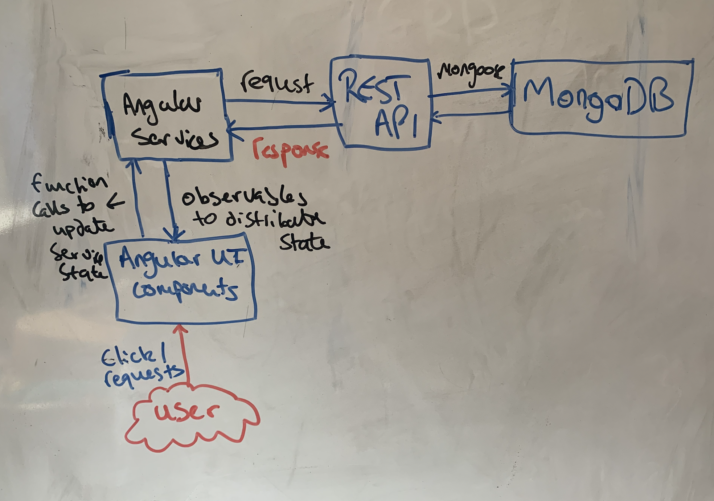

# System Implementation
## Stack architecture and system design (e.g. class diagrams, sequence diagrams)

Before diving into the details of each stack, how they work and link together. Lets talk about the System Architecture as a whole.
<br/> From a very broad perspective this is how application skeleton is structured: <br/>
<br/>


We needed three main components that comprise the stack.

1. The MongoDB database: <br/>
    To store GeoJson and User data through two separate collections. This will communicate with the REST API through the ODM, Mongoose. It will have no direct connection to the front end due to security reasons. All data that is created on the front end will filter throughout API.

2. The REST API: <br/>
    This is capable of dealing with incoming HTTP requests and adequately responds to the client. It is built with NodeJs and a framework called ExpressJs. It makes use of the HTTP protocol to send data from the client to the database. The client submits an HTTP request to the server. This request will have an HTTP param id, which is used to send data through the URL path. This is useful for sending user information from the client to the API, like a username. An HTTP body, which sends the main data structure created on the front end. As an example, when the user makes a new EmotePost, a javascript object is created and that is sent via Angular's HTTP client with that object as a payload. The server will have access to that via using the body method. HTTP headers are also sent. We intend to use the headers to send the JWT token to guard our routing paths on the back end. This essentially makes them accessible to users. Once a request has been detected at one of the servers' paths, it will perform adequate data processing. Ie storing data in the database, querying the database for data, and then send a response back to the client. This will contain, and data required, or messages that tell the client this request couldn't be handled in some way.

3. The frontend/UI: <br/>
    This is responsible for the user experience and data creation through the use of Angular forms.
    The user can explore the map, create an account, log in, create Emote posts, view other users' posts, have access to their posts in a timeline, delete their posts, fly to a post, and search for other users' posts (by date, age, and gender). To display a map, we needed to connect to an external API. We had two options. One Mapbox and the other was GoogleMaps. Firstly, Mapbox was more appealing as it is the underdog. We didn't want to be involved with a conglomerate like Google. After digesting Mapbox's API, we realized it is capable of doing everything we wanted. Especially, displaying a heat map. It accepts geoJson data and provides the developer with a lot of support to customize and visualize that data on the map. It accepts data via a direct link to a URL path, or through building your objects. This was useful as it allowed us to use geoJson objects that are stored in memory on the front end. As an example (will be explained in a lot more detail in the front end), when the user made a post-it would automatically update the UI, as we stored the new post in a Service. The Mapbox component listens to changes in the geoJson array and re-renders the data on the map. We used a set of Angular Services to maintain state and allow data to flow between components on the frontend, as well as providing a link between the data flowing to the REST API.

Lets go into some more depth...    

## Back End - MongoDB - database implementation, the data model that you developed your back end from (e.g. entity relationship diagrams)

### Why use MongoDB?

We choose MongoDb as a suitable database for our backend due to the nature of the GeoJson data structure required by Mapbox to display posts on the screen.
Initially, we were unsure of how to display user posts, create a Heatmap, and whether to allow users to search for posts using polygons. Marceli recommended
using MongoDb as it has a special part of the API designed to dealing with GeoJson queries. He mentioned that was a huge benefit of MongoDB. So to maximize our chances of success with being able to manipulate the Mapbox component in the front end, we chose MongoDB.

There was some consideration to implement an SQL database due to the simple nature of our data model. As shown below, through the ERD, we could easily use join queries on the data which would have been beneficial in the search path of our API. However, due to the reason above, as well as being taught MongoDB in lectures. We stuck with MongoDB.

### How did we connect MongoDb To our API?

Firstly, we needed to initialize the MongoDB database. So we created a free MongoDB account and created a cluster. We set the IP to all, so all of our team members can be sent requests through to the database, which useful for testing, as we could all perform CRUD operations on the database. We then took the connection URL (which has our account details stored) and stored it as a variable: 'mongoDBConnect', in the Express application file. Mongoose as a simple method called "connect" that allows you to connect to the URL easily. Once Node is run, the database can now communicate with our API.

```js
mongoose.connect(mongoDBConnect,{ useNewUrlParser: true, useUnifiedTopology: true })
.then(connection => {
    console.log("Rest Api has successfully connected to mongoDb Database");
})
.catch(err=>{
    console.log("Failed to connect ot mongoDb");
})
```

### MONGOOSE MODELS

#### ERD of the whole data model


The ERD above shows the final data model that is utilised by our application. We defined a schema for each block in the ERD diagram. However, we only have two seperate collections in our database, which was defined by two mongoose models.
```js
module.exports = mongoose.model("User", userSchema);

module.exports = mongoose.model("GeoJson", geoJsonSchema);
```

#### GeoJsonModel : <br/>
This schema was the initial schema we started to develop. As a team, we decided that we needed a data structure that allowed anyone to make a post and display it on the Mapbox component. That was our priority. If we didn't have this functionality then users wouldn't be able to Emote their feeling, see the heatmap, and view other people's posts. After some research, it was found that there is a pre-defined data structure called: "GeoJson". This standard builds upon JSON data format, however, it requires certain attributes. GeoJson is a data structure that
allows one to represent features like "Geometry", along with any non-spatial attributes that the developer has the freedom to define. When discovering this data structure we felt a sense of relief as we were unsure as to model the data. This was the first GeoJson data structure we found in use through a tutorial from "http://132.72.155.230:3838/js/geojson-1.html":


We gathered that you can display a set of GeoJson data by creating a "FeatureCollection". Each one of these will contain a set of GeoJson of type: "Feature". This was then the basis of our GeoJson model. We needed a model that accurately modeled a GeoJson "Feature", which could then be collected as a "FeatureCollection" on the front end.
This is the geoJsonSchema that the GeoJson model is made from:
```js
const geoJsonSchema = new mongoose.Schema({
  type: {
    type: String,
    required: true,
    enum: ['Feature']
  },
  geometry: {
    type: geoPositionSchema,
    required: true,
  },
  properties: {
    type: postSchema,
    required: true,
  },
});
```
Each geoJson by default has type "Feature".
"Geometry" is an attribute that contains the *geoPositionSchema*, which is Mongoose sub-document and likes the two schemas together. The *geoPositionSchema* has an attribute: "type", which refers to the type of geometry. This could be "LineString", "Point" etc. We instantly knew it needed to be "Point", and we used the enum field in Mongoose to set it as a default. Each geometry attribute is required to have a set of coordinates. As we are representing a "Point", this needed to be an array of numbers, where the first element was the longitude and the second was the latitude. <br/>
This is the *geoPositionSchema* that the GeoJson model is made from:
```js
const geoPositionSchema = new mongoose.Schema({
  type: {
    type: String,
    enum: ['Point'],
    required: true,
  },
  coordinates: {
    type: [Number],
    required: true,
  },
});
```
The other attribute is "properties". This is where we have the freedom to design the EmotePost data. And combine that with the geometry so the user's EmotePost can be displayed on the map.
The *postSchema* is Mongoose sub-document that connected to the GeoJsonSchema via the "properties" attribute, this holds all information relating to user posts.
It contains the mood value, which is a number between 1-3 (inclusive) that models the emotions" Happy, Coping and Sad respectively. The textBody is the string that contains the user's actual Emote description. The keyword sums up the post and is used so the users can search for specific keywords. The dateTime attribute contains the exact date time at which the post was made.The username is the user who made the post. The user details are an objectId type, which is referenced to the 'User' model. This is essentially a string that is the unique identifier for the user that creates the post. It allows Mongoose to search for a user in the User collection with the same ID and populate the userDetail field with the data specific to that user. This essentially allows us to join the user details, from the User model to each geoJson post. Analogous, to a many to one relationship in relational databases. Where the user can have many posts but the post has one user.
```js
const postSchema = new mongoose.Schema({
  userDetails: {
    type: mongoose.Schema.Types.ObjectId,
    required: true
    ref: 'User',
  },
  username: {
    type: String,
    required: true
  },
  dateTime: {
    type: Date,
    required: true,
  },
  keyword: {
    type: String,
    required: true,
  },
  mood: {
    type: Number,
    required: true,
  },
  textBody: {
    type: String,
    required: true,
  },
});
```

#### UserModel: <br/>
This holds all the information relating to registered user accounts. Initially, we fathomed a guess as to what the attributes the userSchema should hold.
It made sense for there to be a username, email, password, and geoPost attributes. We thought that the geoPost attribute will contain an array of GeoJson data that the user made, defined by the models above.
So we would just have one Model called User, and whenever the user made a post-it will store the GeoJson data in the User Collection under the user. However, we thought this wouldn't be a good idea as it would cause more work for getting all the GeoJson. It's easier to get all GeoJson and manipulating that array on the API or frontend, than getting all the user's GeoJson and merging them into an array, before manipulating it. Especially, when it would to come searching the GeoJson with complex queries. We also got rid of the email as it was mentioned from numerous user feedback that it wasn't needed. When posting such sensitive information, users wanted to remain anomalous. We also added, date of birth, gender and age attributes to support searching for GeoJson by age and gender. <br/>
Mongoose automatically adds and _Id attribute. This is the ID stored with each GeoJson data that's created from the user 'Emoting'.
We set the username to be unique. So only unique values can be stored in the database. To do with we used a library called "mongoose-unique-validator".
```js
const userSchema = new mongoose.Schema({    
  username: {
    type: String,
    unique: true,
    required: true,
  },
  password: {
    type: String,
    required: true,
  },
  dob: {
    type: Date,
    default: null,
    required: false,
  },
  gender: {
    type: String,
    default: null,
    required: false,
  },
  age: {
    type: Number,
    default: null,
    required: false,
  },
  userSchema.plugin(uniqueValidatorPlugin);
});
```

### Middle Tier - Express, Node, the RESTful API

#### Node:
We used Node as a runtime enviroment allowed us to run javascript code outside  the web browser. As, we built the front-end with Angular, we decided that to use Node to build the backend API, as the languages needed for both are the same. This really helped team members work on both the front and the backend. The node server is built with the HTTP module, and listens for HTTP request/responses on a local port. We didn't build the whole api with Node. We use ExpressJs build to an Express app. The Express app is a comprised of a series of function calls and custom middleware that we developed. The Express app is passed into the Node Server as an argument. Every time a request is made against the server, the argument is called every time. So are Express middleware will essentially run and deal with the request. The server object is an event is an "EventEmitter", we use Express CRUD methods to listen to when an HTTP event is triggered.
```js
/*create server using express app and listen on port*/
const server = http.createServer(app);
server.listen(port);
```

#### Express Application:
Express made dealing with responses and requests a lot easier. In the express app, when a request arrives to the server's url path, it filters down the subsequent HTTP methods in the path until it is resolved with a response. There is also a next function which directly tells the request to move to the next method. However in our application we never felt the need to use this.
Lets break down this Express application and describe how it works:
1. app.js:
      - This is the file that initializes the Express app object and exports it to the Server.js. We initialized the app with 'Cross-Origin-Referencing (cors)'. This is a middleware that makes sure our application can accept requests coming from different clients. For testing, some of us had our client running on running on a different port so this came in handy. The App also uses 'Bodyparser'. This parses incoming requests to JSON and allows the app to receive params data. We then issue a get request to the Index HTML file that is generated using Ng Build. So we can serve the Angular front end without using Ng Serve. Meaning it is compatible with Docker.
        ```js
        app.use(express.static(path.join(__dirname, '../../dist/demosite')));
        // Catch all other routes and return the index file
        app.get('/', (req, res) => {
          res.sendFile(path.join(__dirname, '../../dist/index.html'));
        });
        ```
        Also, app.js uses the express router from the different files. The different paths of our API are joined together through this file.
        ```js
        app.use("/api/user",userRoutes);
        app.use("/api/geopost",geopostRoutes);
        app.use("/api/search",searchRoutes);
        ```

2. API Routes:
    <br/>
    This segment of the API was very important. It allowed us split the Express application into paths that deal a specific type request from the client. We had three routes.
    <br/>
    1. geopost.js => "/api/geopost": <br/>
        Here we dealt with all the requests that are related to the EmotePosts.
          - We have a GET method on the route. Once the GET request from the frontend hits this path it calls a find() method on the GeoJson model that was created from the GeoJson schema. This finds all of the GeoJson points in the database and returns a promise. It's an asynchronous function. Once the promise returns all the GeoJson data points, we send a response back to the front end. The payload contains a JSON object that contains the GeoJson array (all Data), and a message, with a status code 200 (meaning it was successful). This data is then utilized by the Post Service on the front end, which pipes the data into components where needed. If there is an error with the request, the server sends back the default error message.
            ```js
            /*gets all post from the db*/
            router.get("", (req, res, next) => {
              GeoJson.find()
                .then((allGeoPost) => {
                  res.status(200).json({
                    message: "Coordinates sent from database",
                    geoPost: allGeoPost,
                  });
                })
                .catch((error) => {
                  res.status(401).json({
                    message: "unable to retrieve the data",
                    error: error,
                  });
                });
            });
            ```
          - We have a POST method on this route. This saves the user's post in the database. The client has a GeoJson interface, which conforms to the GeoJson schema. The POST accepts a HTTP request from the client with a GeoJson payload. We then get the username from this payload and call the find method on the User model, with the username as a filter query. This returns a promise. We then chain the then method, to wait for the promise. Once the user details return from the database, we create a new GeoJson Mongoose object. When we initialize it, we pass a javascript object (as a parameter) that conforms to the GeoJson schema. The object is comprised of attributes from the request body sent from the client, and the user details send from the database. We add the user's _id type to the userDetail attribute. This stores the user's unique id on the post, so we can join this data with the user's details, when searching. We then call the save method on this object, once the database returns the response that it saved, we create a new response to be sent back to the client that contains the _id of the saved GeoJson post. This _id essentially gets added to the GeoJson object in the Post-service (that was created on the frontend). We also have supplementary error handling to respond to the client if there is an issue.
            ```js
              /*saves a post to the database*/
              router.post("", (req, res, next) => {
                const username = req.body.properties.username;
                User.find({ username: username })
                  .then((user) => {
                    const newPost = new GeoJson({
                      type: req.body.type,
                      geometry: {
                        type: req.body.geometry.type,
                        coordinates: [
                          req.body.geometry.coordinates[0],
                          req.body.geometry.coordinates[1],
                        ],
                      },
                      properties: {
                        userDetails: user[0]._id,
                        username: username,
                        dateTime: req.body.properties.dateTime,
                        keyword: req.body.properties.keyword,
                        mood: req.body.properties.mood,
                        textBody: req.body.properties.textBody,
                      },
                    });
                    newPost
                      .save()
                      .then((dbResponse) => {
                        return res.status(200).json({
                          message: "geoPost saved in database",
                          id: dbResponse._id,
                        });
                      })
                      .catch((error) => {
                        res.status(400).json({
                          message: "unable to save this data",
                          error: error,
                        });
                      });
                  })
                  .catch((error) => {
                    res.status(500).json({
                      message: "user doesnt exist",
                      error: error,
                    });
                  });
              });
            ```
          - Also, we have another GET request on this route. However, we added a param variable to the URL path. So the URL is now: 'api/geopost/:username'. This is similar to the normal GET request. However, when we call the find method on the GeoJson Model, we use the username param as a filter query, meaning the database returns a GeoJson array that only contains posts related to that user. We sort it via DateTime using the Mongoose sort() method, meaning the newer posts are at the start of the array. We did this so our UI will display the user's timeline in that order. This is then sent back to the User-Search-service on the front end. Error handling response was also implemented.
              ```js
              /*sort the date by -1*/
              router.get("/:username", (req, res, next) => {
                GeoJson.find({
                  "properties.username": req.params.username,
                })
                  .sort({ "properties.dateTime": -1 })
                  .then((posts) => {
                    res.status(200).json({
                      message: "sucessfull",
                      userposts: posts,
                    });
                  })
                  .catch((error) => {
                    res.status(500).json({
                      message: "internal error",
                      error: error,
                    });
                  });
              });
              ```
          - Finally, we have a DELETE request. We added a param variable to the URL path. So the URL is now: 'api/geopost/:id'. The id is the _id of the GeoJson Post to be deleted. The _id is sent by the User-service on the front end. We then call the deleteOne() method on the GeoJson Model and use the request param as a filter query. This then removes that user's post from the GeoJson collection. This allows the user to delete their posts. Error handling response was also implemented.
            ```js
            /*removes post from the db*/
            router.delete("/:id", (req, res, next) => {
              console.log(req.params.id);
              GeoJson.deleteOne({ _id: req.params.id })
                .then((result) => {
                  res.status(200).json({
                    message: "Post deleted",
                    result: result,
                  });
                })
                .catch((error) => {
                  res.status(401).json({
                    message: "Post doesn't exist",
                    error: error,
                  });
                });
            });
            ```
            <br/>
    2. search.js => "/api/search": <br/>
        - This route deals with the search queries sent to the API from the User-Search-service. We defined a SearchQuery interface on the front end. When the user makes a query, a Search Object is created on the front end and sent via HTTP POST method by the User-Search-Service to "/api/search".
        This route needs to filter the GeoJson collection with parameters set by the search query. So we use the find() method on the GeoJson model to get all GeoJson data. We chain populate() method. This method populates the attribute "userDetails" of each GeoJson with the age, gender, and date of birth of the corresponding user with the same _id as the value stored in "userDetails". We sort it via DateTime using the, meaning the newer posts are at the start of the array. We did this so our UI will display the search results in that order. <br/>
        This returns a promise. When we receive the GeoJson from the database, we embark on a filtering process. We use the filter method to filter out GeoJson data that are false in the callback function.
        1. Filter posts bound by min and max-age:
            - If the age is null then we remove the data. This means the user has not set their age, thus we decided that their data will not be included in the search. We then sure all posts are within the age range.
        2. Filter posts bound by a min date from the present to a max date from present;
            - The search query contains a min day and a max day. The maximum value the day can be is 0, which is the present day, and the minimum day is -3650 (10 years ago). We return all posts that were made between the minimum and maximum values.
            - We create a function that generates a Date object from both day value. We apply getTime() method on the minDate and maxDate, and to the dates at which the GeoJson Posts were made. This gives the literal time in seconds. Dates closer to the present have a large value, thus we can compare dates and filter out the relevant ones.
        3. Filter posts by gender:
            - The search query contains a boolean for males and females. We filter out GeoJson if the gender is null, or male/female is false. The logic for this was held in filterGender.
        4. Filter posts by Mood:
            -The search query had boolean values for Happy, Coping, and Sad. Each GeoJson Post contains an emotion by default. As the user has an option to choose any combination of the 3 emotions, we filter out the false emotions. The logic for this was held in filterMood.
        Once the GeoJson array has been filtered, we send it in a JSON object as an HTTP response to the User-Search-Service. It is then piped to other components that display the search query.
          ```js
          router.post("", (req, res, next) => {
            GeoJson.find()
              .populate("properties.userDetails", ["age", "gender", "dob"])
              .sort({ "properties.dateTime": -1 })
              .then((data) => {
                  data = data.filter(
                    (geoPost) =>
                      geoPost.properties.userDetails.age != null &&
                      geoPost.properties.userDetails.age >= req.body.minAge &&
                      geoPost.properties.userDetails.age <= req.body.maxAge
                  );
                let minDate = generateDate(req.body.minDay);
                let maxDate = generateDate(req.body.maxDay);
                data = data.filter(
                  (geoPost) =>
                    minDate.getTime() <= geoPost.properties.dateTime.getTime() &&
                    maxDate.getTime() >= geoPost.properties.dateTime.getTime()
                );
                data = filterGender(req.body.male, req.body.female, data);
                data = filterMood(
                  req.body.happy,
                  req.body.coping,
                  req.body.sad,
                  data
                );
                res.status(200).json({ message: "search", geoSearchArray: data });
              })
              .catch((err) => {
                res.status(401).json({ error: err });
                return;
              });
          });
          ```
          <br/>
    3. user.js => "/api/user": <br/>
        This route deals user registration, login, and allowing users to update their date of birth and gender values.
          - "/api/user/signup" deals with registration. When a user signs up on the front end, the Authentication-service sends a payload containing the username and password. Firstly our API checks if the username is equal to  "null". If it is "null" it sends a response to the client with a message saying that the username is taken, and regSuc == false. This is because the Authentication-service checks if the username is "null" when the component initializes, so users cannot use "null" as their username. If this is fine, then we create a new User Mongoose Object, that takes the username and password as a parameter. We then save that into the User collection in that database. If the process is successful we send a response back to the client, with regSuc == true. The client uses regSuc to throw alerts to the user. Ie "Registration" successful. If the promise from the database returns an error, this means that the username has been taken. We send this response back to the client, with regSuc == false. The UI then displays an alert saying the username is taken.
            ```js
              router.post("/signup", (req, res, next) => {
                /*cant use null as a username*/
                if (req.body.username === "null") {
                  return res.json({
                    message: "Username Taken",
                    regSuc: false,
                  });
                }
                const user = new User({
                  username: req.body.username,
                  /*store hashed password in database*/
                  password: req.body.password,
                });
                /*save the data in mongoDb*/
                user
                  .save()
                  /*when promise arrives send the response back to the frontend*/
                  .then((confirmDoc) => {
                    res.status(201).json({
                      message: "The user has been successfully registered",
                      result: confirmDoc,
                      regSuc: true,
                    });
                  })
                  /*this error will be if the email/username isn't unique*/
                  .catch((error) => {
                    res.json({
                      message: "Unable to login with these credentials",
                      regSuc: false,
                    });
                  });
              });
              // });
            ```


### Front End - Angular. Details of implementation
#### Angular Material
[Angular Material](https://material.angular.io)

We extensively utilised angular material to quickly implement well designed graphic and interactive html elements into our website; for example in our userpost component, we utilise mat (angular material) form fields to encapsulate and display all the user input elements - one of which is a mat slider, used for entering a users 'mood rating'. We also utilise the mat icon library for the button icons on this form (i.e. the send and close buttons).
```html
<div class="slider">
  <mat-form-field class="sliderForm">
    <mat-label>Mood</mat-label>
    <input formControlName="rating" matInput [(ngModel)]="rating" type="text"
      onkeydown="return false" style="height: 30px;"/>
  </mat-form-field>
  <mat-slider class="sliderSl" tickInterval="auto" [displayWith]="formatLabel" min="1" max="3" step="1"
    [value]="sliderVal" (input)="onSliderChange($event)"></mat-slider>
</div>
```

In fact the userpost component itself is displayed using the mat dialog element, which we trigger from a click event (either from clicking on the map in the mapbox component or the post button in the sidebar component, which itself utilises a mat icon). This dialog allows us to display the component as a popup on top of the rest of the website.
```javascript
createPost() {
  if (navigator.geolocation) {
    navigator.geolocation.getCurrentPosition((position) => {
      this.postService.updateLongLat({
        long: position.coords.longitude,
        lat: position.coords.latitude,
      });
    });
  }

  /*open a new diaglog object and set the parameters*/
  const dialogConfig = new MatDialogConfig();
  dialogConfig.autoFocus = false;
  dialogConfig.width = '55%';
  dialogConfig.height = '70%';
  dialogConfig.hasBackdrop = true;
  dialogConfig.panelClass = 'custom-dialog';
  dialogConfig.position = {bottom: '8%', right: '23%'};
  this.dialog.open(UserpostComponent, dialogConfig);
}
```
```html
<div class="button" (click)="createPost()">
  <button mat-fab color="primary" aria-label="Example icon button with a delete icon">
    <mat-icon class="icon-display" inline=true>add</mat-icon>
  </button>
</div>
```
#### Forms
We make use of angular forms primarily in order to pass data from our user input elements to services and other components in our website; for example our login component uses angulars' ngForm directive to pass the users username and password from the html to our user authentication service (note the use of mat forms on the html side for displaying the form to the user).
```js
onLogin(form: NgForm) {
  this.authService.login(form.value.username, form.value.password)
  .subscribe((response) => {
    if (response.token) {
      this.authService.setLogin(response.token, response.username);
      this.route.navigate([''])
    }
  });
}
```
```html
<mat-card class="loginForm">
    <mat-spinner *ngIf="isLoading"></mat-spinner>
    <form (submit)="onLogin(loginForm)" #loginForm="ngForm" *ngIf="!isLoading">
        <mat-form-field>
            <input matInput name="username" ngModel type="text" placeholder="Username" #usernameInput="ngModel"
                required>
            <mat-error *ngIf="usernameInput.invalid">Please enter a valid username.</mat-error>
        </mat-form-field>
        <mat-form-field>
            <input type="password" name="password" ngModel matInput placeholder="Password" #passwordInput="ngModel"
                required>
            <mat-error *ngIf="passwordInput.invalid">Please enter a valid password.</mat-error>
        </mat-form-field>
        <button mat-raised-button color="accent" type="submit" *ngIf="!isLoading">Login</button>
    </form>
</mat-card>
```
#### Mapbox
[Mapbox API](https://docs.mapbox.com/mapbox-gl-js/api/)

As our application is centred around displaying information on a map, one of the key aspects in developing the front end was to find and utilise a mapping api which could provide us with the display and interactivity features we needed. We considered other services, the most obvious being google maps, but decided to go with mapbox as not only is it open source, but had a far higher number of free map requests (50k vs 28k for google), and is comparatively lighter on resources to render the map within an application. It also has numerous graphical display options with easy-to-use documentation and examples to help us get our application running quickly. The mapbox-component is the central component within our angular application, with most of the central components being called from the mapbox-component html.

```html
<div class="full">
    <app-user *ngIf="isLoggedIn && sidebarState.profile" [@inOutAnimation]></app-user>
    <app-userpost-display *ngIf="isLoggedIn && sidebarState.userPosts" [@inOutAnimation] (flyToCords)="flyTo($event)">
    </app-userpost-display>
    <app-user-search *ngIf="isLoggedIn && sidebarState.search" [@inOutAnimation]></app-user-search>
    <app-key *ngIf="isLoggedIn && sidebarState.key" [@inOutAnimation]></app-key>
    <div id="map">
    </div>
    <app-usersearch-display *ngIf="isLoggedIn && sidebarState.search" [@inOutAnimation] (flyToCords)="flyTo($event)">
    </app-usersearch-display>
</div>

<app-searchfield *ngIf="!isLoggedIn" (flyToCords)="flyTo($event)"></app-searchfield>
<app-sidebar *ngIf="isLoggedIn && !isMapLoading"></app-sidebar>

```

The following is an overview of the key aspects of the api which we utilised. The first and most obvious is the map layer; the api provides numerous styles of world maps to display (we chose a dark colour scheme to better highlight the information in our data layers, to be covered shortly), which we initialise in the components ngOnInit function.

```javascript
initMap(): void {
  (mapboxgl as any).accessToken = environment.mapboxToken;
  this.map = new mapboxgl.Map({
    container: 'map',
    style: 'mapbox://styles/mapbox/dark-v10',
    zoom: 2,
    center: [-0.2101765, 51.5942466],
  });
}
```
The next and arguably most important aspect is the use of the “map.addSource” and “map.addLayer” api functions; within the addSource function is a key use of our geopost api and post service in angular; the component uses the service to call the api, which in turn fetches geoJson data (a special format of json files which stores coordinates and properties of data points) which contains all of the user posts. The mapbox api then stores this geoJson data in the component, which we then utilise in two addLayer functions.

```javascript
createDataSource(name: string): void {
  this.map.addSource(name, {
    type: 'geojson',
    data: {
      type: 'FeatureCollection',
      features: [],
    },
  });
}
```
```javascript
pullAndDisplayGJPointsFromDB(): void {
  this.createDataSource('data');
  this.source = this.map.getSource('data');
  this.postService.getGeoPostData().subscribe((geoPostArr) => {
    this.source.setData(new FeatureCollection(geoPostArr));
  });
}
```
The addLayer function from the api provides numerous different styles of data presentation for displaying data on top of the map layer. Our first use of the function uses the “circle” type; the api allows us to display circles at each data-points’ location from the geoJson, and colour these circles depending on the data-points’ properties; we colour these circles based on the so called mood-rating that a user picks when making a post to our website – this provides the key functionality of the entire site, allowing users to see patterns in people’s emotions across the map, based on the circle colours. The addLayer function can also be configured such that its visibility is based on a certain zoom level of the map; we utilise this so that when a user has zoomed in the circle layer appears, but when they are zoomed out, the second layer – a heatmap layer – appears. The “heatmap” type is another layer type, and we use it to display the density of user points at a location, with different colours indicating more or less points clustered in a specific location.

```js
this.map.addLayer({
  id: 'markers',
  interactive: true,
  type: 'circle',
  source: layer,
  minzoom: 9.2,
  paint: {
    'circle-stroke-color': '#fff',
    'circle-stroke-width': 1,
    'circle-radius': 5,
    'circle-color': [
      'step',
      ['get', 'mood'],
      '#EC986F',
      1,
      'rgb(65,182,196)',
      2,
      'rgb(254,204,92)',
      3,
      'rgb(227,26,28)',
    ],
  },
});
```

There are a few other key features of the api we use, centred around mouse events. Firstly, we utilise the api’s popup feature, such that when the circle layer is rendered (i.e. the user is zoomed in enough), when a user hovers the mouse over one of the displayed circles, a pop up appears, loading in the specific post data (keyword, rating and description) of that data point from the geoJson data. We also utilise the map.on(click) function to call our userpost-component in a dialog box, so a user can make a post at a specific location by clicking there if they are zoomed in enough. This component also utilises our geopost api and post service, but this time to send data to our database rather than fetch it.

```javascript
this.map.on('click', (e) => {
  if (this.isLoggedIn) {
    const zoom = this.map.getZoom();
    console.log(zoom);
    if (zoom > 12) {
      const dialogConfig = new MatDialogConfig();
      dialogConfig.autoFocus = false;
      dialogConfig.width = '55%';
      dialogConfig.height = '70%';
      dialogConfig.hasBackdrop = true;
      dialogConfig.panelClass = 'custom-dialog';
      dialogConfig.position = { bottom: '8%', right: '20%' };
      this.dialog.open(UserpostComponent, dialogConfig);
      this.postService.updateLongLat({
        long: e.lngLat.lng,
        lat: e.lngLat.lat,
      });
    }
  }
});
```

Finally, we use the api’s map.flyto function to move and zoom in on specific data points, which we call using an event listener in the mapbox-component html from a button click in the usersearch-display-component (which displays posts resulting from a user search).

```javascript
flyTo(lngLat: number[]) {
  if(!isNaN(lngLat[0])&&!isNaN(lngLat[1])){
    this.map.flyTo({
    center: [lngLat[0], lngLat[1]],
    zoom: 15,
  });
}
}
```

### Additional elements and components e.g. authentification. Tell us about any other aspects not covered above!
stuff
### Deployment details (including Docker), include how you have been achieving continuous integration and deployment
We implemented a docker-compose script from early on in the development process, which ended up being crucial in maintaining code quality and compatibility - we made sure that before each push to our group repository that the website was functioning both when running node server.js and docker-compose up. Docker was especially important for this as it provides a repeatable environment in the form of a docker container; we can be sure that if the project is working on one machine in docker, it will work on others. We primarily achieved continuous integration by utilising docker in this way, but also crucial was the factoring in of all the components of the MEAN stack from a very early stage. After deciding on the api we would use to present the map (mapbox) and setting up a basic template website using it, we quickly added an api (this api eventually became geopost.js) in order to deal with fetching the data for the map; even though this was collecting static data at first, it meant that functionally our website was behaving as it would when we we utilising all parts of the mean stack (i.e. when we added in a mongoDB database, this api would now fetch data from the database instead of using static data). This allowed us to test and run our website using node server.js (and docker-compose up) after every change as previously mentioned. As we also made use of github, allowing us to all share and download the most up to date files, we were able to continuously implement and integrate changes throughout the development process (see [Sprints & Project Management](sprints.md) for more details).

Next section; [UX Design](uxDesign.md)
