

## Table of contents
* [Identification of our target users](#users)
* [Early prototyping - paper prototypes and feedback](#prototype)

## Identification of our target 

We knew we wanted to make an app that creates a sense of community in the area of mental health. For full details on the justification of the idea, please see [Introduction, background and motivation](introSect.md). We agreed our initial idea relied on three fundamental features: the ability to create an EmotePost, the ability to read EmotePosts, and the ability to search for EmotePosts by keyword. Changing any of these features would change the idea entirely. We thought it would be a good idea to create a character that represents a potential user. This character's story is intentionally ordinary. We would then keep this character in mind when developing the project, to help ensure the development was geared towards the potential user.
   Here's a bit about Sarah, 19:
<table>
<tr>
  <th>Photo</th>
  <th>Description</th>
  <th>How will user use EmoteMap</th>
</tr>
<tr>
  <td></td>
  <td>"I’m a first year uni student, but I don’t feel like it. The pandemic has meant that we are studying from home, and I haven’t had the opportunity to make friends yet. I’m living with three other students, but I didn’t know them before I moved in, and I’m not so close to them. They all seem to be best friends already. It’s been hard moving to a new city during these times. I often feel alone. I know there must be so many others in my situation, but it’s easy to forget that. I love my course, but this is not what I expected. I wish I could share my feelings with others…"</td>
  <td>Sarah is feeling down, she would use EmoteMap by venting her emotions, and using it like a journal. Helping her de-stress, and separate her emotions from her mind. Initially she would create an account. Then post, attach a keyword and emotion to it. She can search for other posts with the same keyword. She can see what others are going through. She can get a sense that she is not alone. At the moment, EmoteMap only allows users to post and view other posts to give a sense of community. However the can be built upon in the future: See Evaluation and Conclusion</td>
</tr>
</table>

We all know the feeling of isolation, and we believe Sarah's case is relatable, and likely, particularly in the times of the pandemic.

Admittedly, it was only until after we came up with the idea, that we saw its potential use for another type of user: some form of data analyst. The ability to search for EmotePosts makes it a likely interest for this user. We believe generating statistics from users' EmotePosts would be invaluable to research into mental health issues. Just as before, we created a character to represent this type of user.
   Meet Christina, 43:
<table>
<tr>
  <th>Photo</th>
  <th>Description</th>
  <th>How will user use EmoteMap</th>
</tr>
<tr>
  <td></td>
  <td>"I’m a data analyst at a mental-health charity. My role is very important, but it is often overlooked when people think about tackling mental health. My job is to find trends in mental health. Right now, this involves analysing the results of questionnaires that we have given out, but this can be quite tedious, and not so many people respond to our requests. It would be great if I could somehow search for particular feelings, and understand what the current triggers are. We live in a changing world, so I expect these to change over time, and of course, over different locations. My charity uses this important data to direct their efforts precisely, certain areas at people with specific attributes."</td>
  <td>Christina can use EmoteMap to show her employers in the areas where a lot of people are going through a particular issue. She can make use of EmoteMap by creating an account and search to filter posts through emotions, age, gender, and keyword. The charity can use this data to directly impact areas. Helping people at a fast rate. For example, They can increase volunteers or put on anti-stigma campaigns in that area</td>
</tr>
</table>

The is another use case that is worth mentioning. Someone, who doesn't want to use EmoteMap's journal/blogging/community features, and who doesn't work for a charity. Just normal person who is interested in knowing how people are feeling around the world. Interested to see the thought process that occurs in different countries. Maybe exposing them to this app will reduce the stigma around mental health making it less taboo to this person. Maybe, EmoteMap will teach him how people with Psychosis feel, removing any preconceived notion. This person will want to get involved and support people, like the charity above or by donating money.

The identification of this second type of user highlighted the importance of creating a clear and easy-to-use search interface. Because we identified these users early, our front-end planning was designed with them in mind from the very start.

<table>
<tr>
  <th>Photo</th>
  <th>Description</th>
  <th>How will user use EmoteMap</th>
</tr>
<tr>
  <td></td>
  <td>"I'm a regular guitar teacher looking to make a difference in some way. I am not sure what cause I would want to contribute in. There are many options. I wish there was an application that give me a good concrete evidence of how these issues are across the globe. I want know what people are going through at certain locations. I don't know how I can contribute. Maybe through donations at local charities, or offering my support through volunteering at locations where the struggle is real."</td>
  <td>Daniel will use EmoteMap by reading users posts, surfing the map. Similar to the data analyst but less rigorous. He might be more interested in exploring the map and may create an account so he can search. He can show this app to his friends too.</td>
</tr>
</table>

## Early prototyping - paper prototypes and feedback

Our three key users had been identified, and it was now time to start putting our idea into action. The first real visualisation of the website consisted of a paper prototype. This ensured all members of the group were on the same page (no pun intended) regarding the layout, and allowed us to easily and to quickly make adjustments during a group discussion. The creation of this prototype really was the first time the ideas we had shared verbally were coming together in a physical, visual form. Because of this, we focused on making it as simple as possible, including only the core features. At this point in time, we had decided that the core features were: ability to signup (and login), be able to zoom in and out of the map, read EmotePosts of other users, create EmotePosts and search for EmotePosts. Our original, finalised paper prototype is shown to the right.
 

 
At this point, our prototype consisted of only the ideas we had come up with within the team. Despite the fact that our team consisted of five individuals of different academic backgrounds, we were still prone to 'tunnel vision'. We knew that it was crucial to get external feedback, and as early as possible. We shared our paper prototype with friends and family. At this stage, we understood it was difficult to grasp the concept of the project looking at a paper prototype alone, so we informed the individuals on the idea beforehand. We were looking for feedback on our core features, and in the form of written comments (questionnaires with specific questions were used during the wireframe phase, at this stage we did not want to place any restrictions on the feedback).
 
 
 

One individual made an important suggestion: to remove the need to sign up before interacting with the globe and other user posts. We originally planned it like so to encourage more people to sign up. However the individual's reasoning was a stronger point: they warned that the user would be signing up to something they may not completely understand, and in some cases this may turn the potential user away entirely. Of course, we could have put an 'about' page as the splash screen, but it should be interactive, and allow users to learn by doing (this would immediately integrate the ‘serious play’ aspect). We also decided to include a ‘sign up’ option on a navbar. The image below shows the changes we made to our paper prototype as a response:

Other important feedback we received was to replace the globe with a 2-dimensional map interface. The reason for such was 'to make sure you are using screen space efficiently. Having something like stars in the background would be cool, but it would be distracting and unnecessary'. We had originally planned for a rotating globe, as we thought it would be visually pleasing and interactive. In one of our meetings, we discussed this feedback and ultimately decided that the individual was right. We reminded ourselves that keeping the user-interface simple and intuitive was a priority of ours. Besides, we believed the idea of browsing and making EmotePosts was interactive.

One final piece of feedback on our paper prototype was to remove the button(s) to zoom in and out of the map. The user claimed it was intuitive enough to use zoom with the mouse wheel. Removing these buttons would simplify our UI, so it was an easy to decision to make.

Overall, we were pleased with how useful the paper prototype approach was. Despite forming only a very basic visualisation, we gathered invaluable feedback that had an impact on our project development from an early stage.

## On to the Computer...

From this, we went on to build the initial prototype of EmoteMap. We choose a pink and blue theme because members of our team believed it represented the ethos of EmoteMap, as pink can be an emotional color, and we included the icons for 'about', 'login', and the title 'about'. Initially, this has no functionality and was just a way for us to see the initial vision of EmoteMap coming into existence.

  

  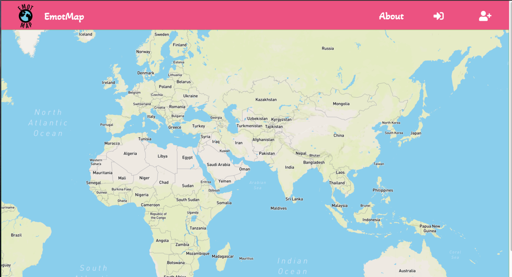
  
  

We started experimenting with Mapbox's circle markers. This was a demo provided by Mapbox and gave us an insight into how we can display different emotions on the map with varying colors (shown in the right picture). We also used [freelogodesign.org/](https://www.freelogodesign.org/), to come up with a variety of different logos to suit our application, and decided to go with the globe (we cant show below as uses black text). We made the logo a button in the toolbar, so users can find their way back to the map when on a different route.

  

  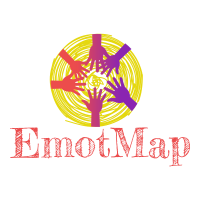
  
  
  

## Implementation of the initial search bar and post form.

At this stage, we have a basic prototype. We were getting used to Mapbox and its GeoJson requirements. Before dealing with user authentication, we wanted to display GeoJson data on the map, implement a basic search filter, and allow users to post by clicking on a button, and routing users to a post page so they can make a post. Ed suggested that we get rid of the white map and use a black map as the contrast between pink was preferred. After some feedback from family and friends, It became obvious that the black map was preferred over this theme.

We also knew that we wanted to search through the posts but we hadn't decided exactly what criteria we would use for searching. We built a search bar at the bottom of the map where the user can search by keyword and by date. Later on as we developed a more complex search for users [here](#sp), we decided to leave this search bar for non users. However, we eventually removed this component because of the feedback received [here](#nos).

  

  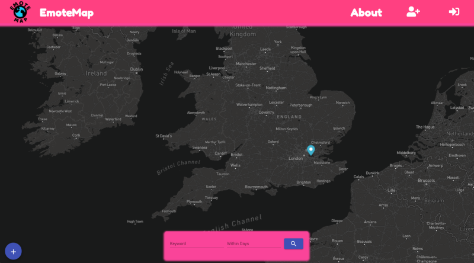
  

It is also worth mentioning here that after showing this version to Marceli, we received some initial criticism on the theme. He said that these colors were not appealing. He suggested that a white navbar will contrast well with the black map. So we tested it out and liked the result. Now we needed to display the form that allowed the user to make a post and display it on the map. At the start, there were several ways of design patterns we could have used. The final version was mentioned in the paper prototype above. However, there were some preliminary ideas we went through:

1. The user clicks a button/map and have the the user route to a new age.
2. The user clicks a button/map and have the form slide out from the screen.

  

  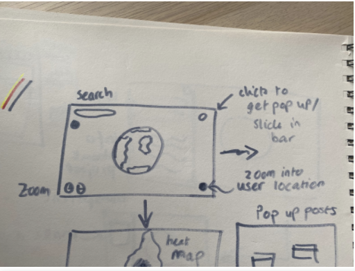
    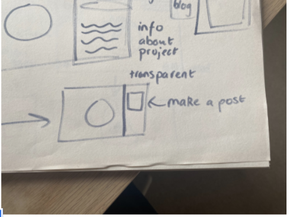
  

We had a team meeting to discuss this, then sought the advice of one of our professors who specializes in HCI. He suggested making it playful by having the post-pop out onto the screen, we all agreed that was the best design of all three methods. 
  
We took a moment to reflect on our project progression in the context of our three fictional users. At this point in time, an EmotePost consisted of an keyword (e.g. lonely) and a description. We had a particular concern regarding Christina, the data analyst, as she was only able to search based on a particular emotion (amongst potentially hundreds if not thousands). Our decided improvement was to include a few more search criteria, to give her more flexibility. One addition to the EmotePosts themselves was a 'mood rating'. We proposed three categories: 'happy', 'coping' and 'sad'. If mood ratings were to be attached to each post, it would be very easy to filter them. This was simply an addition and not a replacement of the pre-existing keyword field. We decided to keep the keyword field for the benefit of Sarah. Emotions are complex, and we thought it would be undermining for example to only give the user the ability to select 'sad', when really they are feeling either depressed, anxious, or lonely. However, to keep within the time frame we only had three emotions. These mood ratings therefore served as search categories.     After some time experimenting with CSS on a mat-dialog component. We initially used a picker element to pick the mood, but then started experimenting with Angular's slider and liked that instead. We decided the secondary colour that fitted well with white, and resembled 'emotions' was purple. So thats the color of the form  
We came up with a pop-up like this:

  

  
  

This post form didn't change much, though we did make a small change to this later. We didn't want to display a number (1 being happy to 3 being 'sad') to represent the mood on the form. Instead of showing numbers, we mapped it with the text, 'happy', 'coping', and 'sad'.

### Displaying EmotePosts

It was obvious to us from the start that we needed use the GeoJson data created from the form above and display it on the map visually through using a marker. There were two options we thought of: Using a marker pin, like in google maps, or using svg circles. The markers (like the blue one in the pink themed screenshot) just felt to clunky, so we decided to use the circles. Mapbox also comes with a hover event feature, we used this to display a pop-up that contained the EmotePost data when a user hovers of a marker with their mouse. After feedback Zaki received from some users, we decided to map each emotion with a corresponding colour.

* Happy => Blue
* Coping => Yellow
* Sad => Red.

For the benefit of our users being able to distinguish their own posts on the map from other user's posts, we made them distinguishable from others by adding an extra SVG on underneath the circle in the shape of a volcano.  

## The heat map

We needed to take into consideration the needs of Christine, and to an extent, Dan. We needed a way to display the mood/emotions across the globe in an attractive style, so they could use this data for their interests and spark curiosity into the nature of users' posts at certain locations. This was on our agenda in a team scrum. We were looking through Mapbox's data visualization features. 

There were several ideas we could use:

* To just have the different colored circles for each EmotePost (shown in the pink prototype above) on the map.
* Use Mapbox's heat map features which displays the density of a specified attribute with customizable colors.
* To create circle clustering, which clusters the data into bigger circles as you zoom out.
* To tile the data onto a map.

  

  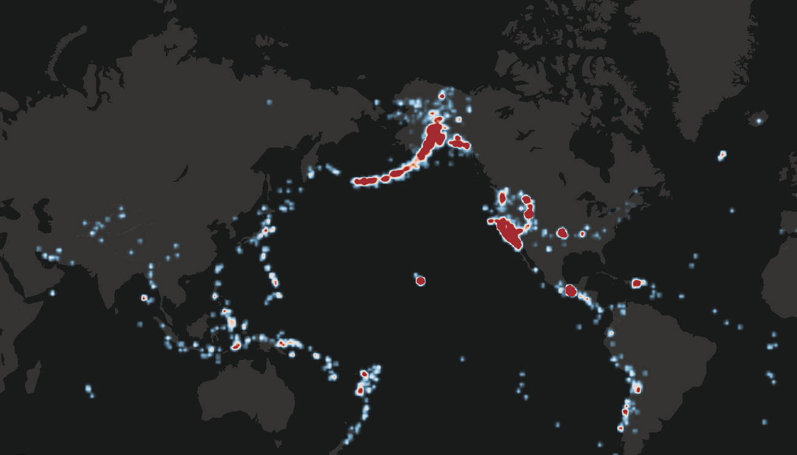
  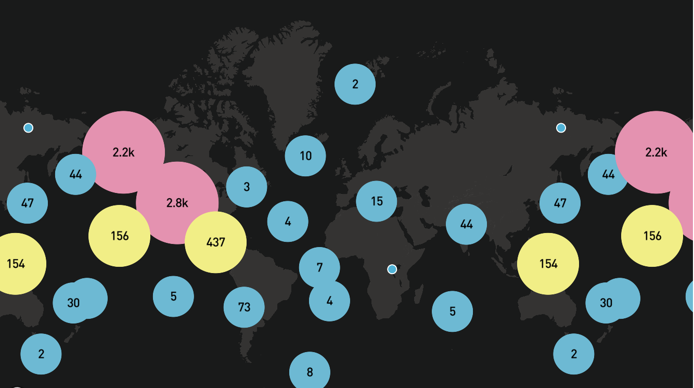
  
  

We test out all three methods. We thought that the heat map was the best, accurate, and easiest way to represent the mood. We assigned the same colors for the heat map as the circles used to represent the EmotePosts. We tested out these methods on our users, and it was split between the heat map and tiling. Also, there were a couple of ways we could represent the heat map.

* Have a button to turn it on.
* Have it on all the time as a layer on top of the circles.
* Have it fade out and in depending on the zoom level.

We decided to go with the third option as it effectively presented multiple data points but also allowed users to zoom in and see exactly where individual posts were.

## User authentication and features

We needed to design the UI for the login and sign up processes. But first, We received feedback from the users and changed the icons for 'sign up' and 'login' to text, as there was some issues highlighted regarding navigating the application. So we made the following changes to the navbar.

  

  
  

    

    
  

We decided that when the user clicks the text, the user will be routed to the corresponding path. Initially, we had idea of having the login/sign up components slide into the map. However, we thought it was best to route the users to a different page. Marceli recommended a great open source for [SVG images](https://undraw.co/illustrations). We picked the 'sign up' SVG because it resembles a new person being welcomed into the family, and the 'login' SVG resembles one who is eager to get back to the application". Purple is a good secondary colour to white, and we want add some extra flair with CSS, so when they user hovers over the form it creates a black shadow.

  

  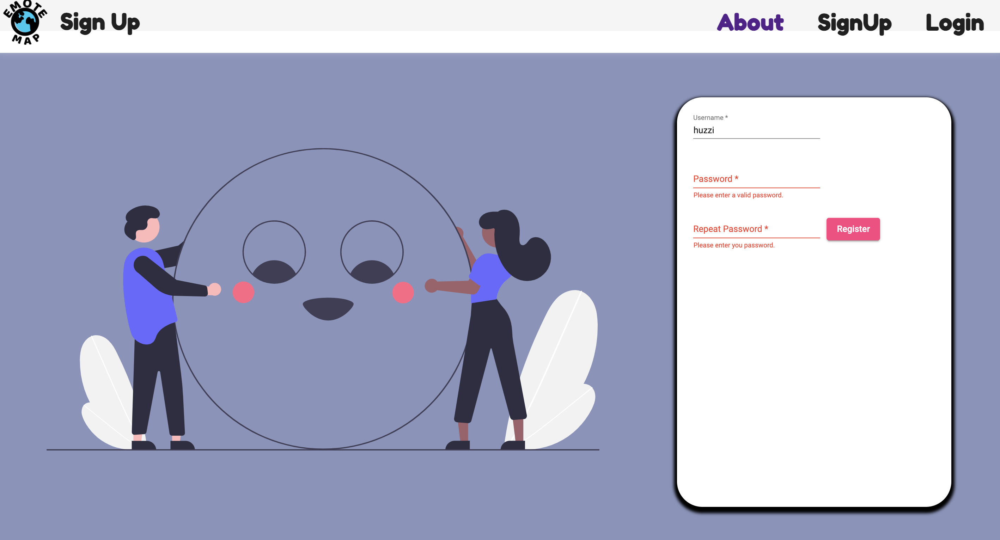
  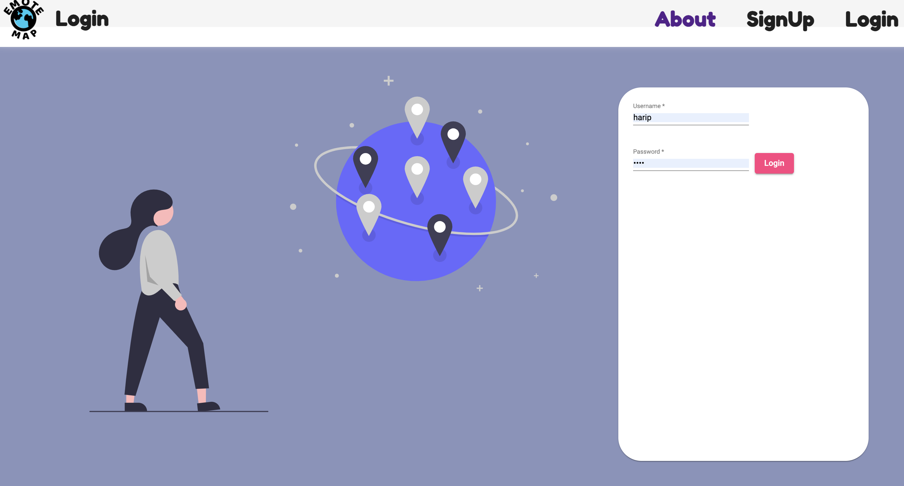
  

We made an initial paper prototype that we thought would be reasonable and fulfill the needs of the user requirements specified in the [user stories](#us):

  

  
  

The sidebar was to include:

* Key => This tells the user the color code of the EmotePost (further information on the development of this is in the ['wireframes'](#first) section below).
* User Profile => This is where the user can enter their date of birth and gender. We combine this data with their EmotePost so other users can filter posts using these attributes too.
* User Timeline => This is where the user can view their EmotePosts, ordered by newest date, and have the option to 'fly-to' location and delete posts (further information on the development of this is in the ['live-user sessions stage'](#second) section below).
* User Search => This allows the user to search for EmotePosts based on gender, age, keyword, emotion, and date of when posts were made. We also added a user-search display component. To display the search results in a timeline instead of being just on the map(further information on the development of this is in the ['live-user sessions stage'](#second) section below).
* Logout => A button where the user could log out.

We also added a blue user post button on the navbar (user can access the pop up Emote form with their current coordinates used as location). Marceli recommended using [Google Icons](https://fonts.google.com/icons/) to represent the features describes above on the navbar.

Here is the initial build of this prototype:
  
  

  
  

However, we discovered that the sidebar didn't look too good. We took inspiration from MacOS and converted the sidebar into a horizontal navbar at the bottom of the screen. Apple's software generally has a simple, minimalistic user-friendly design. We drew upon this principle and used animations to hide and show the relevant components that are activated when the user clicks an icon on the navbar. In addition, we felt it was a nice touch to incorporate the user's username in the top navbar and colour the icon when the user activated its state.
  Here is a representation of this stage:
  
  

  
  

## User Search Prototype

The image below shows the prototype plan, and the image to the right shows the final implementation. On a small paper prototype, the number of options can look slightly overwhelming, however this will change when on a larger screen. To get a balance between flexibility and simplicity, we made each selection optional, so the user does not have to complete each field if they would like to make a short and easy search. We wanted to use colours that followed the theme of the site. We added a white border. Also, were experimenting with the transparency and liked the look the purple being translucent, showing the map underneath. We settled on this style and applied this to all of the other components.
   

  

We wanted to use colours that followed the theme of the site. We added a white border. We were also experimenting with the transparency and liked the look the purple being translucent, showing the map underneath. We settled on this style and applied this to all of the other components.

## Final UI theme, and animation

We showed [this stage](#third) to Marceli, his feedback was this:

  

  
  

We implemented this animation, and then [incorporated the theme we developed for the search component](#sp) to all other components to end up with the final UI:

  

  
  

## How the wireframe feedback influenced our UI...

Our paper prototype served well at forming an initial visualisation of the website, and for receiving feedback on core features. In order to gain feedback related to user experience, we needed to demonstrate the website using a closer representation of a working product. Logically, a wireframe was the next logical step. We used [InVision](https://www.invisionapp.com) to do this. Click [here](https://zaki744910.invisionapp.com/console/EmoteMap-prototype-2-ckn7hacvv1nm601590k9h8044/ckn7han2m109p012d8epohsri/play) or [here](https://zaki744910.invisionapp.com/console/share/NJ2D65MNBU/572059598/play) to go to our interactive wire frame. Below is a preview:

 
Again, we shared the wireframe with friends and family, and coupled it with a questionnaire. As well as the questionnaire, we provided the ability to leave comments on the wireframe itself. One user reported that it would be useful to have a key on the map, informing the user on what coloured marker means what. As a direct response to this feedback, we implemented a key. The final version of the key can be see below (bottom), alongside the original feedback (top).  
 

Another user suggested a 'welcome screen' for users not authenticated. We implemented a welcome button on the map which triggered a semi-transparent pop-up to keep the map present for the user's first impression. Below the feedback is our final implementation of this feature. We also had negative feedback from the users regarding the basic search bar that non-authenticated users could use to search. We decided to remove this and felt the new 'welcome' was enough functionality for non-users could have.

  Leading to the final landing page for non-authenticated users:  

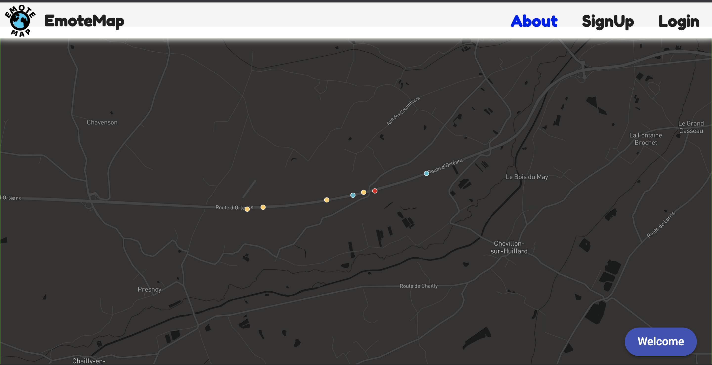

Initially, we didn't implement an 'about' page in the application. We were thinking of implementing it so we left the 'about' text on the navbar. Results of the questionnaire also showed that 80% of people thought an 'about' page would be useful for further clarification. As a response to this, we created an 'about' page confirming what the website intends to do, and how:

## Live user sessions

As our final documented method for UX improvement, we came up with an idea - a live demonstration session. The idea was to first explain the project, before handing the wireframe over to the user. We told the user to imagine that they were using the real, working app. We asked if they could talk aloud their intentions as they were navigating the website. We thought this may be helpful as it would allow us to get a better idea of how users would use our app, and also to allow discussion regarding any ideas, or suggestions they may have. From the recording that was made, we have included a section that was particularly useful for our UX development.

This user helped identify another useful feature, particularly for Sarah.

<em>
User1: So can I make as many posts as I want?

Team member: Of course, there are no limitations in that sense.

User1: Okay good, because I like to make regular updates on my social media accounts [laughs].

Team member: You won't have problems here.

User1: Where can I see my previous posts?

Team member: Actually, you can only see them on the map right now.

User1: Oh, I think it would be good to have a list somewhere. This would also help users keep track of their feelings. I know some people like to keep a diary of how they feel from day to day, this could complement something like that. I would like to have the option to delete these posts also.
</em>

This user was perfectly right; the ability to easily track your EmotePosts is invaluable. We wanted to create a user interface that would allow a user to easily navigate through their history, and having the option to delete posts.  See below for our final version:

  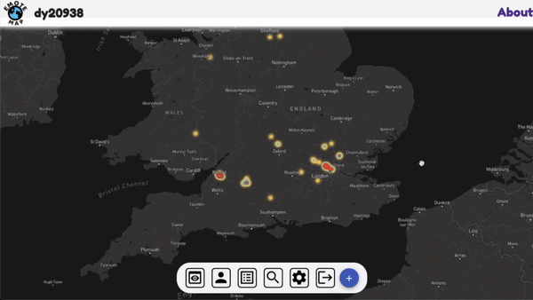

We also incorporated this idea into the search results. Initially, we planned for the search component to just display the relevant GeoJson data on the map. However, we built a search display component and incorporated it as another component on top of the map, when the search mode was activated. Please click [here](#frth) to see it in action:
 
We have also shown below a snippet from another live session with a different user.

<em>
User2: "Okay, I've just posted to say that I'm super excited to be getting my first shot of the vaccine tomorrow! Let me see who else is making EmotePosts about vaccines. [imagining] Oh wow, there are so many positive posts about vaccines. Although the UK is pretty ahead, so I guess there would be quite a few negative ones from other parts of the world."

Team member: "Yes, the  real working search results will show you posts from all over the world."

User2: "That's really cool. How do I see where each post is from?"

Team member: "Good point, you can't right now, but we should include that in the post."

User1: "Yeah, or you could make use of the map, and have a button that locates the post."
</em>

By having the user speak aloud during this exercise, it generated discussion. This was incredibly useful to do at the wireframe stage, because when using the wireframe it is difficult to get a true sense of the working product. For example, an interactive and moving map is a foundation of our application, yet the more static-like nature of a wireframe struggles to remind the user of this. Without the discussion, the user may not have had the idea of wanting to home-in on another post. This probably would have been different if the user was trialing the real product. However, our discussion, as demonstrated, proved to be helpful in identifying limitations/opportunities.

A gif of the implemented home-in feature (nicknamed 'fly-in feature' by the team) can be seen below:

  

## Summary of Design Heuristics used:

* ***Matched the system and the real world:***  We made sure that the UX was easy for the user to comprehend. Ie displaying text, in place of an integer, for the mood. Also, by not using any error codes on the UI, we converted these errors so they are human readable. 
* ***Error Prevention:***   We sent errors back to the user on the forms to ensure incompatible/null data wasn't submitted. Also, we sent errors when the username and password values in the registration forms were invalid.
* ***Help users recognize, diagnose, and recover from errors:***   We made sure to not use any error codes on the UI, we converted these errors to readable descriptive sentences.
* ***Recognition rather than recall:***   We ensured the user could recognize features in the UI instead of having to recall them from previous use. Like the welcome text on the welcome pop-up, and using text for the top navbar.
* ***Aesthetic and minimalist design:***   We wanted to keep the user interface clean to contemplate the design heuristic above. We only added features that the users suggested and nothing more. Also taking inspiration from Apple Inc.
* ***Help and documentation:***   We made sure we provided the user help and guidance while using the UI. We included the 'About' page and the 'welcome' pop-up.

## Final Remarks Regarding UX

Our three characters served as both inspiration and guidance for the initial key features of our application. User feedback proved to highlight useful features that certainly contributed to an improved user experience. It should be noted. however, that not all feedback was acted on. The reason for this was not because we disagreed, but because it was far beyond the scope of our project at this current time (MENTION THAT WE WILL TALK ABOUT THIS MORE IN PROJECT EXTENSION IDEAS PART). Nevertheless, feedback of this nature sometimes inspired us to implement a user's idea slightly differently to what was intended. We will finish this section with an example of this. See below for a user's suggestion:

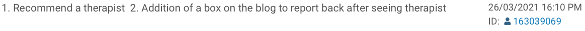

Although this is a perfectly good idea, time restrictions meant that this could not be implemented. As a group, we discussed this and looked for alternative ideas. We decided that the best thing to do was to recommend support for those in need of help. We attached this change to our 'about' page:

Next section; [System Implementation](sysImp.md)
