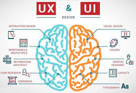
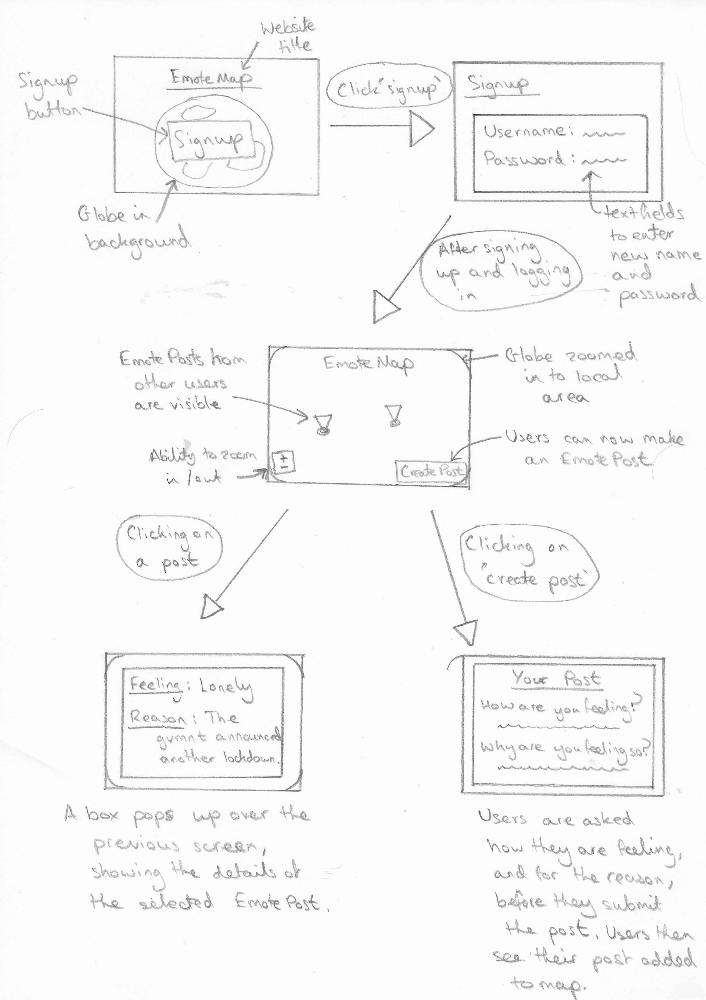
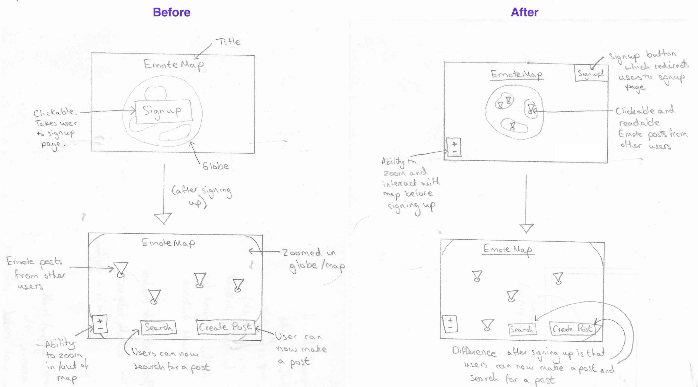
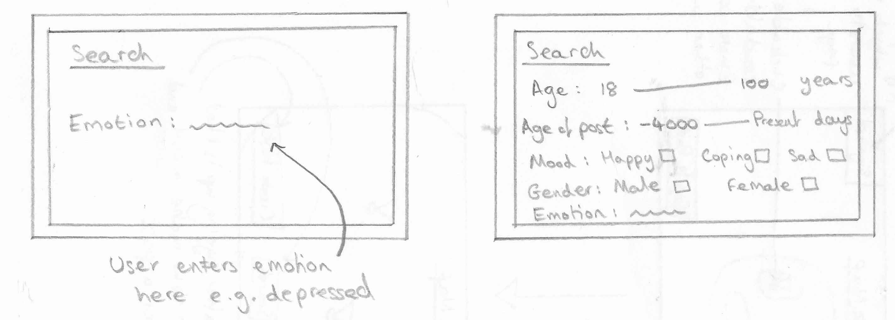
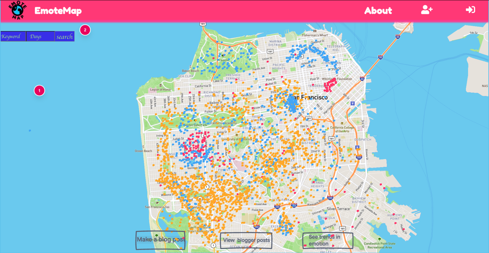
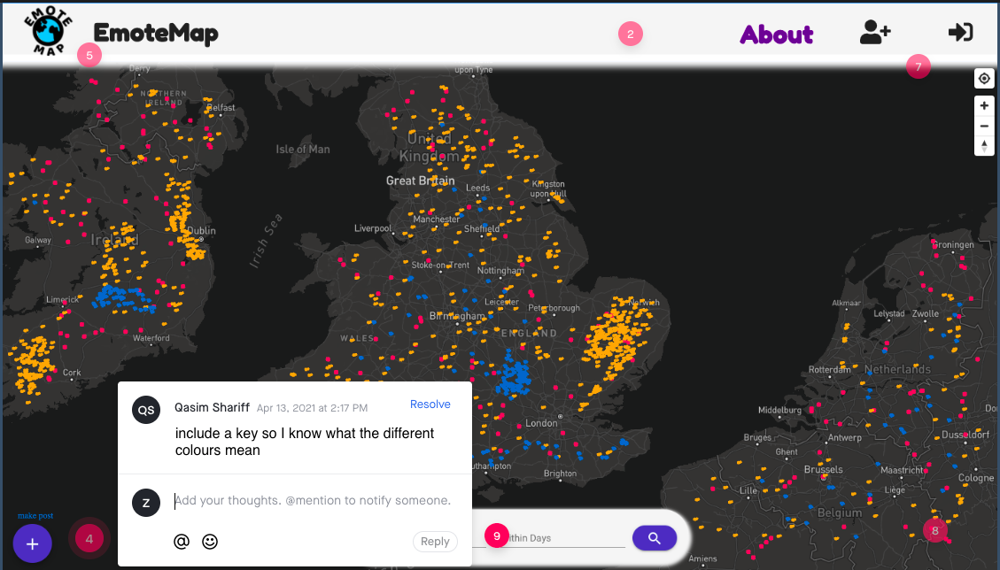
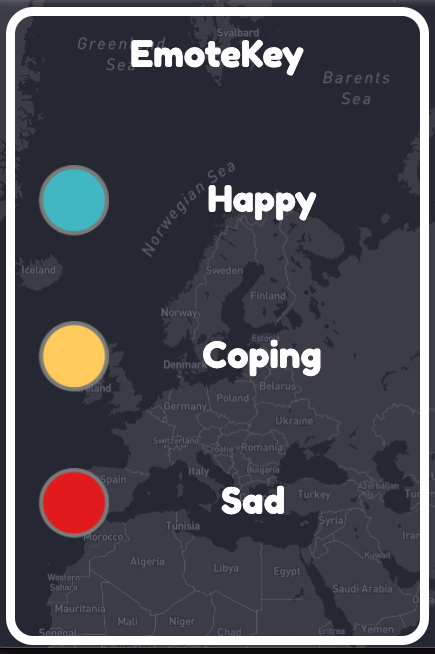
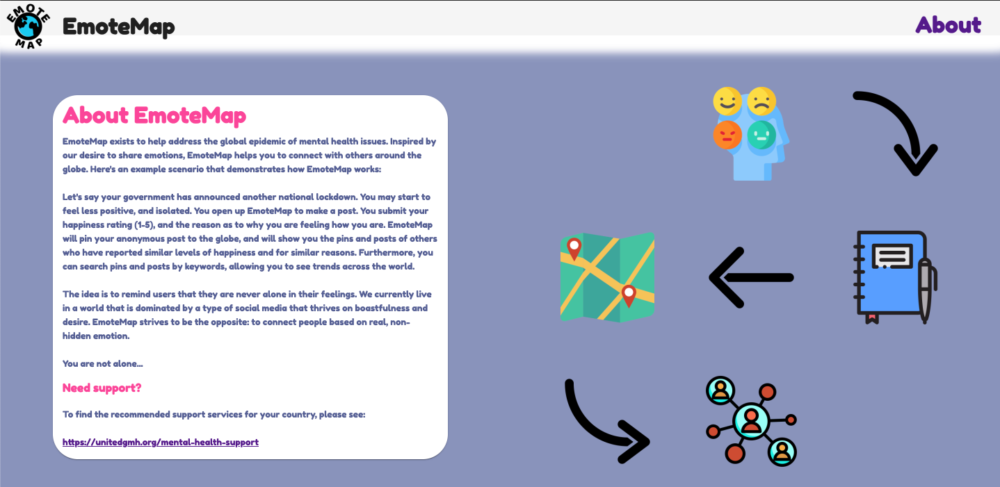
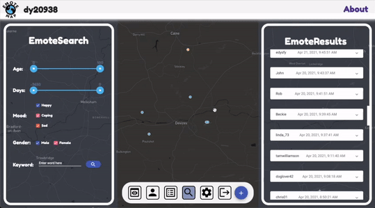

# UX Design

## Identification of our target users

We knew we wanted to make an app that creates a sense of community in the area of mental health. For full details on the justification of the idea, please see LINK!. Our idea relied on three fundamental features: the ability to create an EmotePost, the ability to read EmotePosts, and the ability to search for EmotePosts by keyword. Changing any of these features would change the idea entirely. We thought it would be a good idea to create a character that represents a potential user. This character's story is intentionally ordinary. We would then keep this character in mind when developing the project, to help ensure the development was geared towards the potential user. Here's a bit about Sarah, 19:

"I’m a first year uni student, but I don’t feel like it. The pandemic has meant that we are studying from home, and I haven’t had the opportunity to make friends yet. I’m living with three other students, but I didn’t know them before I moved in, and I’m not so close to them. They all seem to be best friends already. It’s been hard moving to a new city during these times. I often feel alone. I know there must be so many others in my situation, but it’s easy to forget that. I love my course, but this is not what I expected. I wish I could share my feelings with others…"

We all know the feeling of isolation, and we believe Sarah's case is relatable, and likely, particularly in the times of the pandemic.

Admittedly, it was only until after we came up with the idea, that we saw its potential use for another type of user: some form of data analyst. The ability to search for EmotePosts makes it a likely interest for this user. We believe generating statistics from users' EmotePosts would be invaluable to research into mental health issues. Just as before, we created a character to represent this type of user. Meet Christina, 43:

"I’m a data analyst at a mental-heath charity. My role is very important, but it is often overlooked when people think about tackling mental health. My job is to find trends in mental health. Right now, this involves analysing the results of questionnaires that we have given out, but this can be quite tedious, and not so many people respond to our requests. It would be great if I could somehow search for particular feelings, and understand what the current triggers are. We live in a changing world, so I expect these to change over time, and of course, over different locations."

The identification of this second type of user highlighted the importance of creating a clear and easy-to-use search interface. Because we identified these users early, our front-end planning was designed with them in mind from the very start.

### Early prototyping - paper prototypes and feedback

Our two key users had been identified, and it was now time to start putting our idea into action. The first real visualisation of the website consisted of a paper prototype. This ensured all members of the group were on the same page (no pun intended) regarding the layout, and allowed us to easily and to quickly make adjustments during a group discussion. The creation of this prototype really was the first time the ideas we had shared verbally were coming together in a physical, visual form. Because of this, we focused on making it as simple as possible, including only the core features. At this point in time, we had decided that the core features were: ability to signup (and login), be able to zoom in and out of the map, read EmotePosts of other users, create EmotePosts and search for EmotePosts. Our original, finalised paper prototype is shown here:

At this point, our prototype consisted of only the ideas we had come up with within the team. Despite the fact that our team consisted of five individuals of different academic backgrounds, we were still prone to 'tunnel vision'. We knew that it was crucial to get external feedback, and as early as possible. We shared our paper prototype with friends and family. At this stage, we understood it was difficult to grasp the concept of the project looking at a paper prototype alone, so we informed the individuals on the idea beforehand. We were looking for feedback on our core features, and in the form of writtem comments (questionnaires with specific questions were used during the wireframe phase, at this stage we did not want to place any restrictions on the feedback).

One individual made an important suggestion: to remove the need to signup before interacting with the globe and other user posts. We originally planned it like so to encourage more people to signup. However the individual's reasoning was a stronger point: they warned that the user would be signing up to something they may not completely understand, and in some cases this may turn the potential user away entirely. Of course, we could have put an 'about' page as the splash screen, but it should be interactive, and allow users to learn by doing (this would immediately integrate the ‘serious play’ aspect). We also decided to include a ‘signup’ option on a sidebar. The image below shows the changes we made to our paper prototype as a response:

Other important feedback we received was to replace the globe with a 2-dimensional map interface. The reason for such was 'to make sure you are using screen space efficiently. Having something like stars in the background would be cool, but it would be distracting and unnecessary'. We had originally planned for a rotating globe, as we thought it would be visually pleasing and interactive. In one of our meetings, we discussed this feedback and ultimately decided that the individual was right. We reminded ourselves that keeping the user-interface simple and intuitive was a priority of ours. Besides, we believed the idea of browsing and making EmotePosts was interactive.

One final piece of feedback on our paper prototype was to remove the button(s) to zoom in and out of the map. The user claimed it was intuitive enough to use zoom with the mouse wheel. Removing these buttons would simplify our UI, so it was an easy to decision to make.

Overall, we were pleased with how useful the paper prototype approach was. Despite forming only a very basic visualisation, we gathered invaluable feedback that had an impact on our project development from an early stage.

### A moment of reflection

Before moving on to the next prototype design, we took a moment to reflect on our project progression in the context of our two fictional users. At this point in time, an EmotePost consisted of an emotion (e.g. lonely) and a description. We had a particular concern regarding Christina, the data analyst, as she was only able to search based on a particular emotion (amongst potentially hundreds if not thousands). Our decided improvement was to include a few more search criteria, to give her mor flexibility. One addition to the EmotePosts themselves was a  'mood rating'. We proposed three categories: 'happy', 'coping' and 'sad'. If mood ratings were to be attached to each post, it would be very easy to filter them. This was simply an addition, and not a replacement of the pre-existing emotion field. We decided to keep the emotion field for the benefit of Sarah. Emotions are complex, and we thought it would be undermining for example to only give the user the ability to select 'sad', when really they are feeling either depressed, anxious, or lonely. The mood ratings therefore served as search categories. We also added more (optional) search criteria for increased flexibility. The image below (top) shows the prototype plan, and the other image (bottom) shows the final implementation.

On a small paper prototype, the number of options can look slightly overwhelming, however this will change when on a larger screen. To get a balance between flexibility and simplicity, we made each selection optional, so the user does not have to complete each field if they would like to make a short and easy search.

### On to wireframes

Our paper prototype served well at forming an initial visualisation of the website, and for receiving feedback on core features. In order to gain feedback more related to user experience, we needed to demonstrate the website using a closer representation of a working product. Logically, a wireframe was the next best step. We used [InVision](https://www.invisionapp.com) to do this. Click [here](https://zaki744910.invisionapp.com/console/EmoteMap-prototype-2-ckn7hacvv1nm601590k9h8044/ckn7han2m109p012d8epohsri/play) to go to our interactive wireframe. Below is a preview:

Again, we shared the wireframe with friends and family, and coupled it with a questionnaire. As well as the questionnaire, we provided the ability to leave comments on the wireframe (in case they would like to leave feedback beyond what the questionnaire had asked). One user reported that it would be useful to have a key on the map, informing the user on what coloured marker means what. As a direct response to this feedback, we implemented a key. The final version of the key can be see below (bottom), alongside the original feedback (top).

Results of the questionnaire showed that 80% of people thought an 'about' page would be useful for further clarification. As a response to this, we created an 'about' page, confirming what the website intends to do, and how:

### Live user sessions

As our final documented method for UX improvment, we came up with an idea - a live demonstration session. The idea was to first explain the project, before handing the wireframe over to the user. We told the user to imagine that they were using the real, working app. We asked if they could talk out loud their intentions as they were navigating the website. We thought this may be helpful as it would allow us to get a better idea of how users would use our app, and also to allow discussion regarding any ideas, or suggestions they may have. From the recording that was made, we have included a section that was particularly useful for our UX development.

  <em>
User: "Okay, I've just posted to say that I'm super excited to be getting my first shot of the vaccine tomorrow! Let me see who else is making EmotePosts about vaccines. Oh wow, there are so many positive posts about vaccines [imagining]. Although the UK is pretty ahead, so I guess there would be quite a few negative ones from other parts of the world."

Team member: "Yes, the  real working search results will show you posts from all over the world."

User: "That's really cool. How do I see where each post is from?"

Team member: "Good point, you can't right now, but we should include that in the post."

User: "Yeah, or you could make use of the map, and have a button that locates the post."
  </em>

A gif of the implemented fly-in feature can be seen below:

  

[Doodle Jump]: <https://en.wikipedia.org/wiki/Doodle_Jump>
[mapbox]: <https://www.mapbox.com/>
[mapbox heatmap]: <https://docs.mapbox.com/mapbox-gl-js/example/heatmap-layer/>

Next section; [System Implementation](sysImp.md)
